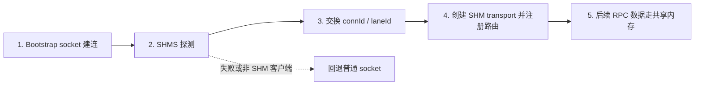

# CXL SHM Thrift 优化汇报备忘

日期：2026-05-31

用途：明早给领导汇报前快速复习。本文不是逐字稿，而是汇报逻辑、每页中心思想、关键话术和可能追问。

## 1. 核心主线

这次汇报不要讲成“我们做了一个共享内存 transport，然后多线程结果不好”。更稳的主线是：

> 我们已经把 Thrift RPC 的底层数据面从 socket 扩展到了 CXL 共享内存，并验证了低并发低延迟路径的明显收益。随后我们系统探索了多 lane、同步 poll、异步 poll、双层 poller/NAPI-like、poller batch 等多种架构，发现高并发下瓶颈不是共享内存读写本身，而是用户态 poller、跨线程投递、EventBase 唤醒和 CPU 预算。下一阶段需要两条线并行：一条是继续完善 transport 的多核扩展性，另一条是更激进的免序列化共享内存语义。

中心思想：

- 低并发结果证明方向成立。
- 高并发结果暴露了更本质的问题，不是简单失败。
- 我们不是只做了一版 demo，而是做了系统性架构探索。
- 当前 transport 优化解决“字节流怎么更快传过去”。
- 免序列化解决“能不能不要再把对象变成字节流”，这是共享内存更大的上限。

## 2. 推荐 PPT 结构

主 PPT 控制在 10 页以内，10 分钟讲完。详细时序图、完整数据表和复杂内存布局放 appendix。

### 第 1 页：结论先行

标题建议：

> CXL 共享内存加速 Thrift RPC：阶段性进展与下一步方向

要点：

- Thrift over CXL SHM 主链路已经打通。
- 单线程/少线程效果显著，证明共享内存低延迟路径有效。
- 高并发闭环压测下，目前瓶颈转移到 poller CPU、跨线程唤醒和调度。
- 后续重点：transport 多核扩展性 + 免序列化。

话术提示：

> 先给结论：这个方向不是没有效果，低线程效果非常明显；但高并发下没有自然超过 socket，说明真正难点已经从“绕过 socket”转移到“用户态数据面怎么扩展到多核”。

### 第 2 页：Thrift / Folly 分工

推荐图：分层栈图。

```text
Business Handler / Client Stub
        |
fbthrift cpp2 runtime
        |
Rocket / Protocol / Serialization
        |
folly AsyncTransport / EventBase / IOBuf
        |
Socket / SHM Transport
```

中心思想：

- Thrift 负责 RPC 语义。
- Folly 承载底层异步 IO 和 transport。
- 我们主要改的是 transport 层，业务 IDL 和 handler 不需要感知。

话术提示：

> 我们这次不是改 Thrift 的业务语义，也不是改 IDL，而是在 Folly 的 AsyncTransport 层增加一条共享内存路径，再在 fbthrift 的建连逻辑里接进去。

### 第 3 页：标准 Thrift RPC 流程

推荐图：简化请求响应流程。

```text
Client call
 -> serialize
 -> Rocket channel
 -> AsyncTransport
 -> socket
 -> Server Cpp2Worker
 -> deserialize
 -> Handler
 -> response back
```

中心思想：

- 当前 Thrift RPC 本质上仍然是字节流传输。
- socket 是 AsyncTransport 的一种实现。
- SHM transport 的定位是替换底层数据面，而不是改变 RPC 语义。

话术提示：

> 只要实现符合 AsyncTransport 语义，上层 Rocket/Thrift 可以继续工作。当前版本仍保留原来的序列化/反序列化，只是把 transport 从 socket 换成共享内存。

### 第 4 页：当前 SHM Transport 方案

推荐图：client/server + 双向共享内存。

```text
Client write -> c2s ring + GQM -> Server poller -> EventBase
Server write -> s2c ring + GQM -> Client poller -> EventBase
```

中心思想：

- bootstrap socket 只做握手。
- RPC 数据走共享内存 ring。
- GQM notification 携带 `connId / offset / length`。
- poller pop notification 后投递给对应 Thrift transport。

话术提示：

> 当前方案里 socket 还在，但只用于 bootstrap。真正 RPC 数据走两条单向共享内存通道。写端写 ring 并 push 一个 GQM notification，读端 poller 根据 connId 找到对应连接，再交给 Thrift 的 EventBase。

### 第 5 页：当前握手，PPT 用简图

不要把完整 Mermaid 时序图放主 PPT，太密。主 PPT 用 5 步流程即可：



中心思想：

- 当前握手很轻量，也很简化。
- 它只交换 `connId` 和 `laneId`。
- 不在热路径上，所以现阶段不是性能主要矛盾。
- 生产化时需要补能力协商、layout 校验、generation、ready barrier 等。

话术提示：

> 这块我实事求是讲：当前握手是 demo/benchmark 友好的轻量实现，不是完整生产协议。但它只发生在建连阶段，不在 RPC 热路径上，所以当前性能问题不在这里。生产化时这块需要做成完整 control plane。

### 第 6 页：我们改了什么

建议两栏展示。

Folly 侧：

- 新增 `ShmPollerService`。
- `BusyPollSharedMemoryTransport` 支持 shared mode。
- GQM notification 重新编码为 `connId / offset / length`。
- 增加 shared-mode handshake。
- memory provider 支持设备文件和 offset import。

fbthrift 侧：

- `ThriftServer` 接入 SHM poller service。
- `Cpp2Worker` 建连时支持 SHM upgrade/fallback。
- perf client/server 支持 `--shm` / `--transport shm`。
- 增加 E2E avg/P99 延迟统计。
- 修复 connId、GQM 初始化、非 SHM client 兼容等问题。

中心思想：

- 这是接进 Thrift 主链路的工程实现，不只是单独样例。
- 上层业务改动很小。
- socket fallback 保留。

话术提示：

> 工程上我们做了两层：Folly 负责新增 transport 能力，fbthrift 负责把它接入 RPC 建连流程。对业务来说，IDL、handler、client call 基本不变。

### 第 7 页：低并发效果

推荐展示：

| 场景 | Socket QPS | SHM QPS | 提升 | Socket P99 | SHM P99 | 改善 |
|---|---:|---:|---:|---:|---:|---:|
| 1 IO / 1 client |  |  |  |  |  |  |
| 2 IO / 2 clients |  |  |  |  |  |  |
| 4 IO / low contention |  |  |  |  |  |  |

中心思想：

- 低线程场景是最强正向结果。
- 绕开 socket 数据面确实能降低固定开销。
- 这说明共享内存 transport 的方向有价值。

话术提示：

> 低并发下效果非常明显，这证明我们不是在优化一个没有收益的方向。只要竞争不高，socket 数据面的固定成本被绕开后，QPS 和延迟收益能直接体现出来。

### 第 8 页：高并发闭环压测现象

推荐展示三类图：

- QPS vs IO threads，标出 SHM 从领先到落后的拐点。
- Avg/P99 latency vs concurrency。
- CPU 使用率拆解，尤其标出 poller core 消耗。

中心思想：

- 高并发下 SHM 没有自然超过 socket。
- IO 线程扩到 16 以上后，poller 成为显性 CPU 成本。
- 同步 poll 会挤占 IO 线程。
- 异步 poll 需要专用核心和跨线程唤醒。
- 问题转移为调度和 CPU 预算问题。

话术提示：

> 高并发闭环下，瓶颈不是 memcpy，也不是单个 GQM pop，而是 poller 和 IO/CPU 线程之间的调度关系。同步 poll 会在 IO 线程里制造 bubble，异步 poll 又引入 eventfd 唤醒和跨线程投递成本。

### 第 9 页：我们试过的架构路线

这页非常重要，它体现工作量和判断力。

| 方案 | 做法 | 结果 | 结论 |
|---|---|---|---|
| 多 lane | 一个 poller 一个 lane，亲和性 + round robin 绑定 IO 线程 | 降低共享队列竞争，但没有完全解决高并发瓶颈 | 多 lane 必要但不充分 |
| 同步 poller | IO 线程在 EventBase loop 中每轮 poll 一包，独享 lane/GQM | 路径最短，但 poll 挤占 IO 线程，闭环下产生 bubble | 适合低延迟，不适合高负载扩展 |
| 异步 poller | poller 收包后 `runInEventBaseThread` 投递 | 多线程表现较好，扩 IO 更方便，核心浪费减少 | 但 eventfd/跨线程投递成本很高 |
| 双层 poller / NAPI-like | L1 poller + L2 IO poller，希望减少休眠和远路径 | 效果较差 | 用户态仿 NAPI 容易叠加队列、唤醒和 cache 迁移 |
| poller batch | poller 批量处理包 | 不如 no batch | 当前瓶颈不是 pop，而是 handoff 和排队 |

中心思想：

- 我们不是只试了一版。
- 简单 batch、多 lane、双层 poller都不是银弹。
- 目前最大问题是每包进入正确执行上下文的成本。

话术提示：

> 这里有一个反常识结论：poller 级别 batch 不如完全不 batch。原因是 batch 会增加排队，延迟 readCursor 推进，还可能向 EventBase 制造 burst。当前瓶颈不在 pop notification，而在 poller 到 IO 线程的 handoff。

### 第 10 页：为什么 socket 强，以及下一阶段方向

推荐图：

```text
NIC multi-queue / RSS
        |
NAPI budget polling
        |
softirq / kernel scheduling
        |
per-CPU network stack / offload / coalescing
        |
application socket
```

中心思想：

- socket 高并发快不是因为纯中断。
- Linux 网络栈有 NAPI、多队列、RSS、softirq、offload、per-CPU 优化。
- 我们现在是在用户态重新构建一套数据面。
- 高并发优化难点是接近内核网络栈的多核扩展能力。
- 下一阶段同时推进 transport 扩展性和免序列化。

话术提示：

> socket 高并发不是“中断很快”。中断更多是触发，后面是 NAPI 的 budget polling、多队列 RSS、softirq 调度和 per-CPU 优化。我们现在的问题，是在用户态重建类似能力时，怎么控制 poller 成本和跨线程 handoff 成本。

如果时间充裕，可以把下面“下一阶段”拆成单独一页；如果要严格 10 分钟，就放在第 10 页右半边。

Transport 扩展性：

- CPU-normalized benchmark。
- poller/EventBase 拓扑亲和。
- ownership-based lane drain，减少每包 eventfd。
- backpressure/admission control。
- 避免 naive batch，基于实测优化。

免序列化：

- 当前 SHM transport 仍保留 Thrift 序列化/反序列化。
- 对复杂 payload，序列化成本可能比 transport 更大。
- 共享内存最强的方向是单边语义 + 免序列化。
- 目标是让数据结构以共享内存对象形式被直接访问。
- 这部分由同事继续讲 demo 和调研。

中心思想：

- transport 优化解决路径问题。
- 免序列化解决数据表示问题。
- 两者结合才是 CXL SHM 对 RPC 框架最大的价值。

衔接话术：

> 我这部分主要讲 transport 数据面，它解决的是“字节流怎么更快传过去”。但共享内存真正更大的想象空间，是“能不能不要再把对象序列化成字节流”。这部分我同事后面会展开。我们的判断是，transport 优化和免序列化结合，才是 CXL 共享内存对 RPC 的最大价值。

## 3. 最简提词稿

这部分按 10 分钟讲，控制节奏，不需要逐字背。

### 开场

- 先给结论。
- 主链路已经打通。
- 低并发效果明显。
- 高并发暴露 poller/调度/CPU 预算问题。
- 下一步是 transport 扩展性和免序列化两条线。

提示句：

> 我今天不只讲最终效果，也讲我们中间试过哪些方案，因为高并发结果背后其实暴露了一个更本质的问题。

### 原理部分

- Thrift 是 RPC 语义和序列化。
- Folly 是底层异步 IO 和 transport。
- AsyncTransport 是替换点。
- 当前 SHM 方案仍然保留 Thrift 字节流语义。

提示句：

> 这次优化的切入点在 transport 层，不改变业务 RPC 语义。

### 当前方案

- socket bootstrap。
- SHMS 轻量握手。
- 交换 connId/laneId。
- 后续数据走 c2s/s2c 共享内存 ring。
- GQM 只通知 `connId/offset/length`。
- poller 分发到 EventBase。

提示句：

> 当前握手不完美，但它不在热路径。真正影响性能的是后续数据面。

### 结果部分

- 低并发：效果好，证明方向成立。
- 高并发：没有超过 socket，瓶颈转移。
- 不要回避负面结果，要解释清楚。

提示句：

> 低并发证明路径有效，高并发暴露的是用户态数据面扩展性问题。

### 探索过程

- 多 lane 做了，能降竞争，但不够。
- 同步 poll 做了，路径短，但挤占 IO 线程。
- 异步 poll 做了，多线程表现好一些，但 eventfd/跨线程投递成本高。
- 双层 poller/NAPI-like 做了，效果差，因为叠加了队列和唤醒。
- batch 做了，反而不如 no batch。

提示句：

> 我们现在认为，问题不是每包 pop 太贵，而是每包进入正确执行上下文太贵。

### 为什么 socket 强

- socket 不是纯中断。
- 高负载下 NAPI polling。
- 多队列/RSS/softirq/offload/per-CPU。
- 内核网络栈已经解决了很多调度和扩展性问题。

提示句：

> 我们绕开了 socket 的一部分开销，但也失去了 socket 背后成熟的多核调度体系。

### 收尾

- 当前成果：路径打通 + 低并发显著收益 + 高并发瓶颈定位。
- 下一步：transport 扩展性 + 免序列化。
- 同事接免序列化。

提示句：

> transport 优化是第一阶段，免序列化才是共享内存更激进的上限。

## 4. 关键话术库

### 讲低并发收益

> 单线程和少线程下，SHM 的收益非常明显。这说明绕开 socket 数据面的固定成本是有效的，方向本身成立。

### 讲高并发不如 socket

> 高并发下没有自然超过 socket，这个结果是符合工程直觉的。socket 背后有多队列、NAPI、softirq、offload 和成熟 backpressure；我们的 SHM 路径当前还是用户态自建的数据面，高并发瓶颈转移到了 poller 和调度。

### 讲 batch 失败

> 我们测试过 poller 级别 batch，结果不如 no batch。原因是当前瓶颈不是 GQM pop 的固定成本，而是 poller 到 EventBase 的 handoff、排队和 P99。batch 反而可能延迟 readCursor 推进，并制造 burst。

### 讲多 lane

> 多 lane 我们已经做了，它能降低共享队列、cursor 和 GQM 竞争，但不能解决 poller 到 IO 线程的投递成本。所以它是必要条件，不是充分条件。

### 讲同步 poll

> 同步 poll 的路径最短，但代价是 poll 占用 IO 线程时间。在闭环压测下，IO 线程本来就忙，poll 会制造 bubble。

### 讲异步 poll

> 异步 poll 的扩展性更好，一个 poller 可以服务多个 IO 线程，也减少了核心浪费。但每包 `runInEventBaseThread` 触发 eventfd 和跨线程投递，这个成本甚至可能超过 socket 的成熟路径。

### 讲双层 poller/NAPI-like

> NAPI 的思想不是简单多一层 poller，而是 ownership、budget、re-arm 和内核调度整体配合。我们在用户态仿 NAPI，容易把 polling、queueing、wakeup 和 cache 迁移成本叠在一起，所以当前效果不好。

### 讲免序列化

> 当前 transport 只是让字节流更快到达，但 Thrift 的序列化和反序列化还在。共享内存真正更大的潜力，是让对象直接以共享内存语义被访问，减少甚至绕开序列化成本。

## 5. 领导可能追问与推荐回答

### Q1：既然高并发不如 socket，这个方向还有价值吗？

推荐回答：

> 有价值，但价值边界要讲清楚。低并发结果已经证明共享内存路径能显著降低固定开销。高并发不如 socket，说明当前 v0 数据面的多核扩展性还不够，不说明共享内存方向无效。下一阶段需要解决 poller/IO/CPU 线程之间的调度和核心预算问题，同时推进免序列化，这部分上限比单纯 transport 更高。

### Q2：为什么 socket 高并发这么强？不是中断开销很大吗？

推荐回答：

> socket 高并发不是每包靠中断。Linux 网络栈高负载下会通过 NAPI 做 budget polling，再结合 NIC 多队列、RSS、softirq、offload、per-CPU buffer 和成熟 backpressure。我们现在绕开了 socket 数据面，但也需要自己承担用户态 poller 和调度体系的成本。

### Q3：多 lane 不是已经解决扩展性了吗？

推荐回答：

> 多 lane 解决的是共享 ring、GQM、cursor 的竞争，但没有解决 poller 到目标 EventBase 的 handoff 成本。我们实测下来，多 lane 是必要的，但真正高并发瓶颈更靠近跨线程投递、eventfd 唤醒、IO 线程 bubble 和 CPU 预算。

### Q4：为什么 batch 不起作用？按理说 batch 应该提升吞吐。

推荐回答：

> batch 只有在固定 per-packet 成本占主导时才一定有收益。我们这里 GQM pop 不是主要瓶颈，主要成本在 handoff 和排队。poller batch 会延迟 readCursor 推进，也可能向 EventBase 制造 burst，所以 P99 和闭环吞吐反而变差。

### Q5：当前握手是不是太简陋？能生产化吗？

推荐回答：

> 当前握手确实简化，主要是为了验证 transport 数据面。它只发生在建连阶段，不在 RPC 热路径，所以不是当前性能瓶颈。生产化需要补版本/能力协商、共享内存 layout 校验、generation、ready barrier、失败回退等 control plane 能力。

### Q6：你们现在到底优化了什么，没优化什么？

推荐回答：

> 已经优化和验证的是 transport 数据面：socket bootstrap 后，RPC 字节流走共享内存 ring/GQM/poller。还没有解决的是两个更难的问题：一是高并发下用户态数据面的调度和多核扩展；二是 Thrift 序列化/反序列化仍然存在。下一阶段就是围绕这两个问题继续推进。

### Q7：免序列化和当前 transport 是什么关系？

推荐回答：

> 当前 transport 解决的是“字节流怎么传得更快”，免序列化解决的是“能不能不要产生这段字节流”。两者不是替代关系。transport 是基础路径，免序列化是进一步利用共享内存单边语义的更激进优化。

### Q8：下一步最应该先做什么？

推荐回答：

> 我建议先做三件事：第一，把 benchmark 改成 CPU-normalized，把 socket 的 kernel/softirq 成本和 SHM 的 poller 成本放到同一口径下比较；第二，继续验证减少每包 eventfd/handoff 的 lane ownership 模型；第三，和免序列化 demo 对齐，明确哪些 workload 适合走 byte-stream SHM，哪些适合走共享对象语义。

## 6. 明早准备清单

- 填低并发 QPS/latency 表，重点突出提升倍数。
- 填高并发 QPS vs IO threads 曲线，标出拐点。
- 准备 CPU 使用率拆解，最好能单独标 poller core。
- 准备 batch vs no-batch 的一行结论，不需要主图太复杂。
- 主 PPT 不放复杂时序图，握手只放 5 步流程。
- appendix 准备完整握手时序图、内存布局、实验参数。
- 和同事确认免序列化部分的承接点：transport 讲完后由他讲“对象不再变字节流”。

## 7. 最后一页总结建议

可以用这三句话收束：

> 第一，我们已经完成 Thrift over CXL SHM 的主链路打通，低并发结果证明共享内存低延迟路径有效。

> 第二，高并发下瓶颈已经从 socket 固定开销转移到用户态 poller、跨线程投递和 CPU 预算；我们已经通过多种架构实验定位到这个问题。

> 第三，下一阶段要同时推进 transport 扩展性和免序列化。前者解决路径和调度，后者解决数据表示，这两者结合才是 CXL 共享内存对 RPC 框架最大的优化空间。
