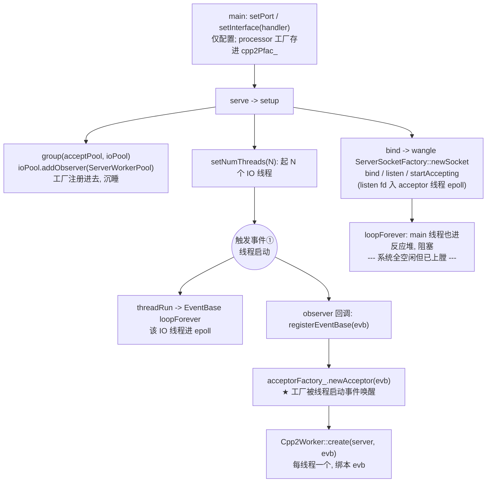
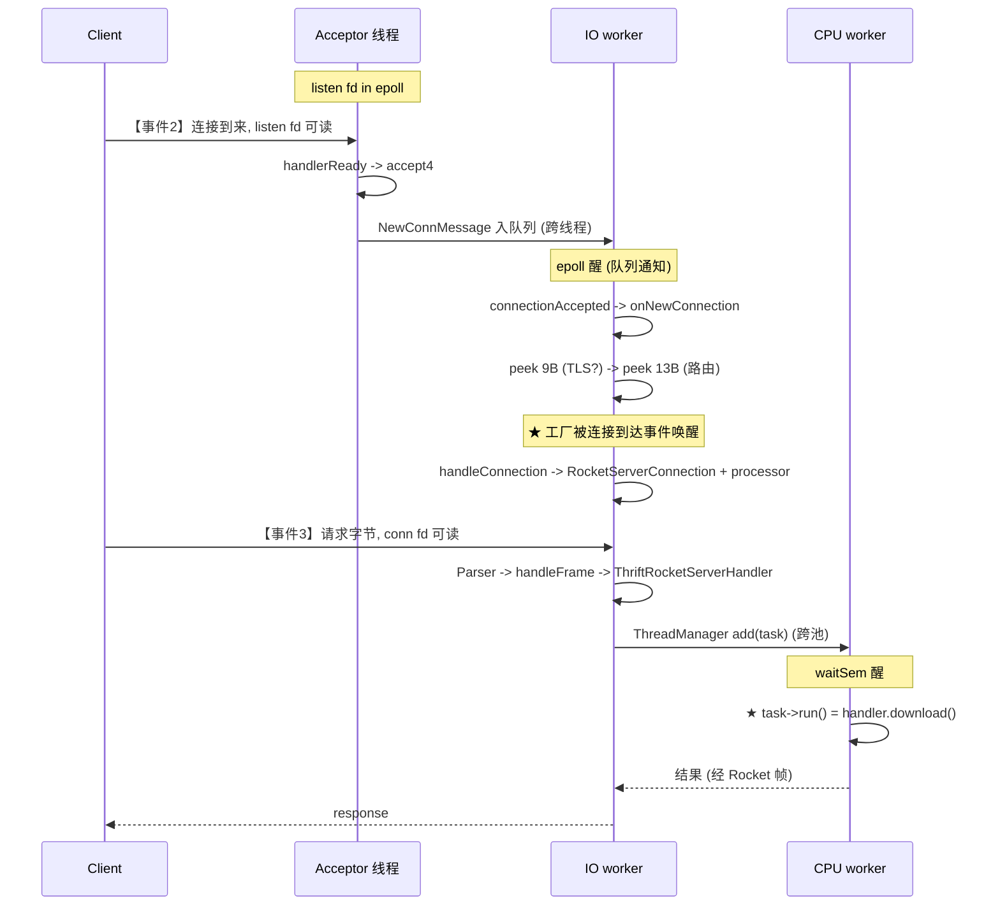
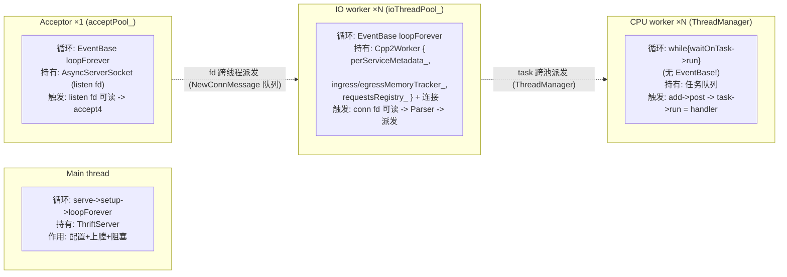

# Thrift Benchmark 服务端启动与运行 —— 复习速查图

> 配套文档：`BENCHMARK_SERVER_WALKTHROUGH.md`（详细走读）、`ROCKET_DOWNLOAD_FLOW.md`。
> 本文只做"一图复习"：**setup 构造期 → runtime 事件期**，标清线程、线程持有的东西、factory 被什么事件触发构造。
> Mermaid 图在 GitHub / GitLab / VS Code 预览里会渲染成图；ASCII 版供终端直读。

仓库前缀：fbthrift `…/worktrees/main/fbthrift`，wangle `…/.cache/getdeps/macos-shared/repos/github.com-facebook-wangle.git/wangle`，folly `…/worktrees/main/folly`。

---

## 一、构造期：setup 阶段谁构造了什么（mermaid）



## 二、运行期：一个请求的端到端旅程（mermaid 时序图）



## 三、四种线程：循环 / 持有 / 触发（mermaid）



---

## 四、ASCII 总图（终端直读版）

### 4.1 setup 构造期 + runtime 事件期

```
═══════════════════ SETUP（构造期 · main 线程同步）═══════════════════

main()
 ├─ setPort / setInterface(handler)          # 仅配置; processor 工厂存进 cpp2Pfac_
 └─ server->serve() → setup()
     ├─ group(acceptPool, ioPool)
     │    └─ ioPool->addObserver(ServerWorkerPool{acceptorFactory_})   ◄ 工厂注册进去
     ├─ ioPool->setNumThreads(N)             # 起 N 个 IO 线程
     │    └─ 每个线程一启动 ───► 【触发事件①：线程启动】
     │         threadRun → EventBase::loopForever()       (IO 线程进 epoll)
     │         observer 回调 → registerEventBase(evb)
     │           └─ acceptorFactory_->newAcceptor(evb)     ◄ ★工厂被"线程启动"唤醒
     │              └─ Cpp2Worker::create(server, evb)     (每线程一个, 绑本 evb)
     ├─ bind() → wangle AsyncServerSocketFactory::newSocket
     │    └─ bind / listen / startAccepting               (listen fd 入 acceptor epoll)
     └─ loopForever()                          # main 线程进反应堆, 阻塞

═══════════════════ RUNTIME（事件驱动 · 无终点循环）═══════════════════

【事件②：客户端连进来】 内核 → listen fd 可读
   acceptor 线程 epoll 醒
     └─ AsyncServerSocket::handlerReady → accept4 → dispatchSocket
          └─ NewConnMessage 入 IO worker#k 队列 ──(跨线程)──┐
   IO worker#k epoll 醒(队列通知)                           │
     └─ connectionAccepted → Cpp2Worker::onNewConnection  ◄┘
        ├─ peek① 9B  → TLS 还是明文?
        └─ peek② 13B → 路由 → RocketRoutingHandler::handleConnection
             └─ ◄ ★工厂被"连接到达"事件唤醒
                ├─ RocketServerConnection 创建
                └─ processor 工厂.getProcessor() → StreamBenchmarkAsyncProcessor

【事件③：客户端发请求字节】 内核 → conn fd 可读
   IO worker#k epoll 醒
     └─ Parser::readDataAvailable → handleFrame → ThriftRocketServerHandler
          └─ processor.executeRequest → ThreadManager::add(task) ──(跨池)──┐
   CPU worker waitSem_ 醒                                                  │
     └─ task->run() → BenchmarkHandler::download()  ◄ ★任务被"字节到达"唤醒 ◄┘
```

### 4.2 四种线程速查

```
Main thread         循环 serve→setup→loopForever | 持有 ThriftServer | 配置+上膛+阻塞
Acceptor ×1         循环 EventBase loopForever   | 持有 AsyncServerSocket(listen fd)
                    触发 listen fd 可读 → handlerReady → accept4 → 派发 fd
IO worker ×N        循环 EventBase loopForever   | 持有 Cpp2Worker ◄(线程启动事件经 factory 造)
                      Cpp2Worker 内: perServiceMetadata_ / ingress,egressMemoryTracker_ / requestsRegistry_
                    触发 conn fd 可读 → Parser → 解帧 → 派发
CPU worker ×N       循环 while{waitOnTask→run} (无 evb) | 持有 任务队列
                    触发 add→post → task->run() = handler
```

---

## 五、factory 被事件触发的三个时刻

| 时刻 | 触发事件 | factory / 机制 | 产物 |
|---|---|---|---|
| setup 期 | ① IO 线程启动 | `acceptorFactory_` | `Cpp2Worker`（每线程） |
| runtime | ② 连接到达 | processor 工厂（`.getProcessor()`） | `RocketServerConnection` + `StreamBenchmarkAsyncProcessor`（每连接） |
| runtime | ③ 请求字节到达 | （非 factory，是 task） | `task->run()` → handler（每请求） |

**复习锚点**：ThriftServer 只配置不干活；wangle/folly 上膛反应堆（fd 入 epoll、线程进 loopForever）；之后一切由内核 I/O 事件驱动——**线程启动造 Cpp2Worker、连接到达造 RocketServerConnection、字节到达跑 handler**。factory 注册完就沉睡，等事件唤醒它。

---

## 六、易混名称速查（别记错）

| 易混/说错的 | 正确名字 | 角色 |
|---|---|---|
| "内联实现" | `ThriftRocketServerHandler` | Rocket 帧→processor 桥（不走 ThriftProcessor） |
| `onAcceptSucc` | `connectionAccepted` | wangle Acceptor 接住 fd 的入口（`Acceptor.cpp:336`） |
| "Cpp2Worker 是观察者" | 观察者是 `ServerWorkerPool` | 持 acceptorFactory、造 Cpp2Worker |
| `RocketServerChannel` | `RocketServerConnection` | 服务端连接对象（Channel 是客户端） |
| `ThriftAcceptor` | `Cpp2Worker` | 每 IO 线程的 acceptor，继承 `wangle::Acceptor` |
| `makeHandler` | `handleConnection` | `TransportRoutingHandler` 接口方法，返回 void |
| 嵌套装饰 | `MultiplexAsyncProcessorFactory` | "装饰"是 multiplex（并列分派），非嵌套 |
| fbthrift 做 listen | wangle `ServerSocketFactory::newSocket` | 真正 bind/listen 在 wangle；fbthrift setPort 只记账 |

### listen vs accept（最易混）

| | bind / listen | accept |
|---|---|---|
| 谁的方法 | wangle `AsyncServerSocketFactory::newSocket` | folly `AsyncServerSocket::handlerReady` |
| 何时 | setup 时一次 | 运行期每连接一次 |
| 触发 | `ServerBootstrap::bind`（在 `ThriftServer::setup` 里） | listen fd 可读 → epoll 唤醒 |

---

## 七、两套线程模型对比（核心区分）

| | IO worker / Acceptor | CPU worker |
|---|---|---|
| 阻塞在 | 内核 `epoll_wait` | 用户态信号量 `waitSem_` |
| 被什么唤醒 | I/O 事件（fd 可读/定时器/队列通知） | 生产者 `add()` → `post()` |
| 工作形态 | reactor：一个线程看几千个连接 | 任务队列：一个线程串行跑 task |
| 接不接 func | 不接（EventBase 驱动回调） | 接（`task->run()`，task 即 Runnable） |
| 适合 | I/O 密集 | CPU 密集 |

**为什么必须分开**：IO worker 一个线程挂几千个连接，若在 handler 里阻塞，EventBase 停转 → 该线程所有连接 I/O 全冻结。所以 CPU-bound 的活扔去 CPU 池，IO 线程永远响应迅速。

---

## 八、per-thread 状态为什么要 per-thread

`Cpp2Worker` 每线程一份的状态（`perServiceMetadata_` / `ingress,egressMemoryTracker_` / `requestsRegistry_`），真正理由是**性能**，不是"独占所以不能全局"：

- **不可变数据的并发读不需要锁**（前提：真不可变）。
- 一旦有并发**写**，才需要同步；代价 ∝ 写频率：
  - 写频繁（`requestsRegistry_` 每请求 insert/move、`MemoryTracker` 每字节增减）→ 重竞争 → per-thread 真划算。
  - 写极少（`perServiceMetadata_` 懒构造+GC，读多）→ 读写锁就够，per-thread 主要是省读开销+缓存局部性（弱收益）。
- **per-thread = 干脆不共享 → 不管读写频率都不需要同步**。最纯粹体现：`MemoryTracker::usage_` 是普通 `size_t`（非原子），因为只有本线程碰。
- 代价：N 份拷贝 + 假设负载均匀（总量/N 预算，倾斜时会误背压）。
```
