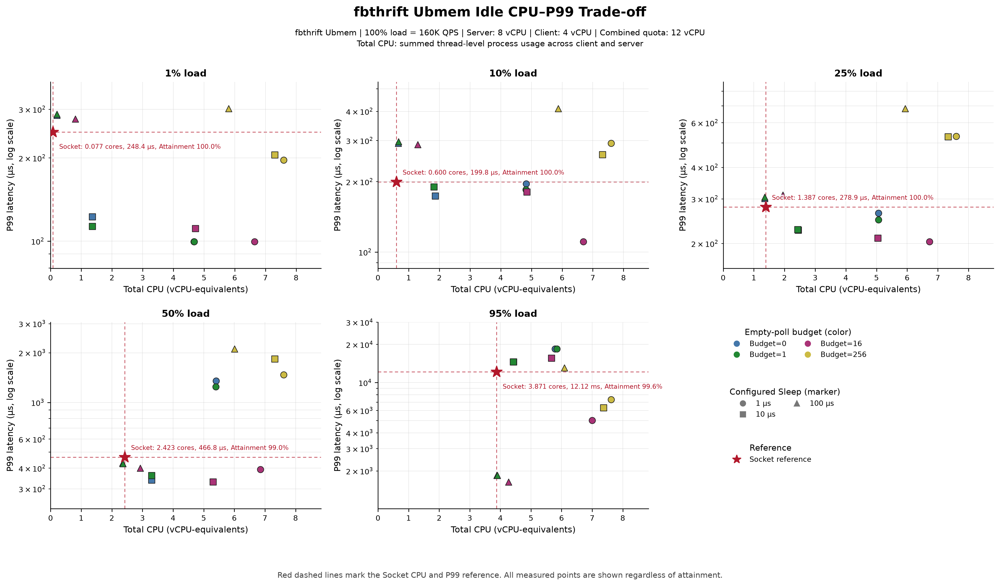
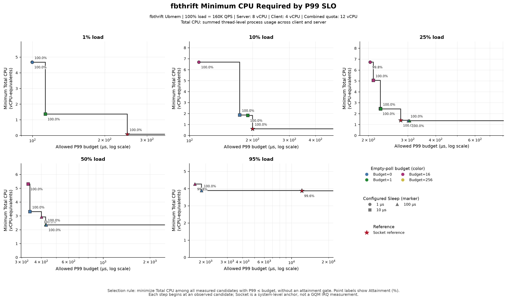

# fbthrift Ubmem Idle 策略的负载敏感性

## 基本结论

本报告归档 fbthrift 的 80 个 Ubmem idle 配置，并使用其中 60 个 idle-enabled 配置和
同五档归一化负载的 5 个 Socket
系统级锚点。固定资源为 Server 8 vCPU、Client 4 vCPU；图表中的 Total CPU 是两端进程所有
线程 CPU% 之和折算的 vCPU-equivalents。无 idle 最大能力按 `160K QPS = 100% load` 定义，
五档负载依次为 `1%、10%、25%、50%、95%`。

当前数据直接支持三个事实：

1. 单层 BUD + Sleep 可以形成显著的 CPU–P99 取舍，但最低 CPU 配置随负载和 P99 SLO
   变化，不存在覆盖五档负载的单一静态最优值。
2. Socket 在 1%、10%、25% 和 95% load 通过 99.5% Sustain gate；50% load 只有 99.0%，
   因此只作为容量锚点。95% load 虽通过吞吐 gate，但 P99 为 12.12ms，不能只看 Sustain%。
3. 这批结果能够说明现有软件 idle 与系统级事件驱动路径之间的选择空间；它不是同一
   Ubmem transport 的 polling/IRQ A/B，不能据此宣布 GQM IRQ 已满足需求或给出 IRQ 固定开销。

## 实验矩阵与口径

| 维度 | 取值 |
|---|---|
| 归一化负载 | `1%, 10%, 25%, 50%, 95%` |
| 100% load 定义 | 无 idle 最大能力 `160K QPS` |
| Idle | Disabled；Enabled with `Sleep=1us, 10us, 100us` |
| BUD | `0, 1, 16, 256` |
| Server 容器 | `8 vCPU` |
| Client 容器 | `4 vCPU` |
| 合计容器配额 | `12 vCPU` |
| Ubmem 完整性 | `80/80` 完整点；图表使用 60 个 idle-enabled 点 |
| Socket 锚点 | 同五档归一化负载，各 1 点 |
| Gate | 原始报告 `Sustain% >= 99.5%` |

派生指标为：

```text
Total CPU (%)  = Client process CPU% + Server process CPU%
Used cores     = Total CPU / 100
Quota use (%)  = Used cores / 12 × 100
QPS/core       = Achieved QPS / Used cores
```

idle-disabled 的 20 个原始点继续保留在数据文件和文末原始结果表中，但不进入候选、策略
边界或图表。

## 负载级汇总

| Load | Idle-enabled 点 | 通过 gate | 最大 Achieved | P99 范围 | Total CPU 范围 |
|---:|---:|---:|---:|---:|---:|
| 1% | 12 | 12 | 1.6K | 99.5–302.1us | 0.207–7.596 cores |
| 10% | 12 | 12 | 16.1K | 110.7–411.5us | 0.664–7.596 cores |
| 25% | 12 | 12 | 40.2K | 203.2–683.6us | 1.352–7.603 cores |
| 50% | 12 | 12 | 80.1K | 329.7us–2.11ms | 2.349–7.612 cores |
| 95% | 12 | 9 | 152.2K | 1.63–18.47ms | 3.887–7.619 cores |

## 1. CPU–P99 取舍



图中展示 60 个 idle-enabled Ubmem 实测点，不按 Sustain% 改变透明度。Socket 使用红色
五角星，并以横纵虚线和文字直接给出 CPU、P99 与 Sustain%。

| Load | Socket Sustain | Socket P99 | Socket Total CPU | Sustain≥99.5% |
|---:|---:|---:|---:|:---:|
| 1% | 100.0% | 248.4us | 0.077 cores | Yes |
| 10% | 100.0% | 199.8us | 0.600 cores | Yes |
| 25% | 100.0% | 278.9us | 1.387 cores | Yes |
| 50% | 99.0% | 466.8us | 2.423 cores | No |
| 95% | 99.6% | 12.12ms | 3.871 cores | Yes |

直接观察：

- 1% load：Ubmem 可用 `BUD=1/Sleep=1us` 达到 99.5us P99，但需 4.681 cores；
  `BUD=1/Sleep=10us` 为 113.1us/1.362 cores；Socket 为 248.4us/0.077 cores。
- 10% load：Ubmem 从 110.7us/6.690 cores 到 189.8us/1.823 cores 形成阶梯；Socket 为
  199.8us/0.600 cores。
- 25% load：Socket 为 278.9us/1.387 cores；Ubmem 可以向低延迟方向走到
  203.2us/6.728 cores，也可以向低 CPU 方向走到 305.2us/1.352 cores。
- 50% load：Socket 的 Sustain 为 99.0%。Ubmem 低 CPU 端为 430.6us/2.349 cores，低延迟端
  为 329.7us/5.304 cores。
- 95% load：Ubmem 的两个代表性点为 1.633ms/4.266 cores 与 1.848ms/3.887 cores；
  Socket 的 CPU 略低，但 P99 增至 12.12ms。

## 2. P99 SLO 对应的最低 CPU 边界



每个阶梯点使用同一确定性规则：

```text
BestPolicy(load, P99_budget)
= argmin TotalCPU(policy)
  subject to measured P99 <= P99_budget
```

区间左闭右开，最后一段延伸到更宽松的 P99 budget。边界只在当前离散实测候选中选择，
不拟合连续参数，也不构成生产默认值。

| Load | P99 budget 区间 | 最低 CPU 候选 | Total CPU | 配额占用 |
|---:|---:|---|---:|---:|
| 1% | `[99.5us, 99.7us)` | `BUD=1, Sleep=1us` | 4.681 cores | 39.0% |
| 1% | `[99.7us, 113.1us)` | `BUD=0, Sleep=1us` | 4.673 cores | 38.9% |
| 1% | `[113.1us, 248.4us)` | `BUD=1, Sleep=10us` | 1.362 cores | 11.3% |
| 1% | `>= 248.4us` | `Socket` | 0.077 cores | 0.6% |
| 10% | `[110.7us, 173.5us)` | `BUD=16, Sleep=1us` | 6.690 cores | 55.8% |
| 10% | `[173.5us, 189.8us)` | `BUD=0, Sleep=10us` | 1.867 cores | 15.6% |
| 10% | `[189.8us, 199.8us)` | `BUD=1, Sleep=10us` | 1.823 cores | 15.2% |
| 10% | `>= 199.8us` | `Socket` | 0.600 cores | 5.0% |
| 25% | `[203.2us, 210.1us)` | `BUD=16, Sleep=1us` | 6.728 cores | 56.1% |
| 25% | `[210.1us, 225.9us)` | `BUD=16, Sleep=10us` | 5.047 cores | 42.1% |
| 25% | `[225.9us, 226.8us)` | `BUD=0, Sleep=10us` | 2.456 cores | 20.5% |
| 25% | `[226.8us, 278.9us)` | `BUD=1, Sleep=10us` | 2.438 cores | 20.3% |
| 25% | `[278.9us, 301.4us)` | `Socket` | 1.387 cores | 11.6% |
| 25% | `[301.4us, 305.2us)` | `BUD=0, Sleep=100us` | 1.354 cores | 11.3% |
| 25% | `>= 305.2us` | `BUD=1, Sleep=100us` | 1.352 cores | 11.3% |
| 50% | `[329.7us, 338.3us)` | `BUD=16, Sleep=10us` | 5.304 cores | 44.2% |
| 50% | `[338.3us, 400.9us)` | `BUD=0, Sleep=10us` | 3.303 cores | 27.5% |
| 50% | `[400.9us, 426.6us)` | `BUD=16, Sleep=100us` | 2.925 cores | 24.4% |
| 50% | `[426.6us, 430.6us)` | `BUD=1, Sleep=100us` | 2.363 cores | 19.7% |
| 50% | `>= 430.6us` | `BUD=0, Sleep=100us` | 2.349 cores | 19.6% |
| 95% | `[1.63ms, 1.85ms)` | `BUD=16, Sleep=100us` | 4.266 cores | 35.5% |
| 95% | `[1.85ms, 12.12ms)` | `BUD=0, Sleep=100us` | 3.887 cores | 32.4% |
| 95% | `>= 12.12ms` | `Socket` | 3.871 cores | 32.3% |

## 结论与证据边界

在 Server 8 vCPU、Client 4 vCPU 的当前 envelope 中，fbthrift 的单层 idle 策略能显著
降低持续轮询 CPU，但代价和可维持负载随 budget、Sleep 与 P99 SLO 共同变化。SLO 图对全部
实测候选进行描述性选优，不把 Sustain% 作为资格门槛；因此边界必须与原始吞吐数据共同阅读，
不能把低达成率策略直接解释为可部署配置。到 95% load，单看 Sustain% 也会掩盖 12ms 级 P99。

因此，本批数据适合定义“现有软件策略能够到达的 CPU–P99 边界”和下一阶段 IRQ A/B 的
对照目标；它不测量 IRQ 本身。若要判断 HWQueue 是否必须增加 IRQ、以及 IRQ 至少要达到
什么规格，仍需在同一 Ubmem transport、相同资源与负载下补 polling/IRQ A/B，并记录
arm、notify、wakeup 和 actual sleep/empty-pop 时序。

## 数据与复现

```bash
uv run pytest -q
uv run python src/fbthrift_idle_analysis.py \\
  --data data/fbthrift_idle_budget_load_sensitivity.csv \\
  --socket-data data/fbthrift_socket_qps_baseline.csv \\
  --derived-output data/fbthrift_idle_budget_load_sensitivity_derived.csv \\
  --summary-output data/fbthrift_idle_budget_load_sensitivity_summary.csv \\
  --candidate-output data/fbthrift_idle_tradeoff_candidates.csv \\
  --policy-boundary-output data/fbthrift_idle_policy_boundaries.csv \\
  --figure-dir figures
```

- [Ubmem 原始文本](data/raw/fbthrift_idle_budget_load_sensitivity.txt)
- [Ubmem 规范化 80 点](data/fbthrift_idle_budget_load_sensitivity.csv)
- [Socket 原始文本](data/raw/fbthrift_socket_qps_baseline.txt)
- [Socket 规范化 5 点](data/fbthrift_socket_qps_baseline.csv)
- [逐点派生数据](data/fbthrift_idle_budget_load_sensitivity_derived.csv)
- [负载级汇总](data/fbthrift_idle_budget_load_sensitivity_summary.csv)
- [联合展示候选](data/fbthrift_idle_tradeoff_candidates.csv)
- [P99-SLO 策略边界](data/fbthrift_idle_policy_boundaries.csv)
- [来源与缺失字段](data/SOURCE.md)

## Ubmem 80 点紧凑结果表

完整字段保留在规范化 CSV；下表列出读图与 gate 所需的核心原始字段。

| # | Target (raw QPS) | Idle | BUD | Achieved | Sustain | P99 | P99.9 | Client CPU | Server CPU | Total CPU | Shed | Gate |
|---:|---:|---|---:|---:|---:|---:|---:|---:|---:|---:|---:|:---:|
| 1 | 1.6K | Disabled | 0 | 1.6K | 100.0% | 224us | 297.9us | 399.3% | 368.9% | 7.682 cores | 0 | Yes |
| 2 | 1.6K | Disabled | 1 | 1.6K | 100.0% | 231.1us | 353.9us | 399.5% | 369.0% | 7.685 cores | 0 | Yes |
| 3 | 1.6K | Disabled | 16 | 1.6K | 100.0% | 229.8us | 297.6us | 399.2% | 368.9% | 7.681 cores | 0 | Yes |
| 4 | 1.6K | Disabled | 256 | 1.6K | 100.0% | 222us | 295.6us | 398.8% | 368.9% | 7.677 cores | 0 | Yes |
| 5 | 1.6K | Sleep=1us | 0 | 1.6K | 100.0% | 99.7us | 174.3us | 280.7% | 186.6% | 4.673 cores | 0 | Yes |
| 6 | 1.6K | Sleep=1us | 1 | 1.6K | 100.0% | 99.5us | 163.5us | 280.9% | 187.2% | 4.681 cores | 0 | Yes |
| 7 | 1.6K | Sleep=1us | 16 | 1.6K | 100.0% | 99.5us | 161.9us | 363.1% | 301.3% | 6.644 cores | 0 | Yes |
| 8 | 1.6K | Sleep=1us | 256 | 1.6K | 100.0% | 196.6us | 288.9us | 396.6% | 363.0% | 7.596 cores | 0 | Yes |
| 9 | 1.6K | Sleep=10us | 0 | 1.6K | 100.0% | 122.5us | 192.8us | 89.2% | 47.5% | 1.367 cores | 0 | Yes |
| 10 | 1.6K | Sleep=10us | 1 | 1.6K | 100.0% | 113.1us | 193.1us | 88.8% | 47.4% | 1.362 cores | 0 | Yes |
| 11 | 1.6K | Sleep=10us | 16 | 1.6K | 100.0% | 111.1us | 190.1us | 321.9% | 150.0% | 4.719 cores | 0 | Yes |
| 12 | 1.6K | Sleep=10us | 256 | 1.6K | 100.0% | 205.2us | 298.4us | 396.4% | 334.0% | 7.304 cores | 0 | Yes |
| 13 | 1.6K | Sleep=100us | 0 | 1.6K | 100.0% | 285.8us | 298.7us | 14.6% | 6.2% | 0.208 cores | 0 | Yes |
| 14 | 1.6K | Sleep=100us | 1 | 1.6K | 100.0% | 288.1us | 298.8us | 14.5% | 6.2% | 0.207 cores | 0 | Yes |
| 15 | 1.6K | Sleep=100us | 16 | 1.6K | 100.0% | 277.1us | 297.9us | 55.3% | 25.4% | 0.807 cores | 0 | Yes |
| 16 | 1.6K | Sleep=100us | 256 | 1.6K | 100.0% | 302.1us | 397.7us | 393.9% | 186.4% | 5.803 cores | 0 | Yes |
| 17 | 16.0K | Disabled | 0 | 16.1K | 100.0% | 972.7us | 1.21ms | 399.1% | 369.0% | 7.681 cores | 0 | Yes |
| 18 | 16.0K | Disabled | 1 | 16.0K | 99.7% | 1.32ms | 12.95ms | 395.8% | 368.9% | 7.647 cores | 741 | Yes |
| 19 | 16.0K | Disabled | 16 | 16.1K | 100.0% | 1.07ms | 1.31ms | 399.2% | 368.9% | 7.681 cores | 0 | Yes |
| 20 | 16.0K | Disabled | 256 | 16.1K | 100.0% | 1.06ms | 1.27ms | 399.1% | 368.9% | 7.680 cores | 0 | Yes |
| 21 | 16.0K | Sleep=1us | 0 | 16.1K | 100.0% | 196.2us | 1.21ms | 293.1% | 189.7% | 4.828 cores | 0 | Yes |
| 22 | 16.0K | Sleep=1us | 1 | 16.1K | 100.0% | 184.8us | 877.3us | 292.5% | 189.9% | 4.824 cores | 0 | Yes |
| 23 | 16.0K | Sleep=1us | 16 | 16.1K | 100.0% | 110.7us | 190.2us | 366.8% | 302.2% | 6.690 cores | 0 | Yes |
| 24 | 16.0K | Sleep=1us | 256 | 16.1K | 100.0% | 292.2us | 496us | 396.5% | 363.1% | 7.596 cores | 0 | Yes |
| 25 | 16.0K | Sleep=10us | 0 | 16.1K | 100.0% | 173.5us | 197.8us | 133.3% | 53.4% | 1.867 cores | 0 | Yes |
| 26 | 16.0K | Sleep=10us | 1 | 16.1K | 100.0% | 189.8us | 203.8us | 129.2% | 53.1% | 1.823 cores | 0 | Yes |
| 27 | 16.0K | Sleep=10us | 16 | 16.1K | 100.0% | 180.5us | 199us | 330.9% | 154.6% | 4.855 cores | 0 | Yes |
| 28 | 16.0K | Sleep=10us | 256 | 16.1K | 100.0% | 261.2us | 403.4us | 396.3% | 335.4% | 7.317 cores | 0 | Yes |
| 29 | 16.0K | Sleep=100us | 0 | 16.1K | 100.0% | 292.3us | 301.1us | 54.3% | 12.1% | 0.664 cores | 0 | Yes |
| 30 | 16.0K | Sleep=100us | 1 | 16.1K | 100.0% | 296.6us | 376.6us | 54.3% | 13.0% | 0.673 cores | 0 | Yes |
| 31 | 16.0K | Sleep=100us | 16 | 16.1K | 100.0% | 288.7us | 313.2us | 98.7% | 30.9% | 1.296 cores | 0 | Yes |
| 32 | 16.0K | Sleep=100us | 256 | 16.1K | 100.0% | 411.5us | 576.9us | 395.5% | 192.1% | 5.876 cores | 0 | Yes |
| 33 | 40.0K | Disabled | 0 | 40.2K | 100.0% | 2.46ms | 2.73ms | 399.3% | 369.0% | 7.683 cores | 0 | Yes |
| 34 | 40.0K | Disabled | 1 | 39.9K | 99.2% | 2.40ms | 13.02ms | 395.9% | 369.0% | 7.649 cores | 4957 | No |
| 35 | 40.0K | Disabled | 16 | 40.2K | 100.0% | 2.49ms | 3.06ms | 399.3% | 368.9% | 7.682 cores | 0 | Yes |
| 36 | 40.0K | Disabled | 256 | 40.2K | 100.0% | 2.59ms | 4.28ms | 399.1% | 368.9% | 7.680 cores | 0 | Yes |
| 37 | 40.0K | Sleep=1us | 0 | 40.2K | 100.0% | 264us | 1.09ms | 310.9% | 195.9% | 5.068 cores | 0 | Yes |
| 38 | 40.0K | Sleep=1us | 1 | 40.2K | 100.0% | 248.5us | 1.74ms | 310.5% | 195.9% | 5.064 cores | 0 | Yes |
| 39 | 40.0K | Sleep=1us | 16 | 40.1K | 99.8% | 203.2us | 2.57ms | 368.6% | 304.2% | 6.728 cores | 1234 | Yes |
| 40 | 40.0K | Sleep=1us | 256 | 40.2K | 100.0% | 530.5us | 1.93ms | 396.9% | 363.4% | 7.603 cores | 0 | Yes |
| 41 | 40.0K | Sleep=10us | 0 | 40.2K | 100.0% | 225.9us | 303.5us | 183.9% | 61.7% | 2.456 cores | 0 | Yes |
| 42 | 40.0K | Sleep=10us | 1 | 40.2K | 100.0% | 226.8us | 384.7us | 182.4% | 61.4% | 2.438 cores | 240 | Yes |
| 43 | 40.0K | Sleep=10us | 16 | 40.2K | 100.0% | 210.1us | 292.8us | 344.4% | 160.3% | 5.047 cores | 0 | Yes |
| 44 | 40.0K | Sleep=10us | 256 | 40.2K | 100.0% | 527.6us | 894.7us | 396.9% | 336.6% | 7.335 cores | 0 | Yes |
| 45 | 40.0K | Sleep=100us | 0 | 40.2K | 100.0% | 301.4us | 392.1us | 114.2% | 21.2% | 1.354 cores | 0 | Yes |
| 46 | 40.0K | Sleep=100us | 1 | 40.2K | 100.0% | 305.2us | 393.9us | 113.4% | 21.8% | 1.352 cores | 0 | Yes |
| 47 | 40.0K | Sleep=100us | 16 | 40.1K | 99.8% | 311.1us | 398.5us | 154.7% | 40.0% | 1.947 cores | 1047 | Yes |
| 48 | 40.0K | Sleep=100us | 256 | 40.2K | 100.0% | 683.6us | 1.10ms | 396.8% | 196.5% | 5.933 cores | 0 | Yes |
| 49 | 80.0K | Disabled | 0 | 80.0K | 99.9% | 12.47ms | 13.59ms | 399.2% | 368.8% | 7.680 cores | 1406 | Yes |
| 50 | 80.0K | Disabled | 1 | 80.0K | 99.9% | 13.13ms | 13.67ms | 399.1% | 368.7% | 7.678 cores | 863 | Yes |
| 51 | 80.0K | Disabled | 16 | 80.0K | 99.9% | 13.15ms | 13.66ms | 399.1% | 369.0% | 7.681 cores | 919 | Yes |
| 52 | 80.0K | Disabled | 256 | 79.9K | 99.8% | 15.91ms | 17.67ms | 399.2% | 368.9% | 7.681 cores | 2185 | Yes |
| 53 | 80.0K | Sleep=1us | 0 | 80.1K | 100.0% | 1.35ms | 7.45ms | 337.6% | 202.5% | 5.401 cores | 0 | Yes |
| 54 | 80.0K | Sleep=1us | 1 | 80.1K | 100.0% | 1.24ms | 5.98ms | 337.4% | 202.4% | 5.398 cores | 0 | Yes |
| 55 | 80.0K | Sleep=1us | 16 | 80.1K | 100.0% | 392.8us | 1.84ms | 378.8% | 306.7% | 6.855 cores | 0 | Yes |
| 56 | 80.0K | Sleep=1us | 256 | 80.1K | 100.0% | 1.47ms | 4.27ms | 397.6% | 363.6% | 7.612 cores | 0 | Yes |
| 57 | 80.0K | Sleep=10us | 0 | 80.1K | 100.0% | 338.3us | 496.5us | 256.1% | 74.2% | 3.303 cores | 0 | Yes |
| 58 | 80.0K | Sleep=10us | 1 | 80.1K | 100.0% | 361.6us | 584.6us | 255.6% | 75.0% | 3.306 cores | 0 | Yes |
| 59 | 80.0K | Sleep=10us | 16 | 80.1K | 100.0% | 329.7us | 487.6us | 362.1% | 168.3% | 5.304 cores | 0 | Yes |
| 60 | 80.0K | Sleep=10us | 256 | 79.9K | 99.7% | 1.83ms | 5.30ms | 394.4% | 337.7% | 7.321 cores | 3127 | Yes |
| 61 | 80.0K | Sleep=100us | 0 | 80.1K | 100.0% | 430.6us | 557.9us | 198.9% | 36.0% | 2.349 cores | 0 | Yes |
| 62 | 80.0K | Sleep=100us | 1 | 80.1K | 100.0% | 426.6us | 561.2us | 200.1% | 36.2% | 2.363 cores | 0 | Yes |
| 63 | 80.0K | Sleep=100us | 16 | 80.1K | 100.0% | 400.9us | 515.4us | 238.6% | 53.9% | 2.925 cores | 0 | Yes |
| 64 | 80.0K | Sleep=100us | 256 | 80.1K | 100.0% | 2.11ms | 4.06ms | 397.6% | 202.7% | 6.003 cores | 0 | Yes |
| 65 | 152.0K | Disabled | 0 | 125.3K | 82.3% | 16.38ms | 21.50ms | 395.7% | 369.0% | 7.647 cores | 403450 | No |
| 66 | 152.0K | Disabled | 1 | 124.7K | 81.9% | 13.75ms | 17.22ms | 399.0% | 368.8% | 7.678 cores | 413127 | No |
| 67 | 152.0K | Disabled | 16 | 125.2K | 82.3% | 13.67ms | 21.51ms | 399.0% | 369.1% | 7.681 cores | 405240 | No |
| 68 | 152.0K | Disabled | 256 | 124.9K | 82.0% | 13.77ms | 17.56ms | 399.0% | 368.8% | 7.678 cores | 409837 | No |
| 69 | 152.0K | Sleep=1us | 0 | 139.5K | 91.6% | 18.47ms | 20.02ms | 365.4% | 213.6% | 5.790 cores | 191336 | No |
| 70 | 152.0K | Sleep=1us | 1 | 143.7K | 94.4% | 18.40ms | 18.59ms | 371.4% | 213.1% | 5.845 cores | 128834 | No |
| 71 | 152.0K | Sleep=1us | 16 | 152.1K | 99.9% | 5.01ms | 17.66ms | 389.0% | 311.0% | 7.000 cores | 1694 | Yes |
| 72 | 152.0K | Sleep=1us | 256 | 151.9K | 99.8% | 7.32ms | 9.63ms | 398.0% | 363.9% | 7.619 cores | 5305 | Yes |
| 73 | 152.0K | Sleep=10us | 0 | 151.7K | 99.6% | 14.51ms | 19.94ms | 348.6% | 94.8% | 4.434 cores | 8769 | Yes |
| 74 | 152.0K | Sleep=10us | 1 | 150.6K | 98.9% | 14.57ms | 14.83ms | 346.5% | 95.7% | 4.422 cores | 24436 | No |
| 75 | 152.0K | Sleep=10us | 16 | 151.4K | 99.5% | 15.55ms | 15.75ms | 384.7% | 182.5% | 5.672 cores | 12243 | Yes |
| 76 | 152.0K | Sleep=10us | 256 | 152.0K | 99.9% | 6.29ms | 13.60ms | 398.1% | 339.0% | 7.371 cores | 2994 | Yes |
| 77 | 152.0K | Sleep=100us | 0 | 152.2K | 100.0% | 1.85ms | 2.49ms | 328.8% | 59.9% | 3.887 cores | 0 | Yes |
| 78 | 152.0K | Sleep=100us | 1 | 152.2K | 100.0% | 1.85ms | 2.50ms | 329.8% | 59.9% | 3.897 cores | 0 | Yes |
| 79 | 152.0K | Sleep=100us | 16 | 151.9K | 99.8% | 1.63ms | 2.28ms | 350.8% | 75.8% | 4.266 cores | 5460 | Yes |
| 80 | 152.0K | Sleep=100us | 256 | 152.1K | 99.9% | 13.05ms | 13.78ms | 398.1% | 211.3% | 6.094 cores | 2482 | Yes |
