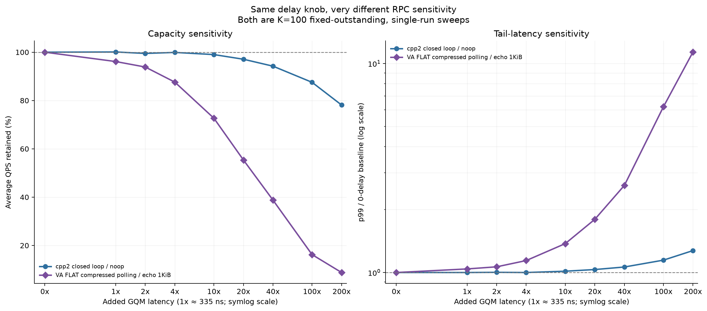
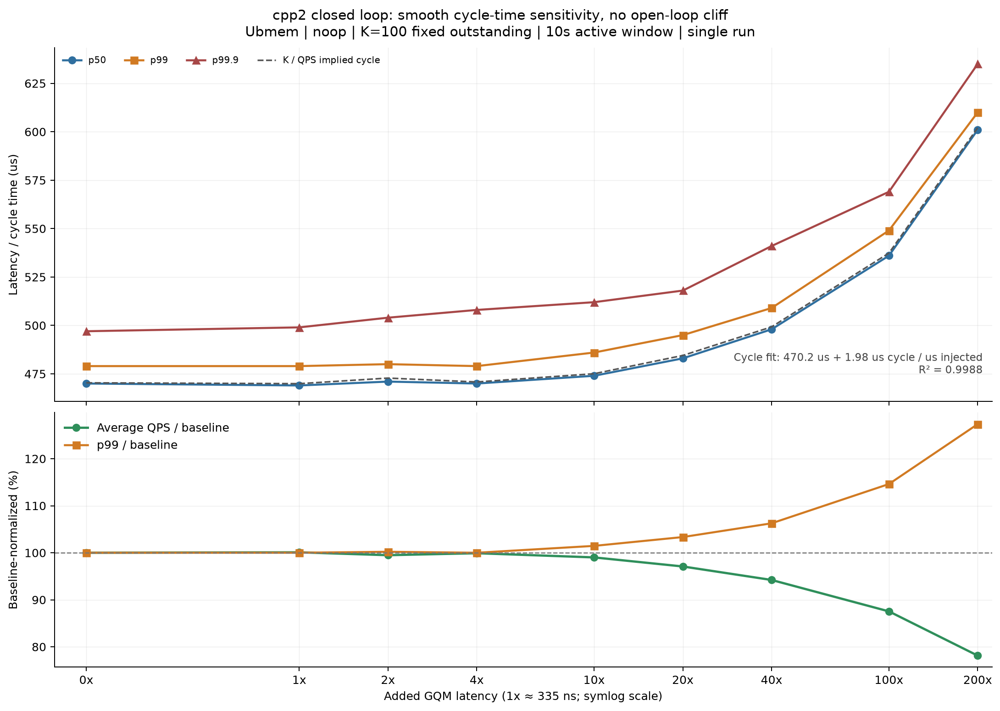
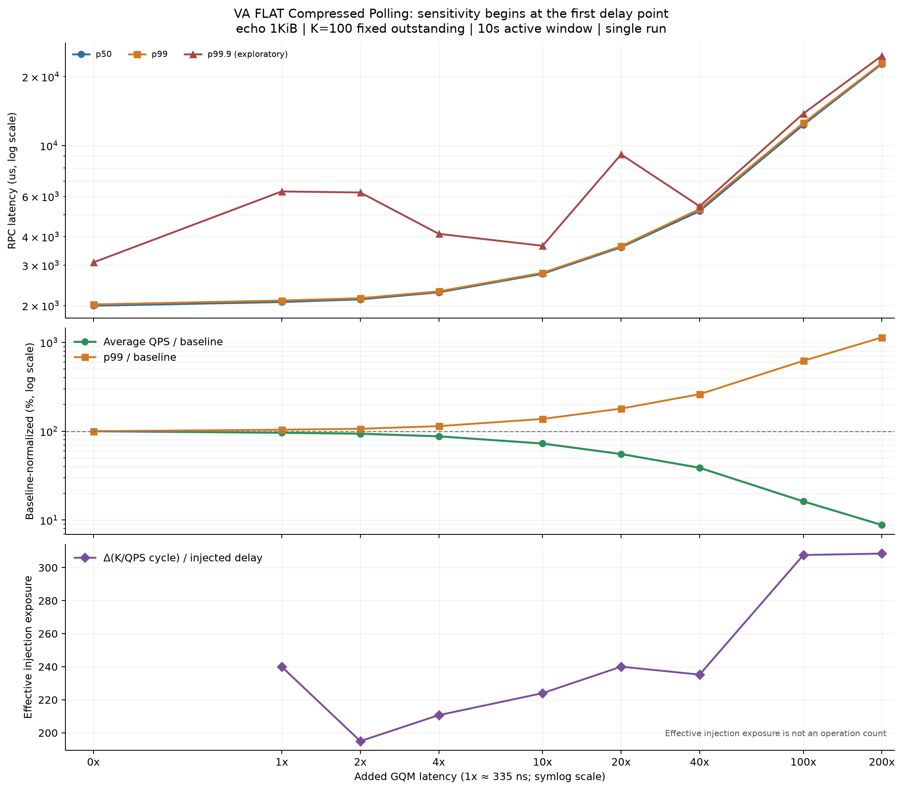

# GQM 注入延迟对 RPC 路径的影响

本报告回答的不是“GQM 微基准有多快”，而是：同一 GQM wrapper operation 成本变化，
在 Ubmem open loop、Ubmem `cpp2` fixed-outstanding closed loop 和 VA FLAT Compressed
Polling 三条 RPC 路径中分别如何影响端到端 latency 与 capacity，以及下一轮硬件优化
应该如何把 push、pop 和每 RPC 调用暴露量拆开。

## 结论摘要

1. **Ubmem open-loop 的 35K QPS 是高压力敏感性锚点，不是健康低延迟基线。** baseline sweep 中，
   35K 的 p99 已从 350 QPS 时的 `130.53us` 上升到 `1299.15us`，约为 10 倍；
   40K 时 p99 为 `1908.29us`，50K 时系统开始明显 shed。
2. **在这个 35K open-loop envelope 下，性能悬崖位于 `13.4us–33.5us`。**
   `13.4us` 时仍完成约 `35.07K QPS`，p50/p99 为 `743/1615us`；`33.5us` 时
   吞吐暂时还能跟上，但 p50/p99 已跳到 `6.99/8.78ms`。
3. **open-loop 的 `67us` 已跨过 capacity boundary。** 完成吞吐从约 `35.07K` 降到
   `30.60K QPS`，`12.74%` 请求在 client 被 shed，p99 达 `16.47ms`。
4. **`cpp2` 闭环对注入呈平滑、近线性的周期敏感度。** 在 `K=100` 下，
   `K/QPS` 推导的 cycle time 可拟合为 `470.2us + 1.98 × injected_delay`，
   `R²=0.9988`。`13.4us (40x)` 时 QPS 保留 `94.21%`、p99 增长 `6.26%`；
   `67us (200x)` 时分别为 `78.13%` 和 `+27.35%`，没有 open-loop 式突发悬崖。
5. **VA FLAT Compressed Polling 从首个 `335ns` 点就明显敏感。** `335ns` 时 QPS 已下降
   `3.87%`、p99 增长 `4.05%`；`13.4us` 时只保留 `38.77%` QPS，p99 为基线
   `2.61x`；`67us` 时只保留 `8.81%` QPS，p99 为 `11.36x`。
6. **同一个 delay knob 的路径敏感度相差两个数量级以上。** `cpp2` 闭环的稳定区间
   对应约 `2x` effective injection exposure；VA FLAT 的 `Δ(K/QPS)/delay` 约为
   `195–240x`，到 `33.5/67us` 升到约 `308x`。该比值是有效暴露量，**不是已经测得的
   push/pop 次数**；它也可能包含二级串行化或 regime change。
7. **微基准支持“注入确实作用于成功 wrapper operation 的同步完成路径”。** 在 `1us`
   配置下，push-only、pop-only、push+pop 归一化后的单次成功操作增量分别约为
   `1009.8ns`、`1024.1ns`、`997.7ns`；raw ugqm、empty pop 和 software ring
   对照基本不随注入变化。
8. **当前数据足以区分“低暴露闭环路径”和“高暴露压缩轮询路径”，不足以给出精确
   调用次数或硬件 latency budget。** 每点只有一次运行，三条路径的 workload/transport
   不同，而且 artifact 没有每端 push/pop counter。

因此，本轮最可靠的硬件反馈是：**先在 VA FLAT 路径上测清并减少每 RPC 的同步 GQM
操作暴露量，同时把 push/pop 和 client/server 分开；`cpp2` 闭环则可作为低暴露量的
线性对照。不能把 effective exposure 直接命名为硬件调用次数。**

下列 delay sensitivity 图统一使用倍率横轴：`1x ≈ 335ns`，精确配置时间保留在各节表格中。




## 1. 数据和实验 Envelope

### 1.1 数据集

- [`data/gqm_microbenchmark.csv`](data/gqm_microbenchmark.csv)：`0/100/1000ns`
  注入下的 GQM wrapper、raw ugqm 和 software ring 微基准。
- [`data/rpc_baseline_qps_sweep.csv`](data/rpc_baseline_qps_sweep.csv)：
  `350–50000` target QPS 的 Ubmem baseline sweep。
- [`data/gqm_delay_sweep_35000qps.csv`](data/gqm_delay_sweep_35000qps.csv)：固定
  `35000` target QPS，注入 `0–67000ns` 的敏感性 sweep。
- [`data/cpp2_closed_loop_gqm_delay_sweep.csv`](data/cpp2_closed_loop_gqm_delay_sweep.csv)：
  `cpp2` Ubmem `noop`、固定 `K=100` outstanding 的 `0–67000ns` sweep。
- [`data/va_flat_compressed_polling_gqm_delay_sweep.csv`](data/va_flat_compressed_polling_gqm_delay_sweep.csv)：
  VA FLAT Compressed Polling `echo 1KiB`、固定 `K=100` outstanding 的 sweep。
- [`data/SOURCE.md`](data/SOURCE.md)：来源 checksum、规范化规则和原报告保留的命令。

### 1.2 已知固定条件

| 维度 | 条件 |
| --- | --- |
| arrival | `poisson_exp` open loop |
| workload | `Unary64` |
| transport | `Ubmem` / `shm_mode=ubmem` |
| client | `client_threads=1`、`connections_per_thread=1` |
| server | `io_threads=1`、`cpu_threads=1` |
| pressure | `max_inflight=496` |
| timing | warmup `3s`、measurement `15s`、drain timeout `5s` |
| placement | client/server 命令均显示 `numactl --cpunodebind=0 --membind=0` |
| sweep anchor | `target_qps=35000` |

### 1.3 两个 fixed-outstanding sweep 的条件

| 维度 | `cpp2` closed loop | VA FLAT Compressed Polling |
| --- | --- | --- |
| client/server | `client_ub` / `server_ub` | `client_va` / `server_va` |
| workload | `noop_weight=1` | `echo_weight=1`、chunk `1024B` |
| pressure | 1 client、1 connection、`K=100` | 1 client、1 connection、`K=100` |
| server | 1 IO、1 CPU thread | 1 IO、0 CPU thread |
| timing | total `30s`、warmup `20s`、active `10s` | total `15s`、warmup `5s`、active `10s` |
| placement | client/server 均绑定 NUMA node 0 | client/server 均绑定 NUMA node 0 |
| sample count | 每个 delay 1 run | 每个 delay 1 run |

两组数据都是 saturated fixed-outstanding closed loop，因此使用 `K/QPS` 推导平均
request-cycle time。这个恒等关系适合描述容量敏感度，不把 p50 当作 mean，也不适用于前面的
Poisson open-loop 数据。

### 1.4 不能从 artifact 确认的条件

- 两台机器的 CPU、内存、firmware、频率策略和精确拓扑。
- 构建实验二进制时的 `folly` / `fbthrift` commit 和 dirty tree 状态。
- 三组 delay sweep 是否都在 client、server 两端设置了 `gqm_inject_cost_ns`；fixed-
  outstanding baseline 命令在两端都写了 0，但各 sweep 点没有完整重复命令。
- injection 是作用于 push、pop，还是两者；每个 RPC 实际执行多少次成功/失败操作。
- server 命令写了 `--forbid_shm_fallback=true`，但 client 结果 JSON 中的
  `forbid_shm_fallback` 为 `false`。这两个字段可能来自不同进程，但缺少路由日志时不能
  据此证明全程没有 fallback。
- `poller_probes` 为 `null`，没有 queue depth、push/pop count、重试、stall 或硬件计数器。
- 两个 fixed-outstanding sweep 没有 CPU、queue counter 或逐端 latency 分解；本仓库也没有
  VA FLAT benchmark 实现，无法从源代码核对 Compressed Polling 的实际 GQM 调用结构。

## 2. Sweep A：确定 35K 压力锚点

下表中的 offered/completed QPS 均由 15 秒窗口内的计数计算，不直接使用配置值代替实测值。

| Target QPS | Scheduled QPS | Completed QPS | Shed | p50 | p99 | p99.9 | Client cores |
| ---: | ---: | ---: | ---: | ---: | ---: | ---: | ---: |
| 350 | 350.2 | 350.2 | 0 | 62.39us | 130.53us | 194.27us | 1.006 |
| 1,000 | 1,006.7 | 1,006.7 | 0 | 63.46us | 159.56us | 196.20us | 1.015 |
| 3,500 | 3,506.4 | 3,506.4 | 0 | 74.84us | 194.81us | 260.77us | 1.044 |
| 10,000 | 10,031.9 | 10,031.9 | 0 | 121.17us | 351.24us | 557.18us | 1.080 |
| 35,000 | 35,068.4 | 35,068.4 | 0 | 534.48us | 1299.15us | 1796.75us | 1.094 |
| 40,000 | 40,082.9 | 40,082.9 | 0 | 866.85us | 1908.29us | 2616.44us | 1.085 |
| 50,000 | 50,076.2 | 43,347.1 | 13.44% | 11011.99us | 11517.64us | 11693.28us | 1.062 |

### 解释

- `35K–40K` 适合做**高压力放大镜**：尚未发生大规模 shed，但 latency 对额外服务成本
  已经敏感。
- 这一区间不应被描述为“RPC 在 35K 前性能完全不变”。从低负载到 35K，p50 和 p99
  已分别增长约 `8.6x` 和 `10.0x`。
- 50K 点同时发生 latency cliff 和 client shed，说明单凭已 dispatch 请求的 latency
  会漏掉 admission/capacity 损失；后续必须同时看 completed QPS 和 shed。

## 3. Sweep B：35K 下的 GQM delay 敏感性

0-delay 使用原报告中单独重复采集的 35K anchor。

| Inject delay | Multiplier | Completed QPS | Shed | p50 | p99 | p99.9 | Run status |
| ---: | ---: | ---: | ---: | ---: | ---: | ---: | --- |
| 0 | 0x | 35,068.6 | 0 | 526.41us | 1274.45us | 1619.03us | valid |
| 0.35us | 1x | 35,068.1 | 0 | 539.31us | 1348.14us | 6355.86us | valid; tail spike |
| 0.67us | 2x | 35,068.2 | 0 | 532.85us | 1280.92us | 1637.47us | valid |
| 1.34us | 4x | 35,068.1 | 0 | 549.10us | 1386.57us | 6819.93us | valid; tail spike |
| 3.35us | 10x | 35,068.5 | 0 | 575.37us | 1358.30us | 2071.43us | valid |
| 6.70us | 20x | 35,066.8 | 0 | 611.08us | 1406.27us | 2624.82us | measured |
| 13.40us | 40x | 35,068.6 | 0 | 743.00us | 1614.81us | 6391.13us | valid; tail spike |
| 33.50us | 100x | 35,066.1 | 0.006% | 6991.70us | 8783.56us | 9630.03us | valid; latency cliff |
| 67.00us | **200x** | 30,601.9 | 12.74% | 15780.88us | 16472.50us | 18715.07us | valid; capacity loss |


### 3.1 三个区间

**`0–13.4us`：吞吐保持、延迟逐步放大。** completed QPS 基本不变；相对 0-delay
anchor，13.4us 的 p50 上升约 `41%`，p99 上升约 `27%`。如果未来的 RPC SLO 是
`p99 < 2ms`，这些单次运行点仍在条件线以内，但这不是统计置信结论。

**`13.4–33.5us`：排队性能悬崖。** 相邻有效点中，p50 从 `743us` 跳到
`6992us`，约 `9.4x`；p99 从 `1615us` 跳到 `8784us`，约 `5.4x`。33.5us 的
completed QPS 仍接近 target，说明 latency 先于吞吐计数发出容量不足信号。

**`33.5–67us`：显式 capacity loss。** 到 67us，完成吞吐降至 `30.60K QPS`，
client shed `66,993` 个请求。原报告把该点标为 `100x`，按 335ns 基准已修正为 `200x`。

### 3.2 为什么不能把 p99.9 画成单调硬件曲线

0.35us、1.34us 和 13.4us 的 p99.9 分别出现 `6.36ms`、`6.82ms` 和 `6.39ms`
尖峰，但相邻点又回落。因为每点只有一次 15 秒运行，没有 error bar，也没有将 queue
depth、scheduler pause、page fault、IRQ 或 retry 与慢请求关联，所以这些点只能说明
“当前 envelope 存在尾部不稳定”，不能说明某个 delay 值必然触发固定的 p99.9 退化。

## 4. Sweep C：`cpp2` fixed-outstanding closed loop



该测试固定 `num_clients=1`、每线程 1 connection、`max_outstanding_ops=100`，workload
为 `noop`。下表的 implied cycle 使用 `100 × 1e6 / Avg QPS` 计算。

| Inject delay | Multiplier | Avg QPS | QPS retained | Implied cycle | p50 | p99 | p99.9 |
| ---: | ---: | ---: | ---: | ---: | ---: | ---: | ---: |
| 0 | 0x | 212,600 | 100.00% | 470.37us | 470us | 479us | 497us |
| 0.335us | 1x | 212,800 | 100.09% | 469.92us | 469us | 479us | 499us |
| 0.670us | 2x | 211,500 | 99.48% | 472.81us | 471us | 480us | 504us |
| 1.340us | 4x | 212,400 | 99.91% | 470.81us | 470us | 479us | 508us |
| 3.350us | 10x | 210,500 | 99.01% | 475.06us | 474us | 486us | 512us |
| 6.700us | 20x | 206,400 | 97.08% | 484.50us | 483us | 495us | 518us |
| 13.400us | 40x | 200,300 | 94.21% | 499.25us | 498us | 509us | 541us |
| 33.500us | 100x | 186,100 | 87.54% | 537.35us | 536us | 549us | 569us |
| 67.000us | 200x | 166,100 | 78.13% | 602.05us | 601us | 610us | 635us |

### 4.1 敏感度形状

对全部 9 个点做普通最小二乘拟合：

```text
K/QPS implied cycle_us = 470.22 + 1.980 × injected_delay_us
R² = 0.9988
```

`0.335–1.34us` 的变化与单次 run 噪声同量级；从 `3.35us` 起，cycle、p50 和 p99
随 delay 平滑增加。该路径没有出现 35K open-loop 的排队悬崖，而是通过固定 `K=100`
把更长的 request cycle 连续转换成更低 QPS。

### 4.2 可以和不可以解释成什么

- 可以说：在这个闭环 envelope 中，每增加 `1us` 配置注入，系统 request cycle 平均增加
  约 `1.98us`，且这一线性模型解释了绝大多数观测方差。
- 可以说：`40x` 并非“无影响”；虽然没有非线性崩塌，QPS 已下降 `5.79%`，p99 增长
  `6.26%`。
- 不可以直接说：一次 RPC 恰好执行 2 次 GQM operation。要成立还需确认 knob 的端点、
  push/pop scope、操作是否串行，以及每 RPC successful operation counter。

## 5. Sweep D：VA FLAT Compressed Polling fixed-outstanding closed loop



该测试同样固定 `K=100`，但 workload 是 `echo 1KiB`，server 配置为 1 IO、0 CPU
thread。原始 artifact 把 `670ns` 写成 `1x`；按 `335ns` 基准规范化为 `2x`。

| Inject delay | Multiplier | Avg QPS | QPS retained | Implied cycle | Effective exposure | p50 | p99 |
| ---: | ---: | ---: | ---: | ---: | ---: | ---: | ---: |
| 0 | 0x | 50,090.9 | 100.00% | 1996.37us | — | 1995.3us | 2021.9us |
| 0.335us | 1x | 48,151.9 | 96.13% | 2076.76us | 239.97x | 2070.8us | 2103.7us |
| 0.670us | 2x | 47,014.4 | 93.86% | 2127.01us | 194.98x | 2127.6us | 2153.1us |
| 1.340us | 4x | 43,884.1 | 87.61% | 2278.73us | 210.72x | 2283.9us | 2306.8us |
| 3.350us | 10x | 36,405.9 | 72.68% | 2746.81us | 224.01x | 2751.2us | 2780.3us |
| 6.700us | 20x | 27,741.6 | 55.38% | 3604.69us | 240.05x | 3594.4us | 3633.2us |
| 13.400us | 40x | 19,422.0 | 38.77% | 5148.80us | 235.26x | 5170.3us | 5279.1us |
| 33.500us | 100x | 8,128.7 | 16.23% | 12302.09us | 307.63x | 12327.3us | 12552.3us |
| 67.000us | 200x | 4,411.8 | 8.81% | 22666.49us | 308.51x | 22743.6us | 22958.9us |

其中：

```text
effective exposure
  = (current K/QPS cycle - baseline K/QPS cycle) / configured injected delay
```

### 5.1 敏感度形状

- **从首个点开始连续退化。** `335ns` 已对应 `3.87%` QPS 损失和 `4.05%` p99
  增长；这条路径不存在一个可称为“40x 前基本无影响”的区间。
- **`0.335–13.4us` 的 effective exposure 约 `195–240x`。** delay 增加被转换为数百倍
  的 request-cycle 增量，是 `cpp2` 闭环约 `2x` 的两个数量级以上。
- **`13.4–33.5us` 进入更高敏感度区间。** 到 `33.5/67us`，effective exposure
  均约 `308x`，提示可能出现额外串行化或内部工作量 regime change；单次 run 还不足以
  给出精确 breakpoint。
- **p99.9 仍是探索性指标。** 它在低 delay 点明显非单调，而 p50/p99 与 `K/QPS`
  implied cycle 基本同向，因此主结论使用 QPS、cycle、p50 和 p99。

### 5.2 为什么 effective exposure 不能直接当作调用次数

只有同时满足“每次成功 operation 注入一次、所有 operation 完全串行、没有额外排队或
控制流变化、两端 knob scope 已知”时，该比值才接近 operation count。当前缺少这些证据。
因此它首先是一个**路径级敏感度诊断量**：用来定位 VA FLAT 的软件/协议路径，而不是直接
向 firmware 宣布“一次 RPC 有 200–300 次 GQM 调用”。

## 6. 两个 fixed-outstanding 路径的横向结论


归一化后，路径差异远大于单次 GQM primitive 的纳秒级差异：

- `13.4us (40x)`：`cpp2` 保留 `94.21%` QPS、p99 为 `1.063x`；VA FLAT 仅保留
  `38.77%` QPS、p99 为 `2.611x`。
- `67us (200x)`：`cpp2` 保留 `78.13%` QPS、p99 为 `1.273x`；VA FLAT 仅保留
  `8.81%` QPS、p99 为 `11.355x`。

这不是严格的 transport A/B：两组 workload、server CPU 配置、benchmark binary 和
数据路径都不同，不能据此比较它们的绝对实现优劣。它能回答的是：**在各自固定 envelope
中，VA FLAT 路径对同一个注入 knob 的局部敏感度远高于 `cpp2` Ubmem 闭环。** 对硬件和
应用协同设计而言，下一步优先级应是：

1. 在 VA FLAT client/server 分别记录 successful/empty push/pop 次数与每 RPC 比值。
2. 若实测 successful operations/RPC 同样很高，先验证 coalescing、batching 或 notification
   reduction；这会直接降低调用密度。
3. 若实测次数很低，则 effective exposure 来自二级串行化，应追踪 queue dependency、
   polling ownership、credit/ACK 和内部扫描范围，而不是把问题归因于单指令 latency。
4. 保留 `cpp2` closed loop 作为近 `2x` 的低暴露量 control，再做 push-only/pop-only 和
   client-only/server-only 注入。

## 7. 微基准：验证注入是不是测到了预期路径


归一化到每个成功 wrapper operation 后：

| Benchmark | 100ns 配置的实测增量 | 1000ns 配置的实测增量 |
| --- | ---: | ---: |
| push-only / 496 | 85.4ns/op | 1009.8ns/op |
| pop-only / 496 | 95.0ns/op | 1024.1ns/op |
| push+pop / 2 | 83.2ns/op | 997.7ns/op |
| fill+drain / 992 | 89.5ns/op | 1021.8ns/op |

`1us` 点与理想注入非常接近；`100ns` 点低约 `5–17ns/op`，可能来自短延迟实现精度、
测量噪声或 benchmark 时间取整。`RawUgqmPushPopPingPong` 在三点分别为
`622.23/617.59/640.23ns`，`HwSingleEmptyPop` 为 `174.69/174.77/179.23ns`，
说明当前注入作用于成功 wrapper operation 的同步完成路径，而不是 raw 基准或每次
empty probe。微基准只能校准作用范围，不能单独判定 delay 在硬件 commit 前后的顺序；
本实验解释仍采用“等待完成后才 commit/result-ready”的同步接口语义。

这个校准**只能验证实验 knob 的作用范围**，不能单独解释 RPC 性能。把它和 35K
open-loop 结果结合起来后，才可以说“当前 wrapper operation 成本能够把 RPC 从排队敏感区
推过 capacity boundary”。

## 8. 对硬件设计的含义

当前数据优先支持三个设计问题，顺序如下：

1. **为什么两条 fixed-outstanding 路径的 effective exposure 相差约百倍？** `cpp2`
   约 `2x`，VA FLAT 约 `200–300x`，已足以把 VA FLAT 的调用密度/二级串行化列为第一
   调查对象。如果实测每 RPC 确实触发大量 successful operation，减少 doorbell 次数、
   合并通知或批量发布，可能比把单次指令再降低几十纳秒更有杠杆。
2. **push 和 pop 哪个更值得优化？** 当前 RPC sweep 使用一个总 knob，无法分辨方向。
   微基准只证明两个 knob 都能被准确注入，不能证明端到端 RPC 对两者的暴露量相同。
3. **硬件应该只降低单次 latency，还是同时提供 observability/coalescing？** `cpp2`
   的近线性结果适合把单次 latency 改善换算成容量收益；VA FLAT 则首先需要 per-queue、
   per-direction successful/empty counter 和批量/合并能力，才能判断 `200–300x` 来自调用
   次数还是协议串行化。p99.9 的非单调尖峰仍需重复与 slow-request 关联。

可以用下面的局部模型组织下一轮数据，但不能把它当作当前实验已经拟合出的公式：

```text
direct queue cost per RPC
  ~= N_client_push * L_client_push
   + N_client_pop  * L_client_pop
   + N_server_push * L_server_push
   + N_server_pop  * L_server_pop

observed RPC latency
  = direct queue cost + software path + queueing amplification
```

接近饱和时，queueing amplification 会让几十微秒的服务成本变化演化成数毫秒 RPC
latency，所以 33.5us 点不能被解释为“RPC 只多了 33.5us”。

## 9. 推荐的下一轮 sweep

### 9.1 先让现有结论可重复

- 固定并记录两仓库 full SHA、二进制 checksum、CPU/firmware、频率策略和完整绑核图。
- 保存 client/server 完整命令与 raw JSON；用 transport route counter 或日志证明没有
  fallback。
- 每个点至少重复 3 次；若 p99.9 是决策指标，建议 5 次且延长 measurement window。
- 0-delay anchor 与实验点交错执行，例如 `0, 40x, 0, 60x, 0, 80x`，识别热漂移。
- server CPU 改成与 client 相同的 15 秒 measurement window；当前 server 的约 21 秒
  whole-serve CPU 只能看趋势，不能与 client 数值直接比较。

### 9.2 加密性能悬崖区间

保持 35K target QPS，建议使用以 335ns 为步长倍数的矩阵：

```text
0x, 20x, 40x, 50x, 60x, 70x, 80x, 90x, 100x, 120x, 160x, 200x
0, 6.7, 13.4, 16.75, 20.1, 23.45, 26.8, 30.15, 33.5, 40.2, 53.6, 67 us
```

其中 `40x–100x` 用于把 cliff 从一个宽区间收窄为带重复置信区间的边界；
`120x–200x` 用于画清 capacity loss。

### 9.3 分解 push/pop 和端点

推荐矩阵不是只做 `all operations`，而是：

| Endpoint | Injection scope | 目的 |
| --- | --- | --- |
| client | push-only | 请求发布/doorbell 成本 |
| client | pop-only | completion/response 获取成本 |
| server | pop-only | 请求获取成本 |
| server | push-only | response 发布成本 |
| both | push+pop | 与当前系统级 sweep 对齐 |

每个配置同时记录 successful/empty push/pop count、batch size、queue occupancy 和 retry。
这样才能把 RPC 曲线还原成对 `Lpush`、`Lpop` 和操作次数的敏感度，直接形成硬件预算。

### 9.4 增加三个负载层次

- `10K QPS`：远离饱和，观察近似直接的 latency 加法。
- `25K QPS`：中等压力，观察 queueing amplification 开始的位置。
- `35K QPS`：高压力，观察 latency cliff 和 capacity boundary。

如果某一 push/pop 方向在 10K 的 p50 slope 就明显更大，应优先优化该方向或减少调用次数；
如果只有 35K 才放大，则优化重点还应包含 batching、queue depth/occupancy 和 admission，
而不能只归因于单条硬件指令。

### 9.5 对 fixed-outstanding 路径补调用暴露量

- `cpp2` 和 VA FLAT 都保留 `K=100`，新增每端 successful/empty push/pop、queue scan、
  notification 和 ACK counter。
- 先重复 `0, 1x, 10x, 40x, 100x, 200x`；VA FLAT 再加密 `40x–100x`，判断约
  `235x -> 308x` 的 effective-exposure 变化是否可重复。
- 对 VA FLAT 增加 `K={1,8,32,100}`，区分“每 RPC 固有调用密度”和“outstanding window
  触发的扫描/批处理成本”。
- 在相同 workload、payload、CPU 配置下增加非 Compressed Polling control，避免把 route
  与业务差异混入调用密度结论。

## 10. 复现分析

```bash
cd thrift/perf/cpp2/performance/analysis/gqm_injected_delay_sweep
uv sync --group dev
uv run --group dev pytest -q
uv run gqm-delay-plot
```

每张图同时生成 PNG 和 SVG。脚本从 CSV 的原始计数派生 completed QPS、shed rate、
latency multiplier、fixed-outstanding implied cycle、effective exposure 和微基准单操作增量；
不会把这些派生数字手工固化在绘图代码中。

## 11. 结论边界

本报告的置信度为 **low-to-medium**：微基准注入校准较可信；35K open-loop 的
latency/capacity 区间、`cpp2` 闭环约 `1.98x` 的线性响应，以及 VA FLAT 远高于 `cpp2`
的路径级敏感度都有直接端到端证据。精确阈值、push/pop 优先级、successful operations/RPC
和硬件 budget 因缺少重复、完整 provenance、端点分解和计数器而保持 `INCONCLUSIVE`。
open-loop 记录见 [`EDR-0002`](../../edr/EDR-0002-gqm-injected-delay-rpc-sweep.md)，
fixed-outstanding 路径记录见
[`EDR-0003`](../../edr/EDR-0003-gqm-fixed-outstanding-path-sensitivity.md)。
