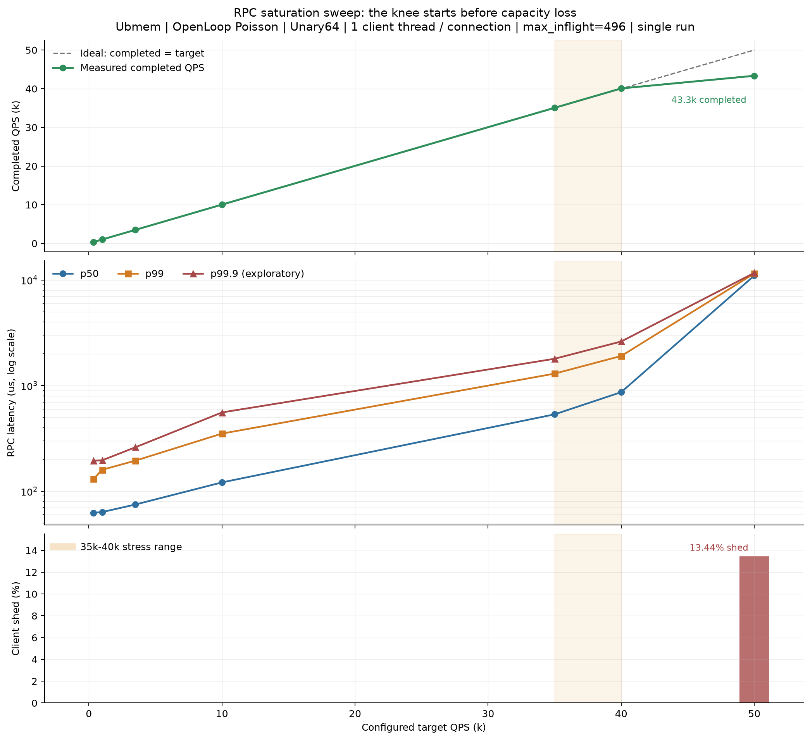
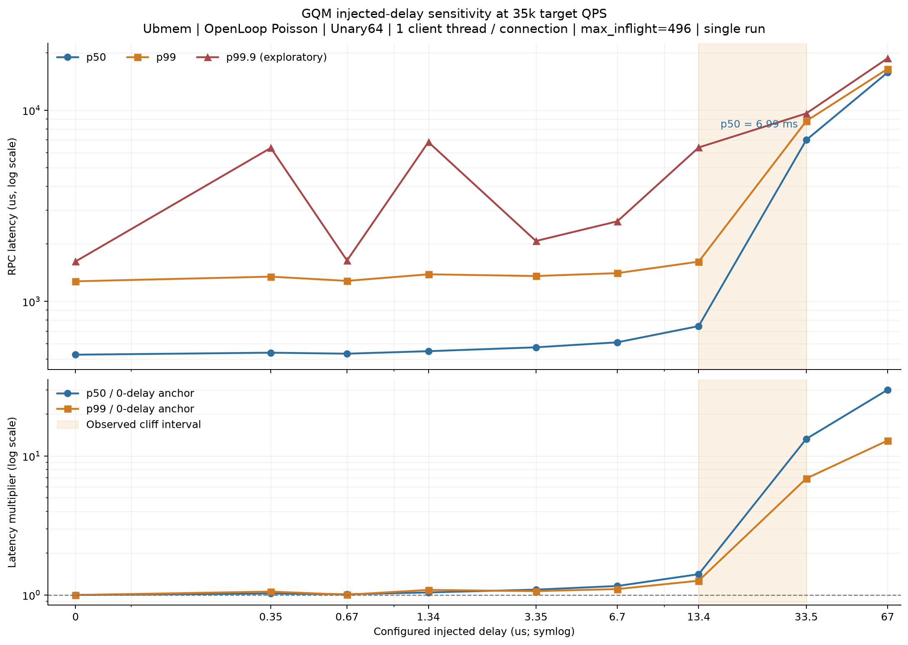
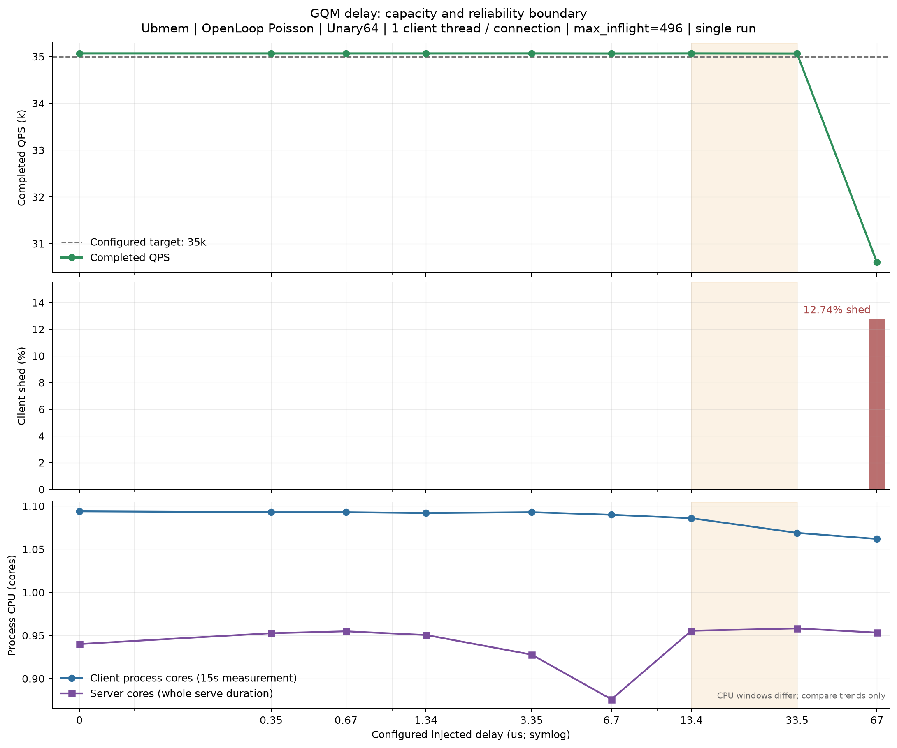
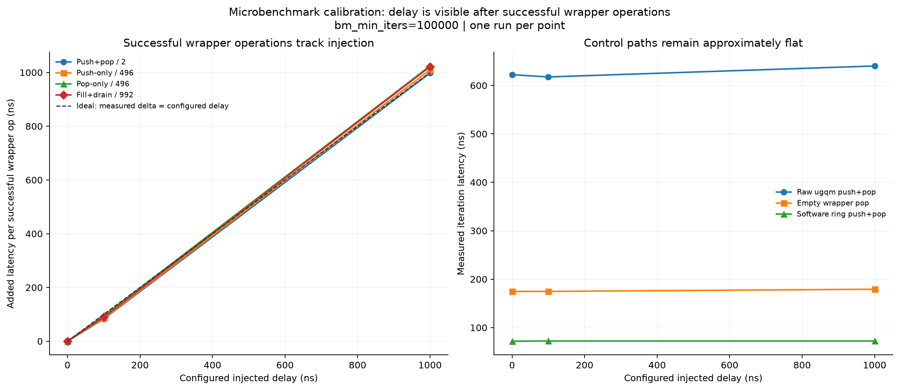

# GQM 注入延迟对 Ubmem RPC 的影响

本报告回答的不是“GQM 微基准有多快”，而是：在当前 Ubmem doorbell RPC 路径中，
GQM wrapper operation 的成本变化会在什么位置开始影响端到端 RPC latency、capacity
和可靠性，以及下一轮硬件优化应该如何把 push、pop 和调用次数拆开。

## 结论摘要

1. **当前 35K QPS 是高压力敏感性锚点，不是健康低延迟基线。** baseline sweep 中，
   35K 的 p99 已从 350 QPS 时的 `130.53us` 上升到 `1299.15us`，约为 10 倍；
   40K 时 p99 为 `1908.29us`，50K 时系统开始明显 shed。
2. **在这一个 35K envelope 下，GQM 注入成本的性能悬崖位于 `13.4us–33.5us`。**
   `13.4us` 时仍完成约 `35.07K QPS`，p50/p99 为 `743/1615us`；`33.5us` 时
   吞吐暂时还能跟上，但 p50/p99 已跳到 `6.99/8.78ms`。
3. **`67us` 已跨过 capacity boundary。** 完成吞吐从约 `35.07K` 降到
   `30.60K QPS`，`12.74%` 请求在 client 被 shed，p99 达 `16.47ms`。
4. **微基准支持“注入确实落在成功 wrapper operation 后”的解释。** 在 `1us`
   配置下，push-only、pop-only、push+pop 归一化后的单次成功操作增量分别约为
   `1009.8ns`、`1024.1ns`、`997.7ns`；raw ugqm、empty pop 和 software ring
   对照基本不随注入变化。
5. **当前数据足以给出区间和下一轮方向，不足以给出精确硬件 latency budget。** 每点
   只有一次运行，p99.9 非单调，而且 artifact 没有说明 delay 在哪一端、作用于 push
   还是 pop、每个 RPC 命中多少次。

因此，本轮最可靠的硬件反馈是：**需要优先测量并减少“每 RPC 的同步 GQM 操作暴露量”，
并把 push 和 pop 分开扫；不能仅依据当前曲线选择一个 push/pop 单指令目标延迟。**





## 1. 数据和实验 Envelope

### 1.1 数据集

- [`data/gqm_microbenchmark.csv`](data/gqm_microbenchmark.csv)：`0/100/1000ns`
  注入下的 GQM wrapper、raw ugqm 和 software ring 微基准。
- [`data/rpc_baseline_qps_sweep.csv`](data/rpc_baseline_qps_sweep.csv)：
  `350–50000` target QPS 的 Ubmem baseline sweep。
- [`data/gqm_delay_sweep_35000qps.csv`](data/gqm_delay_sweep_35000qps.csv)：固定
  `35000` target QPS，注入 `0–67000ns` 的敏感性 sweep。
- [`data/SOURCE.md`](data/SOURCE.md)：来源 checksum、规范化规则和原报告保留的命令。

### 1.2 已知固定条件

| 维度 | 条件 |
| --- | --- |
| arrival | `poisson_exp` open loop |
| workload | `Unary64` |
| transport | `Ubmem` / `shm_mode=ubmem` |
| client | `client_threads=1`、`connections_per_thread=1` |
| server | `io_threads=1`、`cpu_threads=1` |
| pressure | `max_inflight=496` |
| timing | warmup `3s`、measurement `15s`、drain timeout `5s` |
| placement | client/server 命令均显示 `numactl --cpunodebind=0 --membind=0` |
| sweep anchor | `target_qps=35000` |

### 1.3 不能从 artifact 确认的条件

- 两台机器的 CPU、内存、firmware、频率策略和精确拓扑。
- 构建实验二进制时的 `folly` / `fbthrift` commit 和 dirty tree 状态。
- delay sweep 是否在 client、server 或两端都设置了 `gqm_inject_cost_ns`。
- injection 是作用于 push、pop，还是两者；每个 RPC 实际执行多少次成功/失败操作。
- server 命令写了 `--forbid_shm_fallback=true`，但 client 结果 JSON 中的
  `forbid_shm_fallback` 为 `false`。这两个字段可能来自不同进程，但缺少路由日志时不能
  据此证明全程没有 fallback。
- `poller_probes` 为 `null`，没有 queue depth、push/pop count、重试、stall 或硬件计数器。

## 2. Sweep A：确定 35K 压力锚点

下表中的 offered/completed QPS 均由 15 秒窗口内的计数计算，不直接使用配置值代替实测值。

| Target QPS | Scheduled QPS | Completed QPS | Shed | p50 | p99 | p99.9 | Client cores |
| ---: | ---: | ---: | ---: | ---: | ---: | ---: | ---: |
| 350 | 350.2 | 350.2 | 0 | 62.39us | 130.53us | 194.27us | 1.006 |
| 1,000 | 1,006.7 | 1,006.7 | 0 | 63.46us | 159.56us | 196.20us | 1.015 |
| 3,500 | 3,506.4 | 3,506.4 | 0 | 74.84us | 194.81us | 260.77us | 1.044 |
| 10,000 | 10,031.9 | 10,031.9 | 0 | 121.17us | 351.24us | 557.18us | 1.080 |
| 35,000 | 35,068.4 | 35,068.4 | 0 | 534.48us | 1299.15us | 1796.75us | 1.094 |
| 40,000 | 40,082.9 | 40,082.9 | 0 | 866.85us | 1908.29us | 2616.44us | 1.085 |
| 50,000 | 50,076.2 | 43,347.1 | 13.44% | 11011.99us | 11517.64us | 11693.28us | 1.062 |

### 解释

- `35K–40K` 适合做**高压力放大镜**：尚未发生大规模 shed，但 latency 对额外服务成本
  已经敏感。
- 这一区间不应被描述为“RPC 在 35K 前性能完全不变”。从低负载到 35K，p50 和 p99
  已分别增长约 `8.6x` 和 `10.0x`。
- 50K 点同时发生 latency cliff 和 client shed，说明单凭已 dispatch 请求的 latency
  会漏掉 admission/capacity 损失；后续必须同时看 completed QPS 和 shed。

## 3. Sweep B：35K 下的 GQM delay 敏感性

0-delay 使用原报告中单独重复采集的 35K anchor。

| Inject delay | Multiplier | Completed QPS | Shed | p50 | p99 | p99.9 | Run status |
| ---: | ---: | ---: | ---: | ---: | ---: | ---: | --- |
| 0 | 0x | 35,068.6 | 0 | 526.41us | 1274.45us | 1619.03us | valid |
| 0.35us | 1x | 35,068.1 | 0 | 539.31us | 1348.14us | 6355.86us | valid; tail spike |
| 0.67us | 2x | 35,068.2 | 0 | 532.85us | 1280.92us | 1637.47us | valid |
| 1.34us | 4x | 35,068.1 | 0 | 549.10us | 1386.57us | 6819.93us | valid; tail spike |
| 3.35us | 10x | 35,068.5 | 0 | 575.37us | 1358.30us | 2071.43us | valid |
| 6.70us | 20x | 35,066.8 | 0 | 611.08us | 1406.27us | 2624.82us | measured |
| 13.40us | 40x | 35,068.6 | 0 | 743.00us | 1614.81us | 6391.13us | valid; tail spike |
| 33.50us | 100x | 35,066.1 | 0.006% | 6991.70us | 8783.56us | 9630.03us | valid; latency cliff |
| 67.00us | **200x** | 30,601.9 | 12.74% | 15780.88us | 16472.50us | 18715.07us | valid; capacity loss |



### 3.1 三个区间

**`0–13.4us`：吞吐保持、延迟逐步放大。** completed QPS 基本不变；相对 0-delay
anchor，13.4us 的 p50 上升约 `41%`，p99 上升约 `27%`。如果未来的 RPC SLO 是
`p99 < 2ms`，这些单次运行点仍在条件线以内，但这不是统计置信结论。

**`13.4–33.5us`：排队性能悬崖。** 相邻有效点中，p50 从 `743us` 跳到
`6992us`，约 `9.4x`；p99 从 `1615us` 跳到 `8784us`，约 `5.4x`。33.5us 的
completed QPS 仍接近 target，说明 latency 先于吞吐计数发出容量不足信号。

**`33.5–67us`：显式 capacity loss。** 到 67us，完成吞吐降至 `30.60K QPS`，
client shed `66,993` 个请求。原报告把该点标为 `100x`，按 335ns 基准已修正为 `200x`。

### 3.2 为什么不能把 p99.9 画成单调硬件曲线

0.35us、1.34us 和 13.4us 的 p99.9 分别出现 `6.36ms`、`6.82ms` 和 `6.39ms`
尖峰，但相邻点又回落。因为每点只有一次 15 秒运行，没有 error bar，也没有将 queue
depth、scheduler pause、page fault、IRQ 或 retry 与慢请求关联，所以这些点只能说明
“当前 envelope 存在尾部不稳定”，不能说明某个 delay 值必然触发固定的 p99.9 退化。

## 4. 微基准：验证注入是不是测到了预期路径



归一化到每个成功 wrapper operation 后：

| Benchmark | 100ns 配置的实测增量 | 1000ns 配置的实测增量 |
| --- | ---: | ---: |
| push-only / 496 | 85.4ns/op | 1009.8ns/op |
| pop-only / 496 | 95.0ns/op | 1024.1ns/op |
| push+pop / 2 | 83.2ns/op | 997.7ns/op |
| fill+drain / 992 | 89.5ns/op | 1021.8ns/op |

`1us` 点与理想注入非常接近；`100ns` 点低约 `5–17ns/op`，可能来自短延迟实现精度、
测量噪声或 benchmark 时间取整。`RawUgqmPushPopPingPong` 在三点分别为
`622.23/617.59/640.23ns`，`HwSingleEmptyPop` 为 `174.69/174.77/179.23ns`，
说明当前注入更像是成功 wrapper operation 的完成后成本，而不是 raw 指令本身或每次
empty probe 的成本。

这个校准**只能验证实验 knob 的作用范围**，不能单独解释 RPC 性能。把它和 35K
open-loop 结果结合起来后，才可以说“当前 wrapper operation 成本能够把 RPC 从排队敏感区
推过 capacity boundary”。

## 5. 对硬件设计的含义

当前数据优先支持三个设计问题，顺序如下：

1. **一次 RPC 暴露多少次同步 GQM operation？** 如果一次请求/响应跨 client 和 server
   触发多次 push/pop，那么减少 doorbell 次数、合并通知或批量发布，可能比把单次指令
   再降低几十纳秒更有杠杆。当前没有操作计数，无法比较这两种收益。
2. **push 和 pop 哪个更值得优化？** 当前 RPC sweep 使用一个总 knob，无法分辨方向。
   微基准只证明两个 knob 都能被准确注入，不能证明端到端 RPC 对两者的暴露量相同。
3. **应该优化均值，还是 tail/variance？** 当前 p50/p99 的悬崖较清楚，但 p99.9 的
   非单调尖峰没有硬件计数器相关性。先补重复实验和 slow-request 关联，再决定是否把
   firmware jitter、仲裁或重试作为最高优先级。

可以用下面的局部模型组织下一轮数据，但不能把它当作当前实验已经拟合出的公式：

```text
direct queue cost per RPC
  ~= N_client_push * L_client_push
   + N_client_pop  * L_client_pop
   + N_server_push * L_server_push
   + N_server_pop  * L_server_pop

observed RPC latency
  = direct queue cost + software path + queueing amplification
```

接近饱和时，queueing amplification 会让几十微秒的服务成本变化演化成数毫秒 RPC
latency，所以 33.5us 点不能被解释为“RPC 只多了 33.5us”。

## 6. 推荐的下一轮 sweep

### 6.1 先让现有结论可重复

- 固定并记录两仓库 full SHA、二进制 checksum、CPU/firmware、频率策略和完整绑核图。
- 保存 client/server 完整命令与 raw JSON；用 transport route counter 或日志证明没有
  fallback。
- 每个点至少重复 3 次；若 p99.9 是决策指标，建议 5 次且延长 measurement window。
- 0-delay anchor 与实验点交错执行，例如 `0, 40x, 0, 60x, 0, 80x`，识别热漂移。
- server CPU 改成与 client 相同的 15 秒 measurement window；当前 server 的约 21 秒
  whole-serve CPU 只能看趋势，不能与 client 数值直接比较。

### 6.2 加密性能悬崖区间

保持 35K target QPS，建议使用以 335ns 为步长倍数的矩阵：

```text
0x, 20x, 40x, 50x, 60x, 70x, 80x, 90x, 100x, 120x, 160x, 200x
0, 6.7, 13.4, 16.75, 20.1, 23.45, 26.8, 30.15, 33.5, 40.2, 53.6, 67 us
```

其中 `40x–100x` 用于把 cliff 从一个宽区间收窄为带重复置信区间的边界；
`120x–200x` 用于画清 capacity loss。

### 6.3 分解 push/pop 和端点

推荐矩阵不是只做 `all operations`，而是：

| Endpoint | Injection scope | 目的 |
| --- | --- | --- |
| client | push-only | 请求发布/doorbell 成本 |
| client | pop-only | completion/response 获取成本 |
| server | pop-only | 请求获取成本 |
| server | push-only | response 发布成本 |
| both | push+pop | 与当前系统级 sweep 对齐 |

每个配置同时记录 successful/empty push/pop count、batch size、queue occupancy 和 retry。
这样才能把 RPC 曲线还原成对 `Lpush`、`Lpop` 和操作次数的敏感度，直接形成硬件预算。

### 6.4 增加三个负载层次

- `10K QPS`：远离饱和，观察近似直接的 latency 加法。
- `25K QPS`：中等压力，观察 queueing amplification 开始的位置。
- `35K QPS`：高压力，观察 latency cliff 和 capacity boundary。

如果某一 push/pop 方向在 10K 的 p50 slope 就明显更大，应优先优化该方向或减少调用次数；
如果只有 35K 才放大，则优化重点还应包含 batching、queue depth/occupancy 和 admission，
而不能只归因于单条硬件指令。

## 7. 复现分析

```bash
cd thrift/perf/cpp2/performance/analysis/gqm_injected_delay_sweep
uv sync --group dev
uv run --group dev pytest -q
uv run gqm-delay-plot
```

每张图同时生成 PNG 和 SVG。脚本从 CSV 的原始计数派生 completed QPS、shed rate、
latency multiplier 和微基准单操作增量；不会把这些派生数字手工固化在绘图代码中。

## 8. 结论边界

本报告的置信度为 **low-to-medium**：微基准注入校准较可信，35K 下的 latency/capacity
区间判断有直接端到端证据；精确阈值、push/pop 优先级和硬件 budget 因缺少重复、完整
provenance、端点分解和计数器而保持 `INCONCLUSIVE`。对应实验记录见
[`EDR-0002`](../../edr/EDR-0002-gqm-injected-delay-rpc-sweep.md)。
