# HWQueue 对 RPC 性能的影响与下一代硬件需求

本文综合现有 GQM/HWQueue successful-operation delay、private queue-pair scale-out、
open-loop pressure、poll-idle 和 TCP Socket 对照实验，回答两个相互关联的问题：

1. 当前 HWQueue 的哪些性能属性已经会影响 RPC，影响通过什么机制出现；
2. 如果下一代硬件只能优先优化少数能力，应优先优化单次 `push/pop latency`、多队列
   capacity，还是 empty-to-nonempty notification。

本文是一份**阶段性综合分析报告**，不是某一项硬件规格的验收报告。底层真实 HWQueue
实现不在本仓库中；本文只使用现有 RPC 结果、规范化数据和注入机制能够直接支持的事实。
各专项实验仍是原始证据的 source of truth，本文不重新定义其实验状态。

## 1. 当前结论

在现有实验 envelope 内，当前结论可以压缩为以下四点：

1. **当前量级的 successful `push/pop latency` 不是 private queue-pair 多线程 RPC 的
   首要瓶颈。** `N<=8` 时未观察到 delay sensitivity 随队列数增加而放大；在
   `N=8` closed loop 中，每次 successful operation 新增 `335–670ns` 后，QPS 和 p99
   仍处于各自 baseline 邻域。这里的 `0x` 仅表示不增加人工 delay，并不表示硬件操作
   没有成本。
2. **HWQueue latency 的上界和高负载 capacity 比继续压低当前平均值更紧要。** 新增
   `1.675us` 开始出现跨配置的一致退化；新增 `3.35us` 时，`N=8` QPS 已下降
   `10.7–12.4%`、p99 增加 `11.5–13.4%`。在接近饱和的单线程 open loop 中，
   `13.4–33.5us` 之间出现排队悬崖，`67us` 已造成完成吞吐下降和 `12.74%` shed。
3. **软件路径对 HWQueue 成本的暴露程度可能比单次操作 latency 更有优化杠杆。**
   `cpp2` fixed-outstanding 路径的有效注入暴露约为 `2x`；VA FLAT Compressed Polling
   路径为约 `195–240x`，高 delay 区间约为 `308x`。该比值不是实测调用次数，但已经
   说明必须优先增加 per-direction operation counter，并检查批处理、合并和二级串行化。
4. **empty queue 的等待机制是下一代硬件需要单独解决的问题。** Hot polling 能维持
   响应速度但持续占用 CPU；periodic backoff 可以降低 CPU，却把配置的检测周期直接
   带入尾延迟，并在过长 interval 下损失 capacity。TCP 参考表明 event-driven 路径在
   低负载能够进入 periodic backoff 尚未覆盖的 CPU-p99 区域，而高负载时 Ubmem polling
   路径重新取得优势。因此更合理的方向是 **notification + polling hybrid**，不是用
   IRQ 全面替代 polling。

这些结论的强度并不相同：前两项来自同一 HWQueue RPC 路径上的直接 delay/scale-out
实验；第三项是由 fixed-outstanding cycle 派生的路径级诊断；第四项目前是系统需求证据和
性能预算推导，还没有真实 HWQueue IRQ A/B。

### 1.1 面向硬件决策的摘要

| 硬件问题 | 当前回答 | 证据成熟度 |
| --- | --- | --- |
| 是否应继续优先降低当前 successful `push/pop` 平均 latency | 优先级较低；在当前点附近，端到端收益预计有限 | 中：同路径减速实验，但没有更快硬件点 |
| 是否需要限制 operation latency 上界 | 需要；多微秒额外延迟会形成明确 RPC 退化 | 中：多组 delay sweep，单点缺少重复 |
| `N<=8` private queue pair 是否出现 HWQueue latency amplification | 未观察到 | 中低：路径级结果完整，缺少 per-queue counter |
| 是否应增加 queue capacity、occupancy 和 stall 可观测性 | 应增加 | 中：已经观察到 latency cliff，但机制归因未闭合 |
| 是否需要 empty-to-nonempty notification | 有明确系统需求 | 中低：backoff/TCP 支持需求，真实 IRQ 尚未测试 |
| IRQ 是否可以取代 polling | 不建议；应采用负载感知的 hybrid | 中低：跨负载系统结果支持方向，切换策略未实测 |

## 2. 分析模型与证据口径

### 2.1 HWQueue 影响 RPC 的四条路径

现有实验可按下式组织：

```text
RPC latency
  = base software and transport cost
  + successful queue operations per RPC * queue operation latency
  + queueing and capacity amplification
  + empty-queue detection or wakeup latency
```

分别记为：

```text
T_RPC = T_base + N_op * L_op + T_queueing + T_wait/wakeup
```

- `L_op`：一次 successful `push/pop` 的同步完成成本；
- `N_op`：一次 RPC 在 client/server、request/response 方向暴露的成功队列操作数量；
- `T_queueing`：接近 service-rate 上限时的排队、occupancy、retry、stall 和背压；
- `T_wait/wakeup`：queue 为空时，从 publish 到 poll detect 或 IRQ 唤醒并重新运行的时间；
- `T_base`：协议、序列化、EventBase、worker、调度和其他非 HWQueue 路径。

这个模型的用途不是从当前数据精确拟合每一项，而是防止把不同实验混为一个“HWQueue
快或慢”的总分数：successful-operation delay 主要改变 `L_op`；VA FLAT/cpp2 的差异
首先反映 `N_op` 或串行依赖；高压力 open loop 暴露 `T_queueing`；poll-idle/IRQ 讨论的
则是 `T_wait/wakeup`。

### 2.2 三类证据

本文对关键表述使用以下口径：

- **直接观测：** 从规范化实验结果读取的 QPS、p50、p99、CPU、shed 和计数；
- **派生量：** 由观测值计算的 QPS retention、scaling efficiency、`K/QPS` cycle、
  effective exposure 和 IRQ break-even budget；
- **设计建议：** 把多组直接观测和派生量映射为下一代硬件能力，必须同时陈述假设和
  尚缺的验证。

## 3. 实验覆盖

| 研究维度 | 现有实验 | 主要变量 | 回答的问题 | 当前缺口 |
| --- | --- | --- | --- | --- |
| 注入校准 | GQM microbenchmark | successful-operation injected delay | knob 是否作用于预期同步路径 | 不能替代真实 RPC 结果 |
| 负载区间 | Unary64 open-loop baseline sweep | target QPS | 35K/40K 位于什么压力区间 | 单次运行，精确 build provenance 缺失 |
| 单操作 latency | open/closed-loop GQM delay sweep | symmetric delay | RPC 对 `L_op` 的敏感度形状 | push/pop 和端点未分解 |
| 路径暴露程度 | cpp2 与 VA FLAT fixed outstanding | delay | `N_op` 或串行化是否主导 | 两条路径不是严格 A/B，缺 counter |
| 并发窗口 | fixed outstanding | `K` | 并发能否隐藏 operation cost | 缺少系统化 `K x delay` 重复矩阵 |
| 多队列扩展 | private queue pair scale-out | `N={1,2,4,8}` | aggregate capacity 是否扩展 | queue mapping、fairness、counter 缺失 |
| 空队列等待 | 350 QPS budget/sleep sweep | poll budget、sleep interval | CPU-p99 由什么参数控制 | 缺 actual idle/wakeup timestamp |
| 负载与线程 | open-loop backoff sweep | interval，`N={1,8}`，load | trade-off 是否跨负载保持 | 每点一次运行 |
| 事件驱动参考 | TCP Socket | transport reference | event-driven 路径是否覆盖新 Pareto 区域 | 不是同路径 IRQ A/B |
| IRQ 需求 | break-even model | backoff 与 hot-poll p99 差 | notification 应满足怎样的 latency 预算 | 无真实 IRQ latency、CPU/event |

## 4. 实验结果

### 4.1 实验一：注入机制校准

#### 目的

确认 `gqm_inject_cost_ns` 改变的是 successful wrapper operation 的同步完成成本，而不是
raw ugqm、empty pop 或整个 benchmark loop 的任意软件延迟。

#### 设置

微基准分别覆盖 push-only、pop-only、push+pop 和 fill+drain，同时保留 raw ugqm、
empty pop 与 software ring 参考。注入配置为 `0/100/1000ns`。

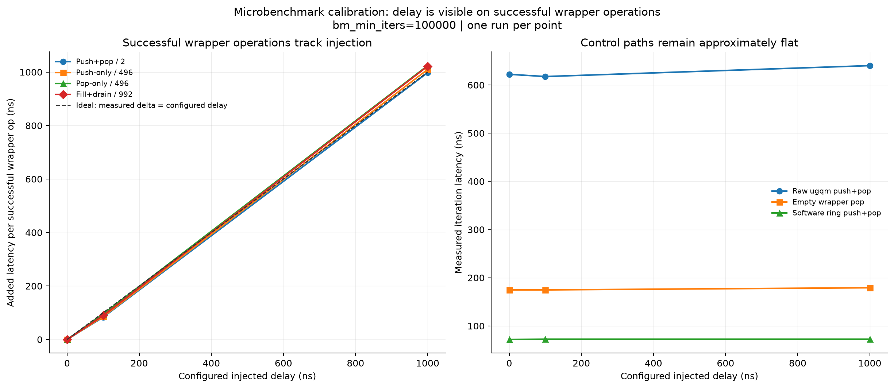

#### 结果

| Benchmark | 100ns 配置的实测增量 | 1000ns 配置的实测增量 |
| --- | ---: | ---: |
| push-only | 85.4ns/op | 1009.8ns/op |
| pop-only | 95.0ns/op | 1024.1ns/op |
| push+pop | 83.2ns/op | 997.7ns/op |
| fill+drain | 89.5ns/op | 1021.8ns/op |

`1us` 配置在四组 successful-operation 测试中均产生约 `1us/op` 的增量；raw ugqm 和
empty pop 基本不随配置变化。这说明后续 RPC sweep 的自变量确实进入了 successful
wrapper operation 的同步完成路径。

#### 证据边界

微基准只校准 delay knob，不说明一次 RPC 会执行多少次操作，也不证明端到端性能会按
primitive latency 等比例变化。注入结果还不能单独区分硬件 commit、firmware completion
与 wrapper result-ready 的内部时序。

### 4.2 实验二：RPC 负载区间与饱和拐点

#### 目的

先确定没有人工 delay 时 RPC 随 offered load 的变化，避免把一个已经接近饱和的测试点
误称为“正常低延迟 baseline”。

#### 设置

单线程 Ubmem `Unary64`、Poisson open loop，target QPS 从 `350` 扫至 `50K`；
`max_inflight=496`，warmup `3s`、measurement `15s`。

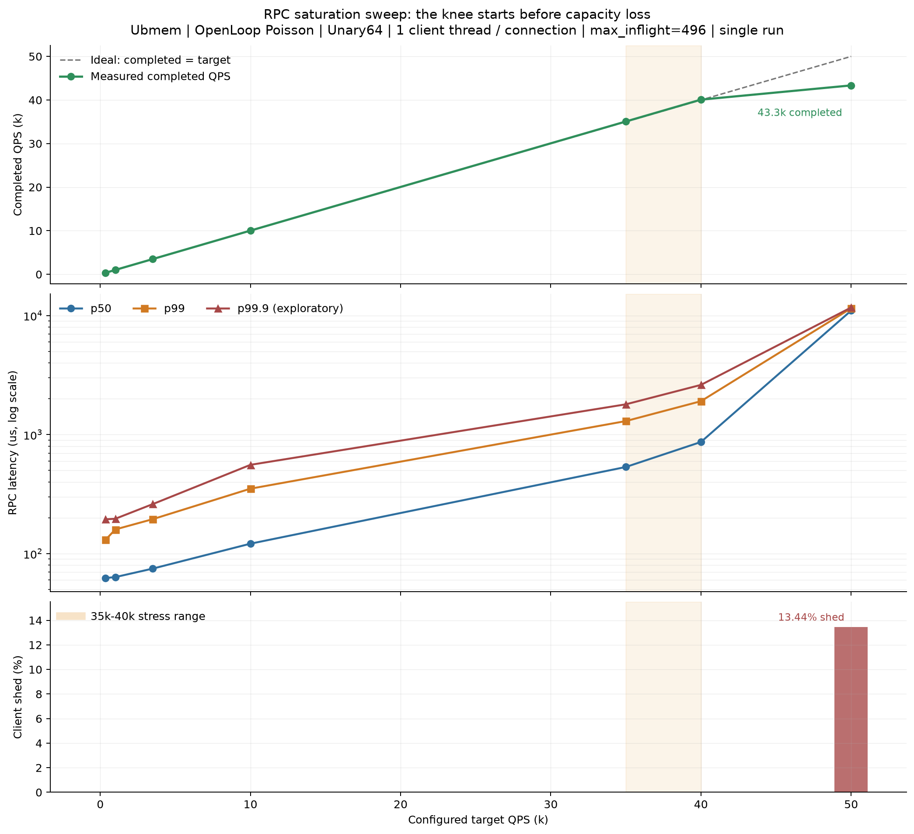

#### 结果

| Target QPS | Completed QPS | p50 | p99 | Shed |
| ---: | ---: | ---: | ---: | ---: |
| 350 | 350.2 | 62.39us | 130.53us | 0 |
| 10K | 10.03K | 121.17us | 351.24us | 0 |
| 35K | 35.07K | 534.48us | 1299.15us | 0 |
| 40K | 40.08K | 866.85us | 1908.29us | 0 |
| 50K | 43.35K | 11011.99us | 11517.64us | 13.44% |

35K 和 40K 尚能完成 offered load，但 p99 已分别达到约 `1.30ms` 和 `1.91ms`；50K
同时发生 latency cliff 和 shed。因此 35K 适合作为放大额外 service cost 的高压力锚点，
但不能代表低压力下的 RPC latency。

#### 证据边界

该 sweep 只有一次观测，机器、频率和精确 build provenance 不完整。它能划分本批实验的
负载区间，不能给出跨平台通用饱和 QPS。

### 4.3 实验三：单线程 open-loop successful-operation latency sweep

#### 目的

观察接近饱和时，同步 successful-operation 成本如何从直接响应延迟演化为排队悬崖和
capacity loss。

#### 设置

固定 35K target QPS，配置注入从 `0` 增至 `67us`。主指标同时保留 completed QPS、
p50、p99、p99.9 和 client shed。

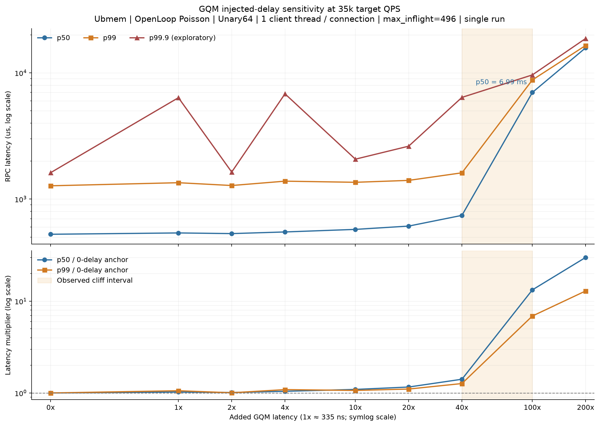

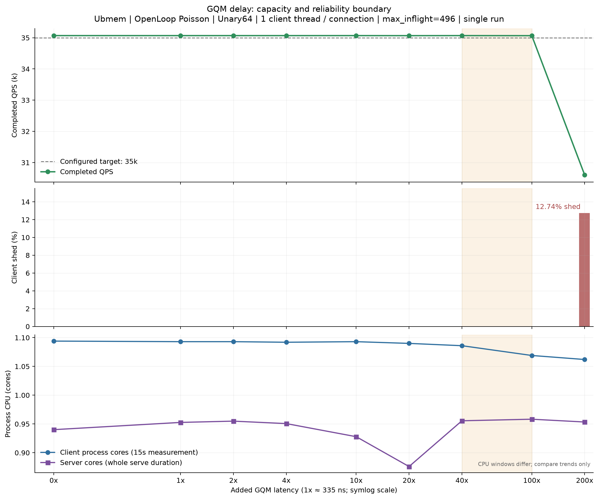

#### 结果

| 新增 operation latency | Completed QPS | p50 | p99 | Shed | 所处区间 |
| ---: | ---: | ---: | ---: | ---: | --- |
| 0 | 35.07K | 526us | 1274us | 0 | baseline |
| 13.4us | 35.07K | 743us | 1615us | 0 | 吞吐保持、latency 上升 |
| 33.5us | 35.07K | 6992us | 8784us | 0.006% | 排队悬崖 |
| 67us | 30.60K | 15781us | 16473us | 12.74% | capacity loss |

在 `0–13.4us` 区间，完成吞吐保持而响应延迟逐步增加；`13.4–33.5us` 之间，p50/p99
分别出现约 `9.4x/5.4x` 的相邻点跃升；到 `67us`，完成吞吐下降并出现明显 shed。
这一顺序说明，接近饱和时 p99 可以先于 QPS 计数暴露 capacity 不足。

#### 证据边界

`13.4–33.5us` 只能视为当前单次实验夹出的 cliff 区间，不能作为绝对硬件 latency
规格。若要收缩区间，需要增加中间点、交错 0-delay anchor 和至少三次重复。低 delay
处的 p99.9 非单调尖峰缺少 slow-request trace，本文不把它解释为硬件确定性响应。

### 4.4 实验四：fixed-outstanding 路径的 latency 暴露

#### 目的

在 saturated closed loop 中，用 `K/QPS` implied cycle 观察 delay 如何转化为 request
cycle，并比较不同 RPC 集成路径对同一 delay knob 的归一化敏感度。

#### 设置

- cpp2 Ubmem：`noop`，1 client，`K=100`，server 为 1 IO/1 CPU thread；
- VA FLAT Compressed Polling：`echo 1KiB`，1 client，`K=100`，server 为 1 IO/0 CPU
  thread；
- 两条路径均 sweep `0–67us`，每点一次观测。

两条路径的 workload、binary 和 CPU 配置不同，因此只比较各自 baseline-normalized
sensitivity，不比较绝对 QPS 或绝对 latency。

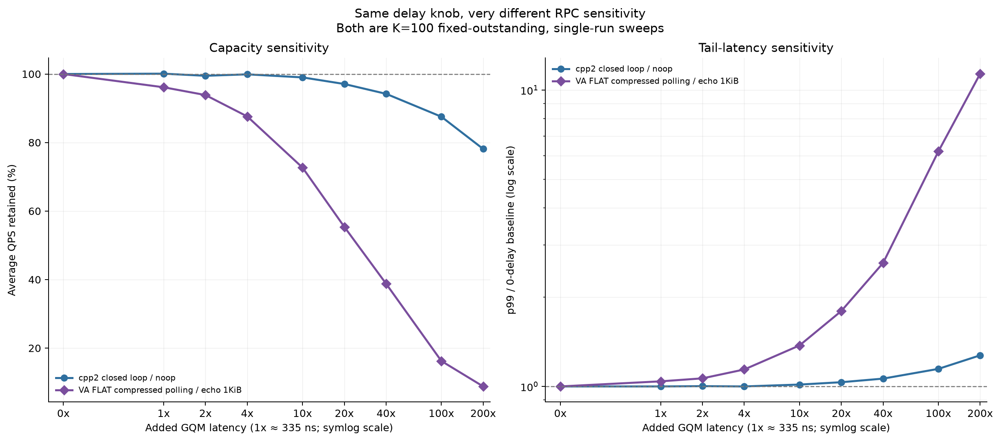

#### cpp2 结果

cpp2 的 implied cycle 可以拟合为：

```text
K/QPS cycle_us = 470.22 + 1.980 * injected_delay_us
R^2 = 0.9988
```

| 新增 latency | QPS retention | p99 / baseline | Effective exposure |
| ---: | ---: | ---: | ---: |
| 0.335us | 100.09% | 1.000x | 邻近噪声区间 |
| 13.4us | 94.21% | 1.063x | 2.16x |
| 67us | 78.13% | 1.273x | 1.97x |

该路径表现为平滑的 request-cycle 增长，没有 open-loop 式排队悬崖。

#### VA FLAT 结果

| 新增 latency | QPS retention | p99 / baseline | Effective exposure |
| ---: | ---: | ---: | ---: |
| 0.335us | 96.13% | 1.040x | 239.97x |
| 13.4us | 38.77% | 2.611x | 235.26x |
| 67us | 8.81% | 11.355x | 308.51x |

VA FLAT 从首个 `335ns` 点开始连续退化；其 effective exposure 在低中 delay 区间约为
`195–240x`，到 `33.5/67us` 约为 `308x`。两条路径对同一个 knob 的响应相差两个
数量级以上。

#### 证据边界

Effective exposure 定义为：

```text
(current K/QPS cycle - baseline K/QPS cycle) / injected delay
```

只有在“作用端点和方向已知、每次成功操作只注入一次、全部成本串行、内部工作量不随
delay 改变”时，它才可能接近 operation count。当前这些条件没有被验证。因此本文只把
`195–308x` 当作路径级敏感度，不能写成“一次 RPC 调用了 200–300 次 HWQueue”。

### 4.5 实验五：private queue-pair 多线程扩展

#### 目的

检查生产形态中每个 IO 线程独占一对 HWQueue 时，private queue pair 从 1 对扩展到 8 对
是否提前遇到 aggregate capacity 平台，以及 latency sensitivity 是否随 `N` 放大。

#### 设置

cpp2 Ubmem `echo 1KiB`，`N={1,2,4,8}`，每线程 outstanding
`K={8,16,32,64}`；`io_threads=cpu_threads=num_clients=N`，每个 client thread 使用
一条 connection。Phase A1 每个 cell 一次正式观测。

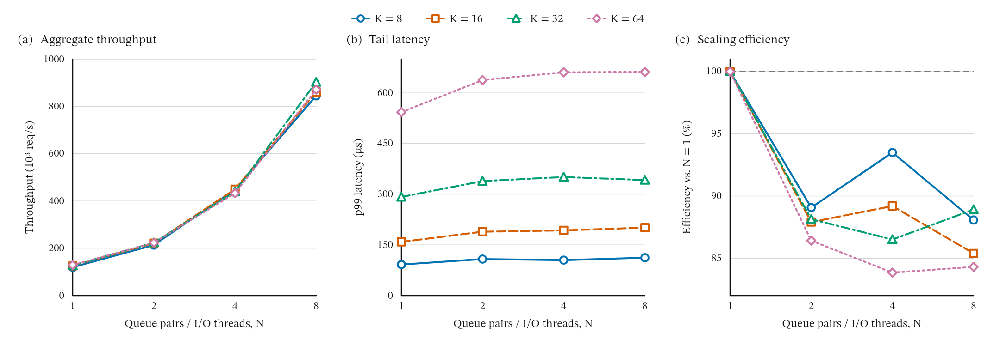

#### 结果

| `K` | QPS `N=1 -> 8` | 吞吐倍率 | N=8 scaling efficiency | p99 `N=1 -> 8` |
| ---: | ---: | ---: | ---: | ---: |
| 8 | 119.9K -> 844.8K | 7.046x | 88.1% | 92 -> 112us |
| 16 | 126.1K -> 861.4K | 6.831x | 85.4% | 159 -> 201us |
| 32 | 126.9K -> 902.7K | 7.113x | 88.9% | 292 -> 342us |
| 64 | 129.2K -> 871.4K | 6.745x | 84.3% | 543 -> 662us |

Aggregate QPS 到 `N=8` 仍持续增长，没有观察到硬平台；扩展效率为 `84.3–88.9%`，
固定 `K` 的 p99 增加 `17.1–26.4%`。最高吞吐点为 `N=8,K=32`，达到
`902.7K QPS`、p99 `342us`。

Outstanding 从 `K=8` 增至 `K=64` 时，吞吐变化只有 `-3.4%` 到 `+7.8%`，但 p99
明显增加。这说明当前 closed loop 中更大的 outstanding window 主要增加排队时间，未持续
转化为吞吐收益。

#### 证据边界

`N` 墠加时 thread、CPU resource 和 private queue pair 一起扩展，因此这是生产 bundle
的 RPC scale-out，不是单独扩展 HWQueue 数量的微基准。缺少 active queue mapping、
per-pair operation rate、fairness、occupancy 和 retry，不能把 `11.1–15.7%` 的线性效率
损失归因于 HWQueue。

### 4.6 实验六：多线程 successful-operation latency 敏感度

#### 目的

在 `N={1,8}` 和不同 outstanding 下为 client/server 两端的 successful `push/pop`
对称增加 delay，检查多队列是否放大单次 operation latency 的端到端影响。

#### 设置

沿用 cpp2 Ubmem `echo 1KiB` 路径，选择 `K={8,64}`，注入
`0/335/670/1675/3350/6700/13400ns`。每条曲线相对自己的 `0x` baseline 归一化。

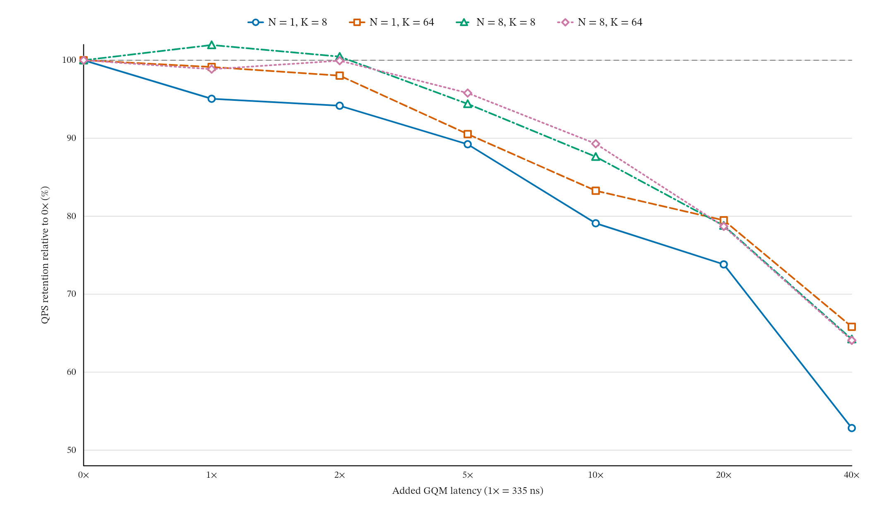

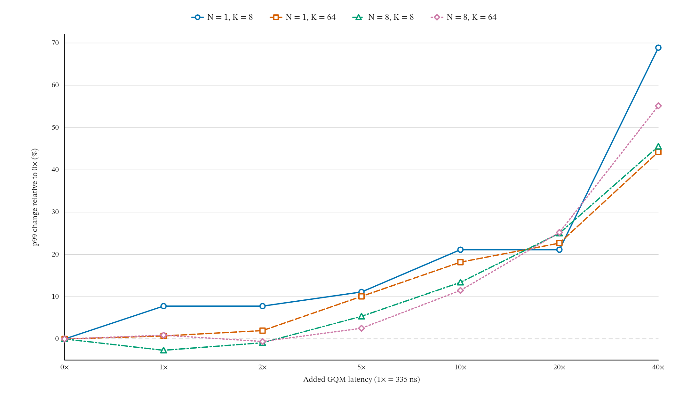

#### 结果

| 每次 successful operation 新增 latency | N=8 QPS 变化 | N=8 p99 变化 | 观察 |
| ---: | ---: | ---: | --- |
| 335–670ns | -1.1%–+1.9% | -2.7%–+0.9% | baseline 邻域 |
| 1.675us | -5.6%–-4.2% | +2.5%–+5.4% | 可见影响的过渡区 |
| 3.35us | -12.4%–-10.7% | +11.5%–+13.4% | 明确系统级影响 |
| 6.7us | -21.3%–-21.2% | +25.0%–+25.2% | 显著退化 |
| 13.4us | -35.9%–-35.8% | +45.5%–+55.1% | 严重退化 |

`N=8` 的归一化 sensitivity curve 没有比 `N=1` 更陡：例如 `3.35us` 时，N=8 QPS
retention 为 `87.6–89.3%`，而 N=1 为 `79.1–83.3%`。这批数据没有观察到
`N x latency` 型 amplification。

在条件假设“当前 successful operation latency 约为 `335ns`”下，可利用右侧减速曲线
粗略估计：将这一量级减半的端到端收益大概率低于 `1%`，理想化完全消除的收益约为
`0–2%`。这是从减速曲线向左外推的量级判断，不是实际更快硬件的 A/B。

#### 证据边界

当前确认的是**相对现有路径额外增加多少 latency 会产生影响**，不是 HWQueue 的绝对
latency specification。每点缺少重复，client/server 和 push/pop 使用同一个总 knob，
无法排序四种 operation 的独立硬件优先级。

### 4.7 实验七：open-loop 中的线程、负载与 capacity headroom

#### 目的

验证 closed-loop 结论在固定 offered load 下的表现形式，并区分“保持完成吞吐但响应变慢”
与“无法维持 offered load”。

#### 设置

Ubmem `Unary64`、Poisson open loop，包含 target-QPS、IO-thread 和 GQM-latency 三条一维
sweep。Latency sweep 固定 `N=1`、total target `40K QPS`。

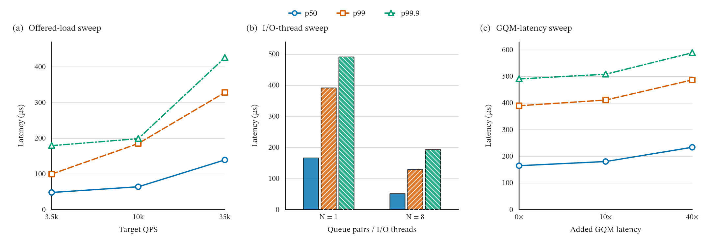

#### 结果

- `N=1,0x` 下，target 从 3.5K 增至 35K，p99 从 `99.82us` 增至 `328.33us`，
  completed QPS 仍跟随 target；
- 固定 total target 40K、`0x` 时，N=8 相比 N=1 将 p99 从 `391.83us` 降至
  `128.61us`，但 client CPU 从约 `1.1` cores 增至约 `8.1` cores；
- 固定 N=1、40K target 时，`0/3.35/13.4us` 三点均完成约 40K QPS，p99 从
  `390.42us` 增至 `411.76/487.31us`。

只要系统仍有 capacity headroom，额外 successful-operation delay 可以先表现为响应延迟
增加，而 completed QPS 继续跟随 offered load。这也解释了为什么 open-loop 测试不能只看
吞吐是否变化。

#### 证据边界

这三条是一维 exploratory sweep，不是完整的 `N x load x delay` interaction；server CPU
和 periodic QPS 未完整采集。N=8 与 N=1 也不是同 CPU budget 的效率 A/B。

### 4.8 实验八：极低负载 poll-idle 参数矩阵

#### 目的

在 350 QPS 的稀疏到达下，分开观察 empty-poll budget 和 sleep interval 对 CPU、p50 和
p99 的影响，为后续 notification 研究建立低负载闭环。

#### 设置

Poisson 350 QPS、64 B echo；empty-poll budget 为 `{0,16,128,1024}`，sleep interval
为 `{1,10,100,1000,10000}us`，共 20 个 idle 配置，另有 HOT POLL 与 TCP Socket
参考点。每点一次 15 秒观测。

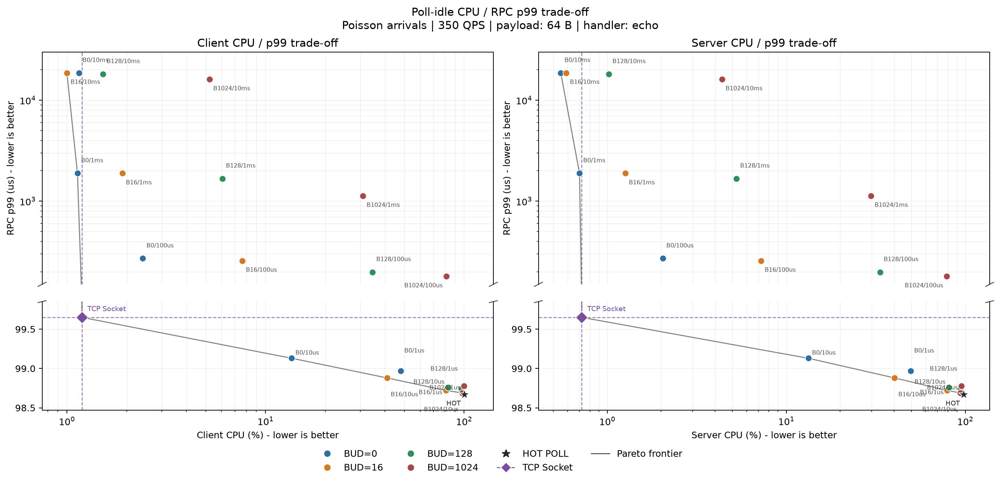

#### 结果

| 配置 | p50 | p99 | Client CPU | Server CPU |
| --- | ---: | ---: | ---: | ---: |
| HOT POLL | 32.35us | 98.67us | 100.25% | 97.75% |
| budget 0 / sleep 10us | 45.03us | 99.13us | 13.55% | 13.29% |
| budget 0 / sleep 100us | 133.35us | 270.72us | 2.41% | 2.04% |
| budget 0 / sleep 1ms | 1014.54us | 1887.58us | 1.13% | 0.70% |
| TCP Socket | 65.84us | 99.65us | 1.19% | 0.72% |

在 `sleep=10us` 下，budget 从 0 增至 1024，p99 只从 `99.13us` 变为 `98.69us`，
但两端 CPU 从约 `13%` 增至约 `94–98%`。Sleep interval 增至 `100us/1ms/10ms`
后，主要 latency regime 随之进入数百微秒和毫秒区间。

这组结果说明：低负载下 sleep interval 决定主要检测延迟区间，empty-poll budget 决定
进入 idle 前保留多少 active polling，并在该区间内继续移动 CPU-latency 取舍点。

#### 证据边界

Budget 是 empty-poll 次数，不是经过时间归一化的物理量；sleep interval 也是配置值，
不是 actual sleep duration。没有 time-to-idle、wakeup-to-poll 和 publish-to-detect timestamp
时，不能把配置值直接写成硬件唤醒延迟。

### 4.9 实验九：中高负载 periodic backoff 与 TCP 参考

#### 目的

检查 empty-poll backoff 的 CPU-p99-capacity 形状是否跨线程数和负载保持，并用 TCP
Socket 判断成熟 event-driven transport 是否能够进入 periodic backoff 尚未覆盖的区域。

#### 设置

Ubmem `Unary64` Poisson open loop，`N={1,8}`，每线程 target 为
`3.5K/10K/35K QPS`，通信两端使用相同 backoff interval
`0/10/100/1000/10000us`。每个 `(N,load)` 另有一个 TCP Socket reference，共 36 个
unique cells，每点一次正式观测。

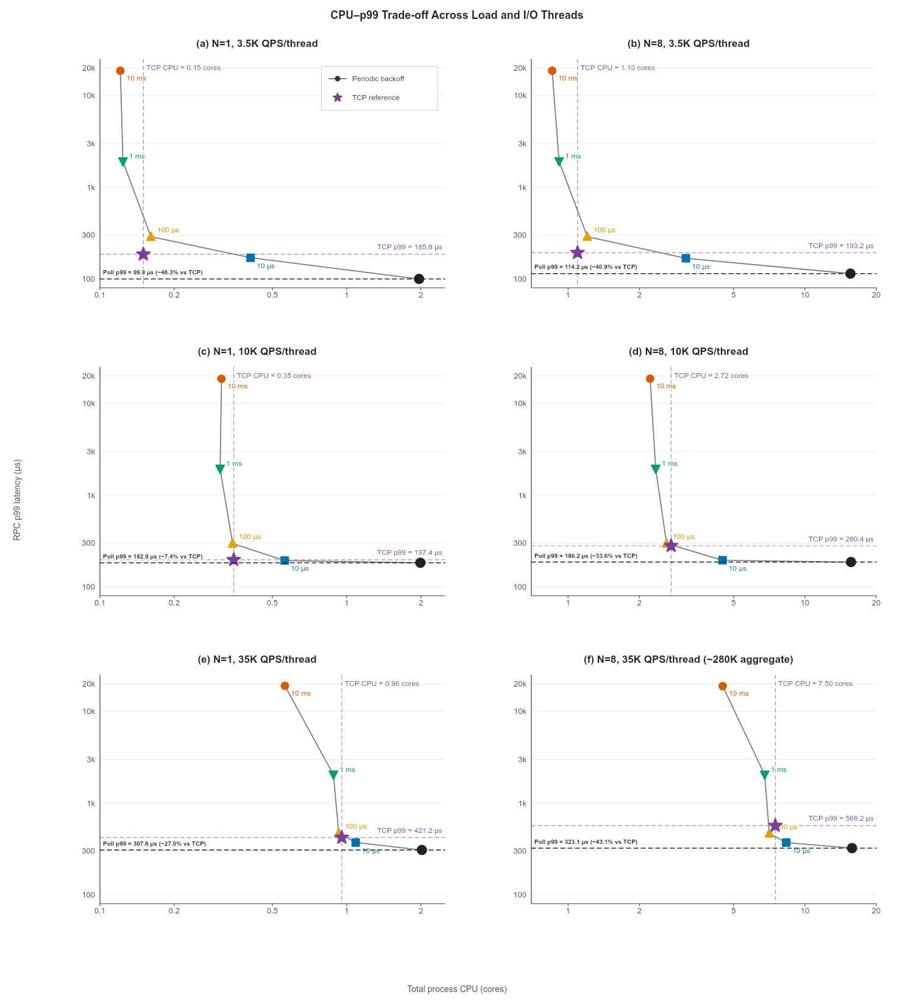

图中在六个负载与线程切片中均直接标出 Poll p99 及其相对 TCP 的降幅。最高已测负载
`N=8、35K QPS/thread`（约 `280K aggregate QPS`）下，Poll 为 `323.1us`，TCP 为
`568.2us`，Poll 的 p99 低 `43.1%`。
Poll 的 Total CPU 为 `15.813 cores`，高于 TCP 的 `7.498 cores`，因此这里突出的是
最低 p99 能力，而不是双指标优劣。二者均维持约 `280K QPS`；这是最高已测吞吐，不是
测得的 capacity ceiling。

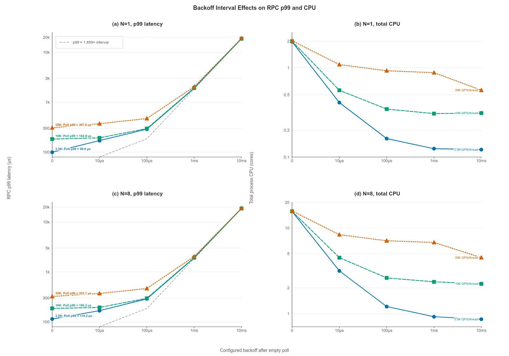

两个 p99 panel 均直接标出三档负载对应的 Poll p99。

#### Periodic backoff 的路径响应

- `10us` 在六个负载切片中均保持目标吞吐，Total CPU 相对 hot poll 下降
  `46.1–79.8%`；
- `1ms/10ms` 的 p50 分别接近 `1ms/10ms`，p99 接近 interval 的
  `1.9–2.0x`；
- 每线程 35K QPS、10ms backoff 时，N=1/N=8 的 completion ratio 均约为 `56.7%`。

如果 request 和 response 各自等待一个独立、近似均匀分布的检测周期，两个等待时间之和
的 p99 为：

```text
p99(W_request + W_response) = (2 - sqrt(0.02)) * T ~= 1.859 * T
```

其中 `T` 是配置的 backoff interval。观测结果与该简单模型一致，但没有内部 timestamp
证明实际实现一定沿这条时序执行。

#### TCP 与 Ubmem 的负载 crossover

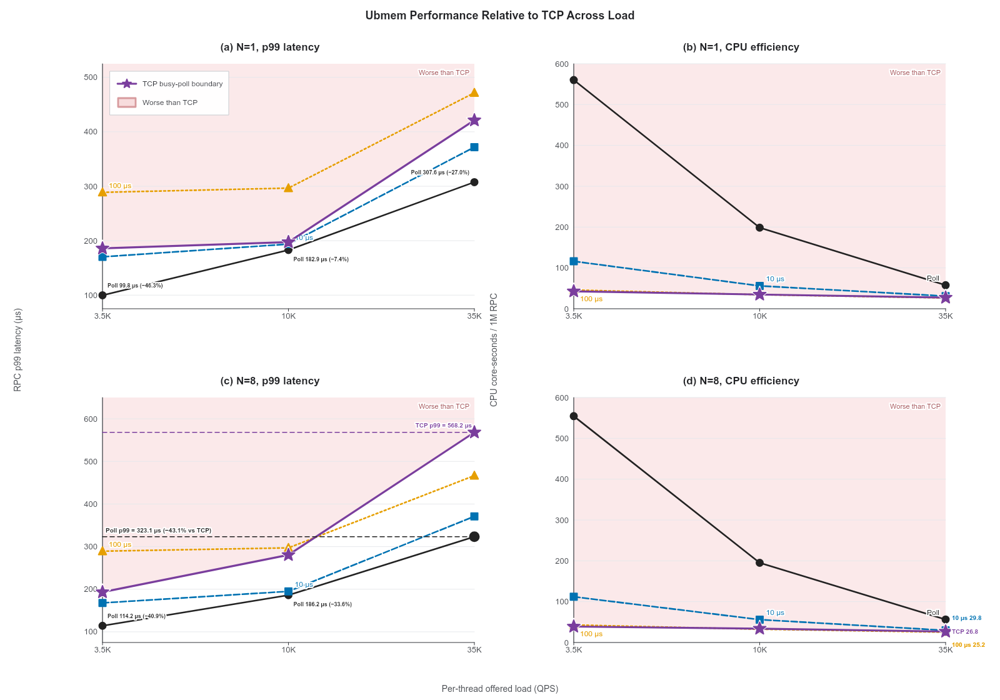

紫色五角星曲线是 TCP busy-poll 对照边界；浅红区域表示同一负载下 p99 或每百万 RPC
的 CPU cost 高于 TCP。Ubmem 的轮询策略和 backoff interval 直接标注在对应曲线上。
两个 p99 panel 均直接标出三档负载的 Poll p99 及其相对 TCP 的降幅；`N=8` 的最高负载
端点另以虚线标出 Poll 与 TCP 的 p99 绝对值，避免线性坐标轴压缩约 `280K QPS` 下的
差异。这些数值仍按相同 workload、线程数和 offered load 比较，不混用不同切片的独立
极值。最高负载下 Poll 的 `323.1us` 相对 TCP 的 `568.2us` 降低 `43.1%`；这里只突出
p99 单指标极值，不作双指标优劣判断。

| Load/thread | N | TCP：p99 / Total CPU | Ubmem 10us | Ubmem 100us |
| ---: | ---: | ---: | ---: | ---: |
| 3.5K | 1 | 185.8us / 0.150 cores | 170.3us / 0.408 | 288.8us / 0.161 |
| 3.5K | 8 | 193.2us / 1.097 cores | 167.9us / 3.144 | 289.3us / 1.206 |
| 10K | 1 | 197.4us / 0.349 cores | 193.7us / 0.561 | 296.6us / 0.345 |
| 10K | 8 | 280.4us / 2.724 cores | 195.0us / 4.492 | 297.1us / 2.606 |
| 35K | 1 | 421.2us / 0.956 cores | 371.8us / 1.088 | 471.7us / 0.929 |
| 35K | 8 | 568.2us / 7.498 cores | 371.1us / 8.335 | 466.7us / 7.077 |

低负载下，TCP 以接近长 backoff 的 CPU 达到接近短 backoff 的 p99；在
`N=8,35K QPS/thread` 时，Poll 的 p99 比 TCP 低 `43.1%`，但需要更高 CPU。这个
crossover 支持“空闲时 notification、繁忙时 polling”的负载分区，但 TCP 不是同一 Ubmem
路径上的 IRQ 实现。

#### Scale-out 形状

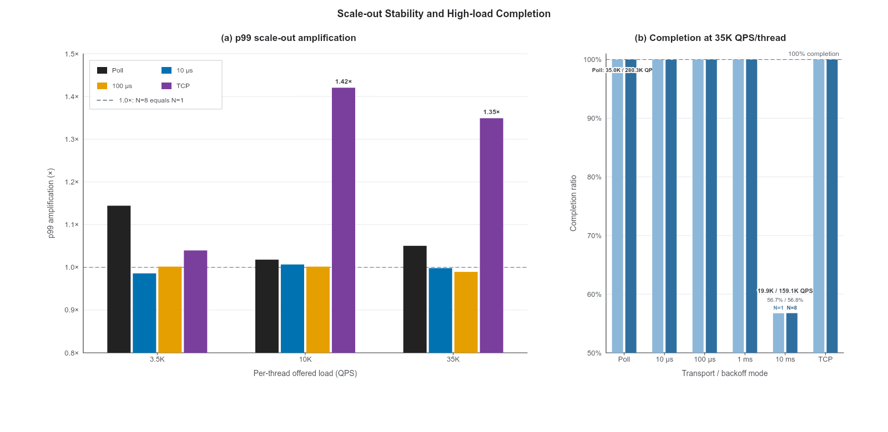

Panel (a) 的 `1.0x` 虚线不是 busy-poll baseline，而是
`p99(N=8)=p99(N=1)` 的无 scale-out amplification 参考线；Panel (b) 的虚线表示
`100%` completion，并直接标注 Poll 完成约 `35.0K/280.3K QPS`，而 `10ms` backoff
仅完成约 `19.9K/159.1K QPS`（`N=1/N=8`）。

Ubmem `10us/100us` 的 p99 `N=8/N=1` amplification 约为 `0.99–1.01x`；TCP 在每线程
10K/35K 时分别为 `1.42x/1.35x`。当前 private queue-pair backoff sensitivity 没有随
N 放大，但 TCP 参考在中高负载出现了多线程 tail amplification。

#### 证据边界

TCP 与 Ubmem 的 transport、协议栈、kernel involvement 和调度路径不同，因此不能把两者
差值当作 HWQueue IRQ 收益。各 cell 只有一次运行；process CPU 也不能定位 softirq、
scheduler 或 firmware 的具体成本。

### 4.10 实验十：IRQ latency break-even requirement

#### 目的

在没有真实 IRQ 数据时，用已经观测到的 hot-poll 与 periodic-backoff p99 差值，推导
notification 至少需要满足的端到端 latency 条件。

#### 方法

以 hot polling 作为不含周期检测等待的基线，定义：

```text
B_irq,round-trip(N, load, backoff)
  = p99(backoff) - p99(hot poll)
```

如果 request 和 response 两端 notification 合计增加的 p99 小于该值，则在近似可加模型
下，IRQ p99 有机会低于对应 backoff。若两端成本对称且每次 RPC 恰好触发两次
notification，单次 notification 预算为该值的一半。

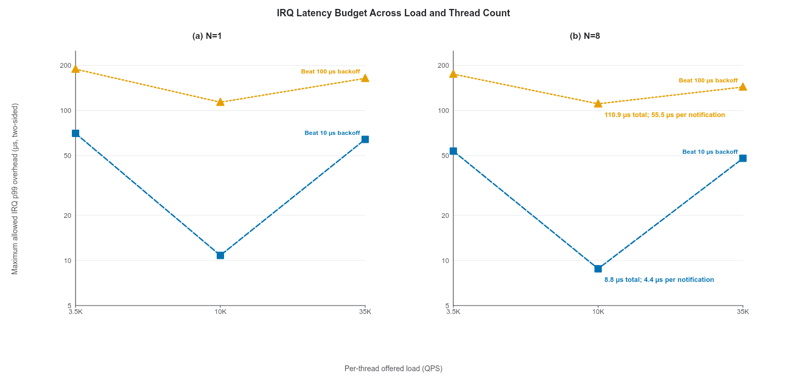

两条曲线名称直接标注在各面板右端；`N=8、10K QPS/thread` 处的文字给出全部已测切片中
最严格的双端预算及其对称两次 notification 假设下的单次预算。

#### 派生结果

| N | Load/thread | Beat 10us：双端 / 单次 | Beat 100us：双端 / 单次 |
| ---: | ---: | ---: | ---: |
| 1 | 3.5K | 70.5us / 35.3us | 189.0us / 94.5us |
| 1 | 10K | 10.8us / 5.4us | 113.7us / 56.9us |
| 1 | 35K | 64.2us / 32.1us | 164.1us / 82.0us |
| 8 | 3.5K | 53.7us / 26.9us | 175.1us / 87.6us |
| 8 | 10K | **8.8us / 4.4us** | **110.9us / 55.5us** |
| 8 | 35K | 48.0us / 24.0us | 143.6us / 71.8us |

若希望在全部已测切片中都获得比 10us backoff 更低的 p99，最严格的双端预算约为
`8.8us`；在“两端对称、两次 notification”的假设下约为 `4.4us/notification`。击败
100us backoff 的对应最严格预算约为 `110.9us` 双端、`55.5us/notification`。

#### 证据边界

这是由 p99 差值反推的 requirement，不是 IRQ 实测性能，也不是严格的随机变量分解。
当前还缺少 interrupt rate、CPU time/event、coalescing、arm-to-notify、notify-to-run 和
publish-to-detect 数据。`4.4us` 是覆盖全部切片的最严格条件，不应未经负载分区直接升级
为所有运行状态都必须满足的单一硬件规格。

## 5. 跨实验综合

### 5.1 已有数据直接支持的事实

1. `gqm_inject_cost_ns` 能近似线性地增加 successful wrapper operation 的同步完成成本；
2. 在 private queue-pair、N<=8 的当前点附近，小幅新增 operation latency 尚未形成稳定的
   QPS/p99 恶化；
3. 多微秒额外 operation latency 会带来明确的吞吐和尾延迟退化；接近饱和时会进一步被
   排队放大；
4. N=1 到 N=8 的 aggregate QPS 继续增长，但扩展效率为 84.3–88.9%，且 p99 有
   17.1–26.4% 增长；
5. 固定周期 backoff 明确降低空轮询 CPU，同时增加 detection latency；过长 interval 会
   损失 capacity；
6. TCP event-driven reference 在低负载覆盖了 periodic backoff 尚未达到的 CPU-p99
   区域，但在多线程高负载不再保持整体优势。

### 5.2 当前最值得保留的跨实验推断

1. **当前 successful-operation 平均 latency 不是 private-pair scale-out 损失的充分
   解释。** 多线程 sensitivity 没有放大，继续压低当前量级 latency 也无法解释
   `11.1–15.7%` 的线性效率损失。
2. **路径暴露量或串行依赖可能比 primitive latency 更关键。** VA FLAT 的 effective
   exposure 比 cpp2 高两个数量级；无论最终来源是 operation count 还是二级串行化，都
   指向路径级 counter、batching、coalescing 和依赖链分析。
3. **HWQueue 需要同时服务两个不同 regime。** 空闲时需要快速且低 CPU 的事件通知；持续
   繁忙时需要低开销 polling、notification suppression 和稳定的 aggregate capacity。
4. **硬件规格不能只有平均 latency。** 下一轮至少需要 operation latency distribution、
   service rate、queue occupancy、full/retry/stall、per-queue fairness 和 notification
   latency/CPU cost。

### 5.3 当前尚不能证明的命题

- 真实 HWQueue IRQ 已经达到 RPC 要求；
- IRQ 的 CPU-p99 取舍一定优于 TCP Socket；
- VA FLAT 每个 RPC 确实调用 200–300 次 successful GQM operation；
- 当前 N=8 scale-out 损失来自 HWQueue shared pipeline；
- push 与 pop 具有相同硬件成本，或其中某一个方向一定更值得优化；
- 当前结果适用于 shared HWQueue、其他 payload、其他 arrival process、跨 NUMA 或其他
  firmware 版本。

## 6. 对下一代 HWQueue 的阶段性建议

### 6.1 优先级

| 优先级 | 硬件能力 | 现有依据 | 需要补齐的验证 |
| --- | --- | --- | --- |
| P0 | 高负载 service rate、latency 上界与稳定性 | 已观察到多微秒退化和 open-loop capacity cliff | occupancy/full/retry/stall 与 firmware tail counter |
| P0 | Empty-to-nonempty notification | 低负载 polling/backoff 存在显著 CPU-p99 冲突 | 同 Ubmem 路径真实 IRQ A/B |
| P0 | Arm/recheck 与 lost-wakeup-safe 语义 | notification 必须能安全替代空轮询窗口 | 功能验证与端到端 timestamp |
| P1 | Notification suppression/coalescing | 高负载 polling 路径重新占优 | burst、event rate、CPU/event、coalescing window |
| P1 | Per-queue affinity 和独立可观测性 | 生产形态为每 IO 线程独占 queue pair | N=1/2/4/8/16 IRQ scale-out |
| P1 | Successful/empty push/pop counter、queue watermarks | 当前无法解释 effective exposure 与 capacity cliff | per-RPC、per-direction、per-endpoint 计数 |
| P2 | 继续降低当前 successful-operation 平均 latency | 当前点附近端到端收益预计有限 | 真实更快硬件点或更高暴露 workload |
| 研究项 | Shared HWQueue arbitration | 当前没有共享队列实现 | contention、fairness、cacheline 和 scheduler 研究 |

### 6.2 建议的接口能力

下一代接口不应只提供“poll 或 IRQ”二选一，而应至少考虑：

1. queue 从确认 empty 到 nonempty 时产生 notification；
2. 软件能够 arm notification、重新检查 queue，并在竞争情况下避免 lost wakeup；
3. queue 持续 active 时支持 notification suppression 或 coalescing；
4. notification 可按 queue 绑定到对应 IO core；
5. 软件可读取 successful/empty operation、notification、suppression、occupancy、full、
   retry、stall 和 latency histogram；
6. polling 与 notification 状态转换应有明确的 memory-ordering 和 completion 语义。

预期的软件策略是：

```text
idle or sparse arrivals  -> arm notification and park
sustained activity       -> suppress notification and poll
transition               -> recheck queue and use hysteresis
```

## 7. 后续实验与研究方法

### 7.1 首要实验：真实 IRQ 同路径 A/B

保持 Ubmem transport、queue mapping、payload、offered load、CPU allocation 和 binary
一致，只改变等待机制：

```text
Ubmem hot poll
Ubmem periodic backoff: 10us, 100us
Ubmem HWQueue notification/IRQ
TCP Socket reference
```

沿用 `N={1,8}` 和每线程 `{3.5K,10K,35K QPS}`，每个 cell 至少执行三次交错重复。
除 QPS、p50/p99/p99.9 和两端 CPU 外，必须记录：

- notification count 与 suppressed count；
- arm-to-notify、notify-to-run、publish-to-detect；
- CPU time/notification 和 context-switch/IRQ count；
- hybrid mode 中的 polling/armed/parked 时间比例；
- burst 下的 coalescing batch size 和 wakeup amplification。

只有这组实验才能判断 IRQ 是否达到要求，并确定 hybrid 切换阈值。

### 7.2 Operation latency 与路径暴露分解

在相同 workload、payload 和 CPU 配置下，分别配置：

```text
client push only
client pop only
server push only
server pop only
all directions symmetric
```

同时记录 successful/empty operation per RPC，并 sweep `K={1,8,32,100}`。分析目标不是
简单排名 push/pop，而是判断：

- 哪一端、哪一方向真正串行暴露到 request critical path；
- VA FLAT 的 effective exposure 是否对应真实调用密度；
- batching/coalescing 能否比降低单次 latency 提供更大收益；
- `pop_empty` 是否只影响 CPU，还是也进入 latency critical path。

### 7.3 Queue capacity、depth 与 backpressure

固定 operation latency，独立 sweep queue depth 和 per-pair offered load；记录 occupancy
distribution、high-watermark、full/retry/stall、service rate 和 shed。至少覆盖：

- steady Poisson load；
- microburst 和 on/off burst；
- request/response 不对称；
- N=1/2/4/8 private pairs；
- hardware/firmware pipeline 接近 aggregate capacity 的区间。

研究目标是把“RPC latency cliff”从现象收缩为 queue service-rate、depth 还是软件排队
导致的机制，并反推出下一代 queue depth 与 aggregate service-rate budget。

### 7.4 多队列与未来 shared queue

Private-pair 主结论先补 N=2/4 的 delay interaction、N=16 单 NUMA 可行点、per-pair
fairness 和 active mapping。Shared queue 在实现可用后单独建实验，不与 private-pair
数据直接合并，重点测量：

- producer/consumer contention；
- fairness 和 head-of-line blocking；
- cacheline bouncing 与 firmware arbitration；
- notification fan-out、affinity 和 thundering herd；
- shared queue depth 如何随线程数分配。

## 8. 证据状态与引用

本文没有新增实验点。各结论对应的长期记录为：

- `EDR-0002`，`INCONCLUSIVE`：GQM injected-delay open-loop sweep；
- `EDR-0003`，`INCONCLUSIVE`：fixed-outstanding 路径敏感度；
- `EDR-0004`，`RUNNING`：private queue-pair 多线程扩展；
- `EDR-0005`，`RUNNING`：empty-poll backoff open-loop 敏感度。

专项报告和数据：

- [GQM 注入延迟对 RPC 路径的影响](../gqm_injected_delay_sweep/README.md)
- [GQM 私有队列对 RPC 扩展性及成功操作时延敏感性](../gqm_private_queue_pair_scaling/GQM_PRIVATE_QUEUE_PAIR_RPC_SCALING_AND_LATENCY_SENSITIVITY.md)
- [GQM 独占 queue pair 的实验记录](../gqm_private_queue_pair_scaling/README.md)
- [Poll-idle 在 Poisson 350 QPS 下的 CPU-尾延迟取舍](../poll_idle_poisson_350qps/README.md)
- [Empty-Poll Backoff 与 TCP Event-Driven Transport 对比](../poll_idle_openloop_load_and_thread_scaling/README.md)

## 9. 图片检查顺序

正文完成后，图片按以下顺序逐张审查。检查目标包括：标题是否只保留研究问题、图例是否
使用完整且直观的名称、轴单位和倍率是否清楚、标注是否遮挡、字体和线型是否符合论文
风格，以及图中是否误把派生量写成实测硬件指标。

1. RPC load and saturation response；
2. Open-loop GQM latency sensitivity 与 capacity boundary；
3. Fixed-outstanding path sensitivity；
4. Private queue-pair RPC scale-out；
5. Closed-loop QPS/p99 sensitivity；
6. Open-loop workload slices；
7. Low-load CPU-p99 trade-off；
8. Backoff interval response；
9. TCP and Ubmem load crossover；
10. Backoff scale-out and capacity；
11. IRQ latency break-even requirement；
12. Microbenchmark calibration。

当前 `figures/` 中保存的是专项报告既有 PNG 的工作副本，用于保证 Markdown 预览能够在
报告目录内直接解析。图片审查完成后，再决定哪些图原样保留、哪些图需要重画、哪些可以
合并为一张多 panel 图；专项报告中的原始图片和绘图脚本仍是现阶段的 source of truth。
