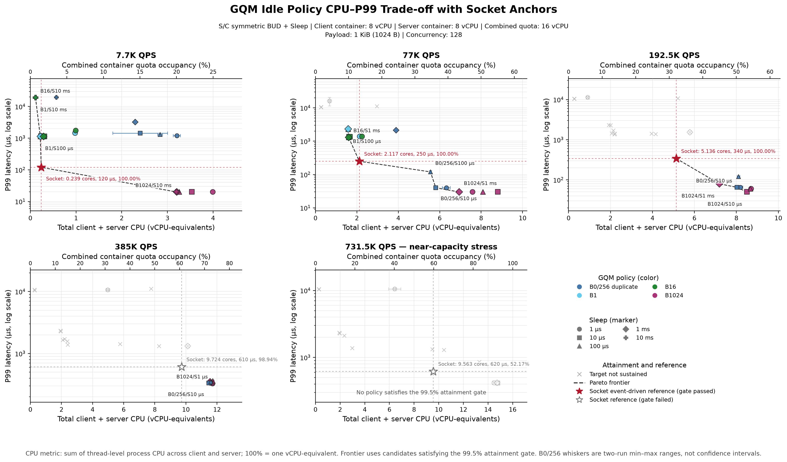
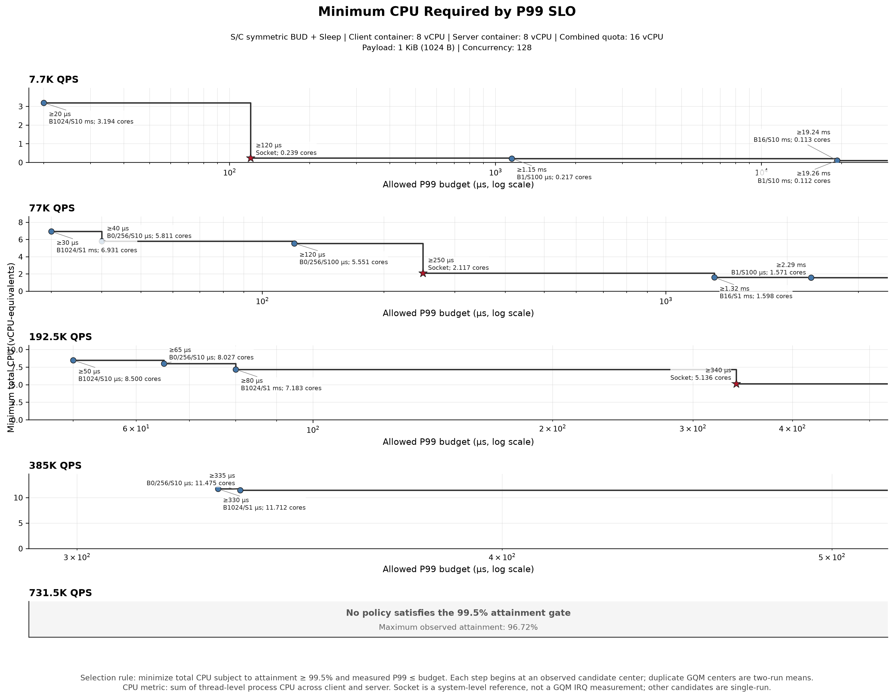

# Netpoll GQM Idle 策略的负载敏感性

## 基本结论

本报告保留 `5 QPS × 5 BUD × 5 Sleep` 的 125 个 GQM 原始配置，并加入同一
`Concurrency=128`、`Payload=1 KiB` 下的 5 个 Netpoll Socket 锚点。Socket 在
`7.7K/77K/192.5K` 三档维持目标，在 `385K` 只达到 `98.94%`，在 `731.5K` 只达到
`52.17%`。因此它能补充低中负载下的事件驱动 CPU–P99 参照，但不能覆盖高负载 capacity。

用户确认 `BUD=0` 与 `BUD=256` 因配置失误实际执行的是同一个策略。两组结果仍逐行保留，
但联合 Pareto 和 P99-SLO 边界将它们视为每个 `QPS × Sleep` 的两次重复：中心取均值，
whisker 显示两次 min–max，且两次都达到 `99.5%` 才进入合格候选。这个修正删除了此前由
重复波动造成的伪策略切换。

这批结果仍不等价于 GQM IRQ A/B。Socket 是系统级事件驱动参考，包含不同 transport 与
software stack；它能显示“现有软件 idle 与事件驱动路径之间仍有取舍空间”，但不能直接
量化 GQM 增加 IRQ 后的收益或规格。

## 实验矩阵与口径

| 维度 | 取值 |
|---|---|
| Target QPS | `7.7K, 77K, 192.5K, 385K, 731.5K` |
| BUD | `0, 1, 16, 256, 1024` |
| Sleep | `1us, 10us, 100us, 1ms, 10ms` |
| 策略应用 | Server/Client 对称使用相同 BUD 与 Sleep |
| Client 容器 | `8 vCPU` |
| Server 容器 | `8 vCPU` |
| 合计容器配额 | `16 vCPU` |
| Concurrency | `128` |
| Payload | `1024 B` |
| 完整性 | `124` 个完整点，`1` 个部分点 |
| Socket 对照 | 同五档 target QPS，各 `1` 次结果 |

图表把原始重复 tuple 压缩为单值 `BUD` 和 `Sleep`。其中 `BUD=0/256` 是同一有效配置的
两次重复，不再作为两个策略比较。派生指标为：

```text
Attainment (%) = TPS / Target QPS × 100
Total CPU (%)  = Client CPU + Server CPU
Used cores     = Total CPU / 100
QPS/core       = TPS / Used cores
Quota use (%)  = Used cores / 16 × 100
```

当 `Attainment >= 99.5%` 且 latency/CPU 字段完整时，记为 `target sustained`。这里的
`used cores` 是 Client 与 Server 进程内所有线程累计 CPU 时间折算出的
vCPU-equivalents；它不是单个线程的占用，也不能据此判断物理核、SMT sibling 或线程间
分布。重复点的 min–max 只表示两次观测范围，不是置信区间；其他 GQM 候选和 Socket
均为单次结果。

## GQM 原始矩阵的负载级汇总

| Target QPS | 完整点 | 维持目标 | 最大 TPS | 最大 Attainment | p99 范围 | Total CPU 范围 |
|---:|---:|---:|---:|---:|---:|---:|
| 7.7K | 25 | 25 | 7.7K | 100.00% | 20us–19.45ms | 0.112–3.993 cores |
| 77K | 25 | 20 | 77.0K | 100.00% | 30us–20.59ms | 0.268–8.809 cores |
| 192.5K | 25 | 10 | 192.5K | 100.00% | 50us–11.31ms | 0.268–8.696 cores |
| 385K | 25 | 10 | 384.3K | 99.82% | 330us–11.07ms | 0.266–11.726 cores |
| 731.5K | 24+1 partial | 0 | 707.5K | 96.72% | 410us–10.58ms | 0.269–14.820 cores |

### `BUD=0/256` 偶然重复的一致性

25 对 `(QPS, Sleep)` 的 gate 分类全部一致：15 对共同通过，10 对共同未通过。在共同通过
的 15 对中，以两次均值为分母计算对称相对差：

| 指标 | 中位数 | P90 | 最大值 | 解释 |
|---|---:|---:|---:|---|
| TPS | 0.00% | 0.05% | 0.10% | 吞吐与 gate 高度可重复 |
| P99 | 0.76% | 15.38% | 16.67% | 绝对差中位数为 10us，受计量粒度影响 |
| Total CPU | 1.56% | 6.85% | 50.03% | 最大点为 `7.7K/S10us` 的 `3.006 vs 1.803 cores` |
| P99.9 | 2.93% | 113.58% | 132.47% | 极端尾部单次波动大，不应用于精细策略排序 |

去掉 `7.7K/S10us` 这一 CPU 离群对后，其余共同通过点的 CPU 相对差均值为 `2.46%`、最大
为 `6.85%`。因此，这批偶然重复足以证明 `BUD=0/256` 不应被解释为两个性能策略，并支持
TPS/gate 的重复性；它不支持把低负载 CPU 或 p99.9 的细小差异写成稳定结论。

## 1. S/C 对称配置的 CPU–P99 取舍



下方横轴是两端线程级进程 CPU 之和折算的 vCPU-equivalents；上方横轴是相对两端合计
`16 vCPU` 配额的占用率。彩色 GQM 点和实心 Socket 五角星满足 99.5% gate；灰色标记
未满足。`B0/256` 点的横纵 whisker 是两次重复的 CPU/P99 min–max。黑色虚线连接 GQM
与合格 Socket 的联合 Pareto frontier。

Socket 五个锚点的原始结果为：

| Target | TPS | Attainment | p99 | p99.9 | Total CPU | 边界资格 |
|---:|---:|---:|---:|---:|---:|:---:|
| 7.7K | 7.7K | 100.00% | 120us | 570us | 0.239 cores | Yes |
| 77K | 77.0K | 100.00% | 250us | 400us | 2.117 cores | Yes |
| 192.5K | 192.5K | 100.00% | 340us | 740us | 5.136 cores | Yes |
| 385K | 380.9K | 98.94% | 610us | 1.23ms | 9.724 cores | No |
| 731.5K | 381.6K | 52.17% | 620us | 1.21ms | 9.563 cores | No |

直接观察如下：

- `7.7K`：Socket 的 `0.239 cores / 120us` 填补了 GQM 软件 idle 的明显空档；相较
  `B1024/S10ms` 的 `3.194 cores / 20us`，它降低 `2.955 cores`，代价是 p99 增加
  `100us`。若允许约 `1.15ms`，GQM `B1/S100us` 又以 `0.217 cores` 略低于 Socket。
- `77K`：Socket 的 `2.117 cores / 250us` 进入联合 frontier；它比 `B0/256/S100us`
  重复均值少用 `3.435 cores`，但 p99 从 `120us` 增至 `250us`。
- `192.5K`：Socket 的 `5.136 cores / 340us` 进入联合 frontier；它比
  `B1024/S1ms` 少用 `2.047 cores`，但 p99 从 `80us` 增至 `340us`。
- `385K`：Socket 的 CPU 较低，但 attainment 只有 `98.94%`，未达到 gate，因此只能
  作为 capacity 锚点；合格 GQM frontier 为 `B1024/S1us @ 11.712 cores/330us` 和
  `B0/256/S10us` 两次均值 `11.4745 cores/335us`。
- `731.5K`：GQM 与 Socket 都未达到目标；GQM 最高为 `707.5K TPS/96.72%`，Socket 为
  `381.6K TPS/52.17%`，不构造等吞吐 CPU–P99 frontier。

## 2. P99 SLO 对应的最低 CPU 策略边界



第二张图把 Pareto 点转成可执行选择规则：给定 target QPS 和允许的 P99 budget，在满足
`Attainment >= 99.5%` 且实测 `p99 <= budget` 的点中选择 Total CPU 最低者。

```text
BestPolicy(QPS, P99_budget)
= argmin TotalCPU(policy)
  subject to attainment >= 99.5%
             p99 <= P99_budget
```

边界区间采用左闭右开语义，最后一段延伸到更宽松的 P99 budget：

| Target | P99 budget 区间 | 最低 CPU 策略 | Total CPU | 配额占用 |
|---:|---:|---|---:|---:|
| 7.7K | `[20us, 120us)` | `BUD=1024, Sleep=10ms` | 3.194 cores | 19.962% |
| 7.7K | `[120us, 1.15ms)` | `Socket` | 0.239 cores | 1.494% |
| 7.7K | `[1.15ms, 19.24ms)` | `BUD=1, Sleep=100us` | 0.217 cores | 1.356% |
| 7.7K | `[19.24ms, 19.26ms)` | `BUD=16, Sleep=10ms` | 0.113 cores | 0.706% |
| 7.7K | `>=19.26ms` | `BUD=1, Sleep=10ms` | 0.112 cores | 0.700% |
| 77K | `[30us, 40us)` | `BUD=1024, Sleep=1ms` | 6.931 cores | 43.319% |
| 77K | `[40us, 120us)` | `BUD=0/256 repeat mean, Sleep=10us` | 5.8115 cores | 36.322% |
| 77K | `[120us, 250us)` | `BUD=0/256 repeat mean, Sleep=100us` | 5.5515 cores | 34.697% |
| 77K | `[250us, 1.32ms)` | `Socket` | 2.117 cores | 13.231% |
| 77K | `[1.32ms, 2.29ms)` | `BUD=16, Sleep=1ms` | 1.598 cores | 9.988% |
| 77K | `>=2.29ms` | `BUD=1, Sleep=100us` | 1.571 cores | 9.819% |
| 192.5K | `[50us, 65us)` | `BUD=1024, Sleep=10us` | 8.500 cores | 53.125% |
| 192.5K | `[65us, 80us)` | `BUD=0/256 repeat mean, Sleep=10us` | 8.027 cores | 50.169% |
| 192.5K | `[80us, 340us)` | `BUD=1024, Sleep=1ms` | 7.183 cores | 44.894% |
| 192.5K | `>=340us` | `Socket` | 5.136 cores | 32.100% |
| 385K | `[330us, 335us)` | `BUD=1024, Sleep=1us` | 11.712 cores | 73.200% |
| 385K | `>=335us` | `BUD=0/256 repeat mean, Sleep=10us` | 11.4745 cores | 71.716% |

边界使用重复候选的中心均值，min–max whisker 不参与保守放大；因此它仍只是当前离散观测
的描述性规则，不是生产参数或带统计置信度的阈值。Socket 只有前三档通过 gate 并进入
边界；后两档只作为无法维持目标吞吐的 capacity 参考。

## 第一阶段解释

1. 事件驱动 Socket 在低中负载确实进入联合 frontier：相比紧轮询/浅 idle，它用更高 p99
   换取更低 CPU；相比深 idle，它又能给出更低 p99，但不总是最低 CPU。
2. 到 `385K`，Socket 已不能通过相同 attainment gate；GQM 仍能接近目标，但代价是
   `11.47–11.71` 个两端合计 vCPU-equivalents。到 `731.5K`，两者都无法维持目标。
3. 这构成了研发 GQM IRQ 的动机：期望在低中负载接近事件驱动 CPU，同时保持 GQM 在高
   负载的 capacity 优势；但该目标必须由同一 GQM transport 的 polling/IRQ A/B 验证。
4. `BUD=0/256` 的偶然重复显示：TPS/gate 具有较好一致性，但部分低负载 CPU 和 p99.9
   波动明显。当前两次重复足以纠正“两个策略”的误读，不足以给出统计误差界。

## 数据与复现

```bash
uv run pytest -q
uv run python src/netpoll_gqm_idle_analysis.py \
  --data data/netpoll_gqm_idle_load_sensitivity.csv \
  --socket-data data/netpoll_socket_qps_baseline.csv \
  --derived-output data/netpoll_gqm_idle_load_sensitivity_derived.csv \
  --summary-output data/netpoll_gqm_idle_load_sensitivity_summary.csv \
  --candidate-output data/netpoll_idle_tradeoff_candidates.csv \
  --policy-boundary-output data/netpoll_gqm_idle_policy_boundaries.csv \
  --figure-dir figures
```

- [GQM 原始文本](data/raw/netpoll_gqm_idle_load_sensitivity.txt)
- [GQM 规范化 125 点](data/netpoll_gqm_idle_load_sensitivity.csv)
- [Socket 原始文本](data/raw/netpoll_socket_qps_baseline.txt)
- [Socket 规范化 5 点](data/netpoll_socket_qps_baseline.csv)
- [逐点派生数据](data/netpoll_gqm_idle_load_sensitivity_derived.csv)
- [负载级汇总](data/netpoll_gqm_idle_load_sensitivity_summary.csv)
- [联合候选与重复范围](data/netpoll_idle_tradeoff_candidates.csv)
- [P99 SLO 策略边界](data/netpoll_gqm_idle_policy_boundaries.csv)
- [来源与缺失字段](data/SOURCE.md)

## GQM 完整结果表

下表按 `Target QPS → BUD → Sleep` 排列。最后一行仅保留附件中实际存在的字段。

| # | Target | BUD | Sleep | TPS | Attainment | p99 | p99.9 | Client CPU | Server CPU | Total cores | Gate |
|---:|---:|---:|---:|---:|---:|---:|---:|---:|---:|---:|:---:|
| 1 | 7.7K | 0 | 1us | 7.7K | 100.00% | 1.20ms | 1.78ms | 156.2% | 172.5% | 3.287 | Yes |
| 2 | 7.7K | 0 | 10us | 7.7K | 100.00% | 1.38ms | 1.79ms | 135.8% | 164.8% | 3.006 | Yes |
| 3 | 7.7K | 0 | 100us | 7.7K | 100.00% | 1.31ms | 1.97ms | 127.6% | 151.0% | 2.786 | Yes |
| 4 | 7.7K | 0 | 1ms | 7.7K | 100.00% | 3.24ms | 3.27ms | 103.9% | 125.4% | 2.293 | Yes |
| 5 | 7.7K | 0 | 10ms | 7.7K | 100.00% | 19.32ms | 20.43ms | 26.3% | 32.6% | 0.589 | Yes |
| 6 | 7.7K | 1 | 1us | 7.7K | 100.00% | 1.46ms | 2.07ms | 41.3% | 56.4% | 0.977 | Yes |
| 7 | 7.7K | 1 | 10us | 7.7K | 100.00% | 1.16ms | 1.21ms | 12.7% | 10.7% | 0.234 | Yes |
| 8 | 7.7K | 1 | 100us | 7.7K | 100.00% | 1.15ms | 2.16ms | 11.7% | 10.0% | 0.217 | Yes |
| 9 | 7.7K | 1 | 1ms | 7.7K | 100.00% | 1.15ms | 2.17ms | 11.9% | 10.0% | 0.219 | Yes |
| 10 | 7.7K | 1 | 10ms | 7.7K | 100.00% | 19.26ms | 20.23ms | 11.2% | 0.0% | 0.112 | Yes |
| 11 | 7.7K | 16 | 1us | 7.7K | 100.00% | 1.75ms | 2.24ms | 41.6% | 57.6% | 0.992 | Yes |
| 12 | 7.7K | 16 | 10us | 7.7K | 100.00% | 1.15ms | 1.18ms | 16.9% | 14.1% | 0.310 | Yes |
| 13 | 7.7K | 16 | 100us | 7.7K | 100.00% | 1.15ms | 2.16ms | 16.0% | 13.1% | 0.291 | Yes |
| 14 | 7.7K | 16 | 1ms | 7.7K | 100.00% | 1.15ms | 2.17ms | 15.7% | 13.0% | 0.287 | Yes |
| 15 | 7.7K | 16 | 10ms | 7.7K | 100.00% | 19.24ms | 20.22ms | 11.3% | 0.0% | 0.113 | Yes |
| 16 | 7.7K | 256 | 1us | 7.7K | 100.00% | 1.21ms | 1.79ms | 149.4% | 163.4% | 3.128 | Yes |
| 17 | 7.7K | 256 | 10us | 7.7K | 100.00% | 1.48ms | 1.81ms | 86.6% | 93.7% | 1.803 | Yes |
| 18 | 7.7K | 256 | 100us | 7.7K | 100.00% | 1.32ms | 2.02ms | 131.9% | 157.7% | 2.896 | Yes |
| 19 | 7.7K | 256 | 1ms | 7.7K | 100.00% | 3.24ms | 3.27ms | 102.8% | 126.7% | 2.295 | Yes |
| 20 | 7.7K | 256 | 10ms | 7.7K | 100.00% | 19.45ms | 20.54ms | 25.0% | 30.0% | 0.550 | Yes |
| 21 | 7.7K | 1024 | 1us | 7.7K | 100.00% | 20us | 60us | 204.3% | 195.0% | 3.993 | Yes |
| 22 | 7.7K | 1024 | 10us | 7.7K | 100.00% | 20us | 30us | 177.0% | 176.6% | 3.536 | Yes |
| 23 | 7.7K | 1024 | 100us | 7.7K | 100.00% | 20us | 40us | 164.0% | 161.7% | 3.257 | Yes |
| 24 | 7.7K | 1024 | 1ms | 7.7K | 100.00% | 20us | 60us | 161.1% | 159.3% | 3.204 | Yes |
| 25 | 7.7K | 1024 | 10ms | 7.7K | 100.00% | 20us | 8.88ms | 160.5% | 158.9% | 3.194 | Yes |
| 26 | 77.0K | 0 | 1us | 77.0K | 100.00% | 40us | 110us | 338.4% | 312.5% | 6.509 | Yes |
| 27 | 77.0K | 0 | 10us | 77.0K | 100.00% | 40us | 350us | 302.6% | 287.9% | 5.905 | Yes |
| 28 | 77.0K | 0 | 100us | 77.0K | 100.00% | 130us | 1.28ms | 285.8% | 272.6% | 5.584 | Yes |
| 29 | 77.0K | 0 | 1ms | 76.9K | 99.87% | 2.11ms | 2.46ms | 204.7% | 182.2% | 3.869 | Yes |
| 30 | 77.0K | 0 | 10ms | 16.4K | 21.30% | 20.59ms | 20.75ms | 37.2% | 32.6% | 0.698 | No |
| 31 | 77.0K | 1 | 1us | 77.0K | 100.00% | 1.39ms | 2.05ms | 106.7% | 106.5% | 2.132 | Yes |
| 32 | 77.0K | 1 | 10us | 77.0K | 100.00% | 1.36ms | 2.18ms | 91.1% | 71.3% | 1.624 | Yes |
| 33 | 77.0K | 1 | 100us | 77.0K | 100.00% | 2.29ms | 2.38ms | 88.6% | 68.5% | 1.571 | Yes |
| 34 | 77.0K | 1 | 1ms | 77.0K | 100.00% | 2.33ms | 2.41ms | 88.6% | 68.7% | 1.573 | Yes |
| 35 | 77.0K | 1 | 10ms | 12.4K | 16.10% | 10.47ms | 20.50ms | 14.5% | 12.3% | 0.268 | No |
| 36 | 77.0K | 16 | 1us | 77.0K | 100.00% | 1.39ms | 2.05ms | 108.8% | 115.3% | 2.241 | Yes |
| 37 | 77.0K | 16 | 10us | 77.0K | 100.00% | 1.35ms | 1.89ms | 91.1% | 75.0% | 1.661 | Yes |
| 38 | 77.0K | 16 | 100us | 77.0K | 100.00% | 1.32ms | 2.21ms | 87.7% | 72.2% | 1.599 | Yes |
| 39 | 77.0K | 16 | 1ms | 77.0K | 100.00% | 1.32ms | 2.34ms | 87.6% | 72.2% | 1.598 | Yes |
| 40 | 77.0K | 16 | 10ms | 12.5K | 16.23% | 10.48ms | 20.30ms | 15.0% | 12.6% | 0.276 | No |
| 41 | 77.0K | 256 | 1us | 77.0K | 100.00% | 40us | 130us | 319.1% | 293.8% | 6.129 | Yes |
| 42 | 77.0K | 256 | 10us | 77.0K | 100.00% | 40us | 1.27ms | 293.0% | 278.8% | 5.718 | Yes |
| 43 | 77.0K | 256 | 100us | 77.0K | 100.00% | 110us | 260us | 282.9% | 269.0% | 5.519 | Yes |
| 44 | 77.0K | 256 | 1ms | 76.9K | 99.87% | 2.13ms | 2.47ms | 206.7% | 184.6% | 3.913 | Yes |
| 45 | 77.0K | 256 | 10ms | 13.5K | 17.53% | 11.40ms | 20.67ms | 33.0% | 32.7% | 0.657 | No |
| 46 | 77.0K | 1024 | 1us | 77.0K | 100.00% | 30us | 90us | 390.6% | 366.9% | 7.575 | Yes |
| 47 | 77.0K | 1024 | 10us | 77.0K | 100.00% | 30us | 90us | 450.3% | 430.6% | 8.809 | Yes |
| 48 | 77.0K | 1024 | 100us | 77.0K | 100.00% | 30us | 170us | 411.5% | 396.4% | 8.079 | Yes |
| 49 | 77.0K | 1024 | 1ms | 77.0K | 100.00% | 30us | 1.78ms | 351.3% | 341.8% | 6.931 | Yes |
| 50 | 77.0K | 1024 | 10ms | 53.7K | 69.74% | 11.29ms | 12.04ms | 156.3% | 140.0% | 2.963 | No |
| 51 | 192.5K | 0 | 1us | 192.5K | 100.00% | 60us | 440us | 443.6% | 387.1% | 8.307 | Yes |
| 52 | 192.5K | 0 | 10us | 192.5K | 100.00% | 60us | 500us | 429.8% | 379.1% | 8.089 | Yes |
| 53 | 192.5K | 0 | 100us | 192.4K | 99.95% | 120us | 690us | 425.0% | 378.9% | 8.039 | Yes |
| 54 | 192.5K | 0 | 1ms | 183.7K | 95.43% | 1.52ms | 2.24ms | 310.2% | 269.3% | 5.795 | No |
| 55 | 192.5K | 0 | 10ms | 24.6K | 12.78% | 11.27ms | 20.41ms | 45.6% | 41.4% | 0.870 | No |
| 56 | 192.5K | 1 | 1us | 171.2K | 88.94% | 1.42ms | 1.96ms | 216.2% | 179.4% | 3.956 | No |
| 57 | 192.5K | 1 | 10us | 110.3K | 57.30% | 1.41ms | 2.11ms | 122.5% | 98.7% | 2.212 | No |
| 58 | 192.5K | 1 | 100us | 102.5K | 53.25% | 2.29ms | 2.39ms | 110.2% | 90.5% | 2.007 | No |
| 59 | 192.5K | 1 | 1ms | 101.1K | 52.52% | 2.33ms | 2.40ms | 102.9% | 88.4% | 1.913 | No |
| 60 | 192.5K | 1 | 10ms | 12.4K | 6.44% | 10.47ms | 20.48ms | 14.5% | 12.3% | 0.268 | No |
| 61 | 192.5K | 16 | 1us | 173.9K | 90.34% | 1.38ms | 1.95ms | 217.2% | 198.0% | 4.152 | No |
| 62 | 192.5K | 16 | 10us | 109.0K | 56.62% | 1.37ms | 2.02ms | 118.1% | 101.0% | 2.191 | No |
| 63 | 192.5K | 16 | 100us | 108.3K | 56.26% | 1.71ms | 2.22ms | 115.0% | 98.0% | 2.130 | No |
| 64 | 192.5K | 16 | 1ms | 105.5K | 54.81% | 1.43ms | 2.35ms | 110.7% | 94.7% | 2.054 | No |
| 65 | 192.5K | 16 | 10ms | 12.4K | 6.44% | 10.49ms | 20.51ms | 14.9% | 12.9% | 0.278 | No |
| 66 | 192.5K | 256 | 1us | 192.5K | 100.00% | 70us | 540us | 431.5% | 375.1% | 8.066 | Yes |
| 67 | 192.5K | 256 | 10us | 192.5K | 100.00% | 70us | 580us | 423.3% | 373.2% | 7.965 | Yes |
| 68 | 192.5K | 256 | 100us | 192.4K | 99.95% | 120us | 940us | 430.4% | 386.1% | 8.165 | Yes |
| 69 | 192.5K | 256 | 1ms | 180.8K | 93.92% | 1.55ms | 2.40ms | 308.8% | 268.5% | 5.773 | No |
| 70 | 192.5K | 256 | 10ms | 28.9K | 15.01% | 11.31ms | 20.64ms | 49.4% | 45.4% | 0.948 | No |
| 71 | 192.5K | 1024 | 1us | 192.5K | 100.00% | 60us | 490us | 463.2% | 406.4% | 8.696 | Yes |
| 72 | 192.5K | 1024 | 10us | 192.5K | 100.00% | 50us | 460us | 450.1% | 399.9% | 8.500 | Yes |
| 73 | 192.5K | 1024 | 100us | 192.5K | 100.00% | 60us | 480us | 459.2% | 407.6% | 8.668 | Yes |
| 74 | 192.5K | 1024 | 1ms | 192.5K | 100.00% | 80us | 1.74ms | 380.9% | 337.4% | 7.183 | Yes |
| 75 | 192.5K | 1024 | 10ms | 189.8K | 98.60% | 10.79ms | 11.43ms | 284.9% | 236.0% | 5.209 | No |
| 76 | 385.0K | 0 | 1us | 384.1K | 99.77% | 340us | 980us | 629.2% | 529.6% | 11.588 | Yes |
| 77 | 385.0K | 0 | 10us | 383.8K | 99.69% | 340us | 1.04ms | 623.1% | 522.6% | 11.457 | Yes |
| 78 | 385.0K | 0 | 100us | 384.0K | 99.74% | 350us | 1.04ms | 629.1% | 534.5% | 11.636 | Yes |
| 79 | 385.0K | 0 | 1ms | 378.6K | 98.34% | 1.33ms | 1.98ms | 554.9% | 456.8% | 10.117 | No |
| 80 | 385.0K | 0 | 10ms | 236.1K | 61.32% | 10.63ms | 11.31ms | 279.3% | 230.6% | 5.099 | No |
| 81 | 385.0K | 1 | 1us | 263.7K | 68.49% | 1.43ms | 1.97ms | 318.3% | 258.7% | 5.770 | No |
| 82 | 385.0K | 1 | 10us | 117.7K | 30.57% | 1.57ms | 1.94ms | 130.4% | 106.5% | 2.369 | No |
| 83 | 385.0K | 1 | 100us | 103.0K | 26.75% | 2.29ms | 2.38ms | 104.8% | 91.0% | 1.958 | No |
| 84 | 385.0K | 1 | 1ms | 101.4K | 26.34% | 2.34ms | 2.40ms | 103.5% | 89.8% | 1.933 | No |
| 85 | 385.0K | 1 | 10ms | 12.3K | 3.19% | 10.73ms | 20.49ms | 14.5% | 12.1% | 0.266 | No |
| 86 | 385.0K | 16 | 1us | 327.0K | 84.94% | 1.32ms | 1.78ms | 447.4% | 379.5% | 8.269 | No |
| 87 | 385.0K | 16 | 10us | 119.1K | 30.94% | 1.39ms | 1.92ms | 129.2% | 111.2% | 2.404 | No |
| 88 | 385.0K | 16 | 100us | 112.5K | 29.22% | 1.71ms | 2.12ms | 119.0% | 101.4% | 2.204 | No |
| 89 | 385.0K | 16 | 1ms | 106.5K | 27.66% | 1.66ms | 2.36ms | 111.4% | 97.0% | 2.084 | No |
| 90 | 385.0K | 16 | 10ms | 12.5K | 3.25% | 10.46ms | 11.44ms | 14.9% | 12.8% | 0.277 | No |
| 91 | 385.0K | 256 | 1us | 384.3K | 99.82% | 340us | 960us | 628.8% | 526.9% | 11.557 | Yes |
| 92 | 385.0K | 256 | 10us | 384.2K | 99.79% | 330us | 930us | 624.3% | 524.9% | 11.492 | Yes |
| 93 | 385.0K | 256 | 100us | 384.0K | 99.74% | 350us | 1.01ms | 628.5% | 529.2% | 11.577 | Yes |
| 94 | 385.0K | 256 | 1ms | 379.6K | 98.60% | 1.31ms | 1.95ms | 552.4% | 459.6% | 10.120 | No |
| 95 | 385.0K | 256 | 10ms | 225.8K | 58.65% | 10.60ms | 11.28ms | 264.9% | 220.9% | 4.858 | No |
| 96 | 385.0K | 1024 | 1us | 384.3K | 99.82% | 330us | 920us | 636.7% | 534.5% | 11.712 | Yes |
| 97 | 385.0K | 1024 | 10us | 383.9K | 99.71% | 340us | 1.03ms | 632.1% | 532.7% | 11.648 | Yes |
| 98 | 385.0K | 1024 | 100us | 383.9K | 99.71% | 360us | 1.02ms | 636.0% | 536.6% | 11.726 | Yes |
| 99 | 385.0K | 1024 | 1ms | 384.3K | 99.82% | 350us | 1.19ms | 622.7% | 532.1% | 11.548 | Yes |
| 100 | 385.0K | 1024 | 10ms | 326.1K | 84.70% | 11.07ms | 11.54ms | 429.3% | 347.2% | 7.765 | No |
| 101 | 731.5K | 0 | 1us | 705.8K | 96.49% | 420us | 1.15ms | 755.6% | 694.5% | 14.501 | No |
| 102 | 731.5K | 0 | 10us | 706.6K | 96.60% | 410us | 1.10ms | 755.6% | 726.4% | 14.820 | No |
| 103 | 731.5K | 0 | 100us | 706.1K | 96.53% | 420us | 1.11ms | 755.0% | 725.9% | 14.809 | No |
| 104 | 731.5K | 0 | 1ms | 706.8K | 96.62% | 410us | 1.16ms | 753.9% | 719.1% | 14.730 | No |
| 105 | 731.5K | 0 | 10ms | 353.8K | 48.37% | 10.56ms | 11.29ms | 360.5% | 331.6% | 6.921 | No |
| 106 | 731.5K | 1 | 1us | 686.8K | 93.89% | 860us | 1.48ms | 730.0% | 599.5% | 13.295 | No |
| 107 | 731.5K | 1 | 10us | 486.0K | 66.44% | 1.33ms | 1.62ms | 523.0% | 425.6% | 9.486 | No |
| 108 | 731.5K | 1 | 100us | 103.1K | 14.09% | 2.29ms | 2.38ms | 105.1% | 92.3% | 1.974 | No |
| 109 | 731.5K | 1 | 1ms | 101.0K | 13.81% | 2.34ms | 2.41ms | 103.7% | 89.2% | 1.929 | No |
| 110 | 731.5K | 1 | 10ms | 12.4K | 1.70% | 10.46ms | 20.48ms | 14.5% | 12.4% | 0.269 | No |
| 111 | 731.5K | 16 | 1us | 687.2K | 93.94% | 790us | 1.39ms | 729.8% | 673.8% | 14.036 | No |
| 112 | 731.5K | 16 | 10us | 508.5K | 69.51% | 1.30ms | 1.56ms | 549.0% | 492.2% | 10.412 | No |
| 113 | 731.5K | 16 | 100us | 151.8K | 20.75% | 1.38ms | 2.08ms | 158.2% | 138.9% | 2.971 | No |
| 114 | 731.5K | 16 | 1ms | 120.3K | 16.45% | 2.12ms | 2.42ms | 124.9% | 108.9% | 2.338 | No |
| 115 | 731.5K | 16 | 10ms | 12.7K | 1.74% | 10.46ms | 20.69ms | 14.8% | 13.0% | 0.278 | No |
| 116 | 731.5K | 256 | 1us | 705.4K | 96.43% | 420us | 1.17ms | 754.6% | 692.6% | 14.472 | No |
| 117 | 731.5K | 256 | 10us | 707.0K | 96.65% | 420us | 1.12ms | 753.2% | 724.4% | 14.776 | No |
| 118 | 731.5K | 256 | 100us | 707.5K | 96.72% | 410us | 1.10ms | 755.0% | 723.6% | 14.786 | No |
| 119 | 731.5K | 256 | 1ms | 704.7K | 96.34% | 430us | 1.41ms | 751.7% | 723.7% | 14.754 | No |
| 120 | 731.5K | 256 | 10ms | 296.8K | 40.57% | 10.58ms | 11.32ms | 313.1% | 280.6% | 5.937 | No |
| 121 | 731.5K | 1024 | 1us | 705.2K | 96.40% | 420us | 1.13ms | 755.6% | 694.5% | 14.501 | No |
| 122 | 731.5K | 1024 | 10us | 705.4K | 96.43% | 420us | 1.13ms | 755.0% | 724.1% | 14.791 | No |
| 123 | 731.5K | 1024 | 100us | 705.9K | 96.50% | 420us | 1.15ms | 754.3% | 722.3% | 14.766 | No |
| 124 | 731.5K | 1024 | 1ms | 705.5K | 96.45% | 420us | 1.13ms | 755.4% | 724.8% | 14.802 | No |
| 125 | 731.5K | 1024 | 10ms | 704.9K | 96.36% | N/A | N/A | N/A | N/A | N/A | No |

## 证据边界

- `BUD=0/256` 提供 25 对偶然重复；其他 GQM cell 与 5 个 Socket 点只有单次结果。
- 重复候选的 error bar 是两次 min–max，不是置信区间；collapsed 10ms 区域与 p99.9
  存在明显波动，不宜据此做精细阈值判断。
- 未保存实际 sleep duration、stage residency、empty-pop 次数或 wakeup latency。
- 未保存运行命令、binary/firmware SHA、CPU/NUMA placement 和硬件 queue mapping。
- 已加入同 envelope 的 Netpoll Socket reference，但没有同一 GQM transport 的 IRQ A/B；
  Socket 差异不能归因于 IRQ 单一机制。
- `731.5K` 档没有维持目标，因此其 latency 只能作为压力现象，不能与低负载做等吞吐比较。
