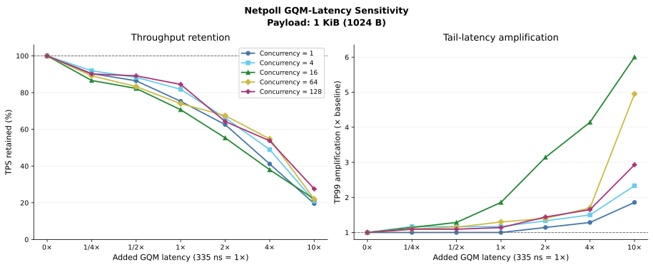
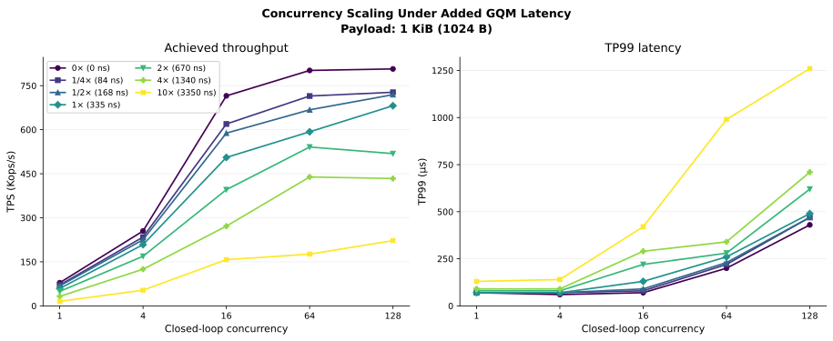

# Netpoll GQM latency × closed-loop concurrency sweep

## 结论摘要

这组实验覆盖 `5` 个 closed-loop concurrency 和 `7` 个 GQM latency，共 `35`
个实测 cell。结果显示：Netpoll 路径从首个 `84 ns（约 1/4×）` 注入点就出现一致的
吞吐下降，五个并发档仅保留基线的 `86.59%–91.88%`；到 `335 ns（1×）` 时保留
`70.67%–84.46%`，到 `3350 ns（10×）` 时只保留 `19.54%–27.55%`。因此，在当前
`1 KiB Echo`、closed-loop envelope 内，GQM latency 是可观测且持续的 RPC capacity
敏感项。

并发基线本身也存在明显拐点。`Concurrency=16` 到 `64` 只增加 `12.09%` TPS，却使
TP99 从 `70 µs` 增至 `200 µs`；`64` 到 `128` 仅增加 `0.65%` TPS，TP99 又增至
`430 µs`。因此 `C=16` 更适合观察未饱和或接近饱和的 latency sensitivity，`C=64`
适合作为高吞吐压力点，`C=128` 应解释为饱和压力点，而不宜作为唯一的典型配置。

## 实验设置

| 项目 | 设置 |
|---|---|
| RPC framework | Netpoll |
| Workload | Echo |
| Body size | `1024 B` |
| Load model | closed-loop concurrency |
| Concurrency | `1, 4, 16, 64, 128` |
| Added GQM latency | `0, 84, 168, 335, 670, 1340, 3350 ns` |
| 展示倍率 | `0, 1/4, 1/2, 1, 2, 4, 10×`，以 `335 ns=1×` |
| 测量数 | `35` 个 cell，每个 cell 一条观测 |
| 主要指标 | TPS、TP99、TP99.9、client/server CPU、RSS |

原始表中的 `Value=84x84` 等标签被原样保存在 CSV 中；本文只把 `CostNs` 映射成
`335 ns=1×` 的展示倍率，不进一步推断注入在内部调用路径上的实际次数。

## 数据文件和复现

- [原始数据](data/netpoll_gqm_latency_concurrency_raw_20260810.csv)：保留用户提供的
  两批数据、原始批次内序号、`Value`、公共字段和全部观测值。TPS 以原表显示精度
  `Kops/s` 保存，没有补点或平滑。
- [派生数据](data/netpoll_gqm_latency_concurrency_derived_20260810.csv)：在原始列之外增加
  GQM 倍率、同并发 `0 ns` 基线、TPS retention、TP99/TP99.9 amplification、总 CPU、
  估算 used cores、TPS/used-core，以及相对 `C=16` 的 TPS/TP99。

在本目录执行：

```bash
uv run pytest -q
uv run netpoll-gqm-concurrency-plot
```

## 结果一：GQM latency sensitivity



图 1 同时给出各并发档相对自身 `0 ns` 基线的 TPS retention 与 TP99 amplification。
归一化消除了不同 concurrency 的绝对 capacity 差异，回答“在同一并发档内，GQM
latency 增加后 RPC 退化多少”。

### TPS retention

| Added latency | Multiplier | C=1 | C=4 | C=16 | C=64 | C=128 |
|---:|---:|---:|---:|---:|---:|---:|
| 0 ns | 0× | 100.00% | 100.00% | 100.00% | 100.00% | 100.00% |
| 84 ns | 1/4× | 90.36% | 91.88% | 86.59% | 89.14% | 90.15% |
| 168 ns | 1/2× | 86.42% | 88.31% | 82.25% | 83.28% | 89.13% |
| 335 ns | 1× | 75.25% | 81.80% | 70.67% | 73.95% | 84.46% |
| 670 ns | 2× | 62.56% | 66.24% | 55.32% | 67.47% | 64.25% |
| 1340 ns | 4× | 41.12% | 48.94% | 37.96% | 54.75% | 53.74% |
| 3350 ns | 10× | 19.54% | 20.94% | 22.00% | 21.98% | 27.55% |

TPS 对注入延迟呈总体单调下降。尤其首个 `84 ns` 点在全部并发档已下降约
`8.12%–13.41%`，说明当前采样粒度下尚未观察到“完全不敏感区”。`335 ns` 后五条曲线
都已进入明显退化区；到 `3350 ns` 时，并发提高也不能恢复 capacity。

### TP99 amplification

| Added latency | Multiplier | C=1 | C=4 | C=16 | C=64 | C=128 |
|---:|---:|---:|---:|---:|---:|---:|
| 0 ns | 0× | 1.00× | 1.00× | 1.00× | 1.00× | 1.00× |
| 84 ns | 1/4× | 1.00× | 1.17× | 1.14× | 1.10× | 1.09× |
| 168 ns | 1/2× | 1.00× | 1.17× | 1.29× | 1.15× | 1.09× |
| 335 ns | 1× | 1.00× | 1.17× | 1.86× | 1.30× | 1.14× |
| 670 ns | 2× | 1.14× | 1.33× | 3.14× | 1.40× | 1.44× |
| 1340 ns | 4× | 1.29× | 1.50× | 4.14× | 1.70× | 1.65× |
| 3350 ns | 10× | 1.86× | 2.33× | 6.00× | 4.95× | 2.93× |

TP99 的相对放大在不同并发档并不一致。`C=16` 的相对放大最大，是因为其 `0 ns`
TP99 只有 `70 µs`；`C=128` 看似相对放大较小，但它的基线已经是 `430 µs`，而
`3350 ns` 点的绝对 TP99 达到 `1260 µs`。因此不能仅凭 amplification 判断
`C=128` 对 GQM latency 更不敏感，必须与绝对 TP99 一起解释。

## 结果二：concurrency scaling 与 saturation



图 2 保留全部七条 latency 曲线，以绝对 TPS 和绝对 TP99 展示 concurrency 增长带来的
收益与代价。这张图回答“增加 outstanding work 是否还能隐藏 GQM latency，以及何处进入
饱和”。

### `0 ns` baseline

| Concurrency | TPS | TP99 | TP99.9 | Total CPU | TPS / estimated used-core | TPS gain vs previous C | TP99 change vs previous C |
|---:|---:|---:|---:|---:|---:|---:|---:|
| 1 | 78.8K | 70 µs | 110 µs | 349.1% | 22.57K | — | — |
| 4 | 255.0K | 60 µs | 90 µs | 1042.3% | 24.47K | +223.60% | -14.29% |
| 16 | 715.3K | 70 µs | 230 µs | 1482.2% | 48.26K | +180.51% | +16.67% |
| 64 | 801.8K | 200 µs | 840 µs | 1506.6% | 53.22K | +12.09% | +185.71% |
| 128 | 807.0K | 430 µs | 1180 µs | 1638.7% | 49.25K | +0.65% | +115.00% |

`C=1→4→16` 仍有显著 TPS 增益；`C=16→64` 后增益快速收窄，`C=64→128` 基本不再
增加吞吐，却继续累积排队延迟。不同 GQM latency 下大体维持相同形态：中等 delay 可由
更高 concurrency 隐藏一部分，但在 `1340/3350 ns` 下，额外 concurrency 已无法恢复到
低 delay 的 capacity。

CPU 派生值只是把 client 与 server 的进程 CPU 百分比相加后除以 `100` 得到的描述性
used-core 估计，不代表单机核利用率，也不用于硬件归因。

## 原始观测表

公共字段：`Body=1024 B`、原表 `QPS=0`、`Retry=1`、`Status=OK`。下表按 CostNs 和
concurrency 排序；原始到达顺序与完整字段见 raw CSV。

| Value | C | TPS | TP99 | TP99.9 | Client CPU | Server CPU | Client RSS | Server RSS |
|---:|---:|---:|---:|---:|---:|---:|---:|---:|
| 0x0 | 1 | 78.8K | 70 | 110 | 172.2% | 176.9% | 60416 | 46080 |
| 0x0 | 4 | 255.0K | 60 | 90 | 534.6% | 507.7% | 96256 | 37888 |
| 0x0 | 16 | 715.3K | 70 | 230 | 775.9% | 706.3% | 227328 | 51200 |
| 0x0 | 64 | 801.8K | 200 | 840 | 756.8% | 749.8% | 269312 | 56320 |
| 0x0 | 128 | 807.0K | 430 | 1180 | 763.0% | 875.7% | 280576 | 64512 |
| 84x84 | 1 | 71.2K | 70 | 110 | 179.1% | 180.6% | 60416 | 46080 |
| 84x84 | 4 | 234.3K | 70 | 110 | 549.1% | 511.9% | 89088 | 47104 |
| 84x84 | 16 | 619.4K | 80 | 390 | 763.5% | 684.1% | 218112 | 50176 |
| 84x84 | 64 | 714.7K | 220 | 870 | 755.4% | 739.0% | 234496 | 55296 |
| 84x84 | 128 | 727.5K | 470 | 1780 | 760.7% | 847.9% | 258048 | 67584 |
| 168x168 | 1 | 68.1K | 70 | 110 | 182.8% | 181.4% | 58368 | 43008 |
| 168x168 | 4 | 225.2K | 70 | 120 | 547.1% | 504.2% | 91136 | 48128 |
| 168x168 | 16 | 588.3K | 90 | 410 | 750.2% | 667.0% | 209920 | 45056 |
| 168x168 | 64 | 667.7K | 230 | 1030 | 752.8% | 721.4% | 224256 | 55296 |
| 168x168 | 128 | 719.3K | 470 | 1520 | 761.5% | 847.3% | 242688 | 66560 |
| 335x335 | 1 | 59.3K | 70 | 120 | 178.2% | 185.9% | 55296 | 44032 |
| 335x335 | 4 | 208.6K | 70 | 140 | 539.8% | 488.0% | 84992 | 44032 |
| 335x335 | 16 | 505.5K | 130 | 600 | 714.5% | 612.1% | 188416 | 50176 |
| 335x335 | 64 | 592.9K | 260 | 1560 | 781.3% | 683.8% | 202752 | 60416 |
| 335x335 | 128 | 681.6K | 490 | 1790 | 760.5% | 850.4% | 247808 | 65536 |
| 670x670 | 1 | 49.3K | 80 | 120 | 184.4% | 188.1% | 58368 | 45056 |
| 670x670 | 4 | 168.9K | 80 | 810 | 519.5% | 496.8% | 76800 | 43008 |
| 670x670 | 16 | 395.7K | 220 | 940 | 652.0% | 590.4% | 152576 | 49152 |
| 670x670 | 64 | 541.0K | 280 | 1720 | 780.4% | 716.0% | 201728 | 62464 |
| 670x670 | 128 | 518.5K | 620 | 1830 | 793.4% | 815.9% | 210944 | 62464 |
| 1340x1340 | 1 | 32.4K | 90 | 120 | 196.7% | 209.2% | 50176 | 44032 |
| 1340x1340 | 4 | 124.8K | 90 | 1060 | 501.8% | 502.5% | 71680 | 45056 |
| 1340x1340 | 16 | 271.5K | 290 | 1150 | 600.7% | 568.5% | 94208 | 46080 |
| 1340x1340 | 64 | 439.0K | 340 | 2060 | 775.4% | 721.6% | 167936 | 58368 |
| 1340x1340 | 128 | 433.7K | 710 | 2400 | 794.4% | 777.6% | 188416 | 66560 |
| 3350x3350 | 1 | 15.4K | 130 | 160 | 255.3% | 245.8% | 47104 | 40960 |
| 3350x3350 | 4 | 53.4K | 140 | 1080 | 490.4% | 499.5% | 53248 | 41984 |
| 3350x3350 | 16 | 157.4K | 420 | 1240 | 577.3% | 559.0% | 78848 | 45056 |
| 3350x3350 | 64 | 176.2K | 990 | 3200 | 717.2% | 611.5% | 84992 | 52224 |
| 3350x3350 | 128 | 222.3K | 1260 | 2860 | 794.5% | 657.6% | 108544 | 59392 |

## 证据边界与下一步

- 每个 cell 当前只有一条观测，因此图中不绘制 error bar；曲线只能用于描述当前 run，
  不能把相邻点的小幅差异解释为稳定排序。
- 当前只覆盖 `1 KiB Echo` 和 closed-loop concurrency，不能直接外推其他 body size、
  open-loop offered load 或生产请求分布。
- 现有数据能证明“增加 GQM latency 会显著降低当前 Netpoll RPC capacity”，但减速实验
  不能直接给出把现有硬件 latency 优化到更低值后的精确加速比。
- 如果用于下一代硬件预算，优先补 `0–335 ns` 区间的加密点和至少三次交错重复，并保存
  每 RPC successful/empty GQM operation counter；`C=16` 与 `C=64` 应作为两条主要
  envelope，`C=128` 保留为 saturation stress control。
