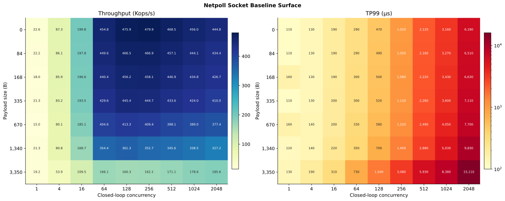
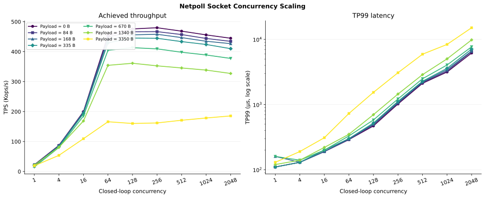

# Netpoll Socket payload × closed-loop concurrency baseline

## 结论摘要

本实验覆盖 `7` 个 payload size 与 `9` 个 closed-loop concurrency，共 `63` 个 Socket
baseline 实测 cell。对于 `0–1340 B`，`Concurrency=64` 已达到各 payload 最大 TPS 的
`94.77%–98.09%`；继续提高到 `128/256`，吞吐仅小幅增加，但 TP99 快速放大。因此
`C=64` 是当前数据中最稳定的 capacity knee，`C=128` 适合作为接近饱和的压力点，
`C>=256` 主要用于观察排队和过载。

Payload 在 `0–335 B` 时对 capacity 影响较小；`670–1340 B` 开始持续降低吞吐；
`3350 B` 进入明显不同的大 payload 区间。在 `C=64`，TPS 从 `0 B` 的 `454.8K`
降至 `3350 B` 的 `166.1K`，TP99 从 `290us` 增至 `730us`。

## 实验设置

| 项目 | 设置 |
|---|---|
| RPC framework | Netpoll Socket |
| Workload | Echo payload sweep |
| Payload size | `0, 84, 168, 335, 670, 1340, 3350 B` |
| Load model | closed-loop concurrency |
| Concurrency | `1, 4, 16, 64, 128, 256, 512, 1024, 2048` |
| 测量数 | `63` 个 cell，每个 cell 一条观测 |
| 原始指标 | TPS、TP99、TP99.9、client/server CPU、client/server RSS、Retry、Status |

## 数据保存与复现

- [原始数据](data/netpoll_socket_baseline_raw_20260810.csv)：完整保存 63 行及用户提供的
  所有字段，包括 `Value`、`Conc`、`Body`、`QPS`、`Cost`、TPS、TP99、TP99.9、
  client/server CPU、client/server RSS、Retry 和 Status；没有删除不利点、补点或平滑。
- [派生数据](data/netpoll_socket_baseline_derived_20260810.csv)：在原始测量基础上增加
  payload peak TPS/peak concurrency、TPS/peak、同 concurrency 下相对 `0 B` 的 TPS
  retention、相对 `C=64` 的 TP99/TP99.9 amplification、相邻 concurrency 的 TPS/TP99
  变化、总 CPU、estimated used-core 和 TPS/used-core。

```bash
uv run pytest -q
uv run netpoll-socket-baseline-plot
```

## 结果一：完整性能面



图 1 左侧为全部 63 个 cell 的 TPS，右侧为对应 TP99。TP99 使用对数颜色映射以同时展示
`110us–15.11ms` 的范围，但每个 cell 仍标注绝对值。

### TPS（Kops/s）/ TP99（us）

| Payload | C=1 | C=4 | C=16 | C=64 | C=128 | C=256 | C=512 | C=1024 | C=2048 |
|---:|---:|---:|---:|---:|---:|---:|---:|---:|
| 0 B | 22.6 / 110 | 87.3 / 130 | 199.8 / 190 | 454.8 / 290 | 475.9 / 470 | 479.9 / 1,020 | 468.5 / 2,120 | 456.0 / 3,160 | 444.8 / 6,180 |
| 84 B | 22.2 / 110 | 86.1 / 130 | 197.8 / 190 | 449.6 / 290 | 466.5 / 490 | 466.9 / 1,050 | 457.1 / 2,180 | 444.1 / 3,270 | 434.4 / 6,510 |
| 168 B | 18.0 / 160 | 85.9 / 130 | 196.6 / 190 | 440.4 / 300 | 456.2 / 500 | 458.1 / 1,080 | 446.9 / 2,220 | 434.8 / 3,430 | 426.7 / 6,630 |
| 335 B | 21.3 / 110 | 83.2 / 130 | 193.5 / 200 | 429.6 / 300 | 445.4 / 520 | 444.7 / 1,120 | 433.6 / 2,280 | 424.0 / 3,600 | 410.0 / 7,110 |
| 670 B | 15.0 / 160 | 80.1 / 140 | 185.1 / 200 | 404.6 / 330 | 413.3 / 580 | 409.4 / 1,220 | 398.1 / 2,490 | 389.0 / 4,050 | 377.4 / 7,700 |
| 1,340 B | 21.3 / 120 | 80.8 / 140 | 168.7 / 220 | 354.4 / 350 | 361.3 / 700 | 352.7 / 1,450 | 345.6 / 2,880 | 338.5 / 5,030 | 327.2 / 9,830 |
| 3,350 B | 19.2 / 130 | 53.9 / 190 | 109.5 / 310 | 166.1 / 730 | 160.3 / 1,540 | 162.1 / 3,080 | 171.1 / 5,930 | 178.6 / 8,380 | 185.6 / 15,110 |

### TP99.9（us）

| Payload | C=1 | C=4 | C=16 | C=64 | C=128 | C=256 | C=512 | C=1024 | C=2048 |
|---:|---:|---:|---:|---:|---:|---:|---:|---:|
| 0 B | 130 | 160 | 240 | 410 | 810 | 1,650 | 2,700 | 4,870 | 9,000 |
| 84 B | 130 | 170 | 240 | 420 | 950 | 1,900 | 3,010 | 4,900 | 9,380 |
| 168 B | 190 | 170 | 240 | 450 | 980 | 2,110 | 3,070 | 5,100 | 9,930 |
| 335 B | 130 | 170 | 250 | 500 | 990 | 2,110 | 3,240 | 5,330 | 10,450 |
| 670 B | 200 | 180 | 250 | 570 | 1,260 | 2,250 | 3,410 | 5,600 | 11,080 |
| 1,340 B | 140 | 180 | 280 | 710 | 1,370 | 2,350 | 3,500 | 6,210 | 12,270 |
| 3,350 B | 160 | 240 | 370 | 1,010 | 1,970 | 3,620 | 6,530 | 12,080 | 20,310 |

## 结果二：concurrency scaling



图 2 使用绝对 TPS 和对数 TP99 展示 concurrency 增长过程。`C=1→64` 的 throughput
扩展明显；`C=64→128/256` 后，小中 payload 进入平台区；`C>=256` 时多数 payload
吞吐持平或下降，而 TP99 持续增长。

### Capacity knee 汇总

| Payload | C=64 TPS / TP99 | Peak TPS | Peak C | C=64 / Peak |
|---:|---:|---:|---:|---:|
| 0 B | 454.8K / 290us | 479.9K | 256 | 94.77% |
| 84 B | 449.6K / 290us | 466.9K | 256 | 96.29% |
| 168 B | 440.4K / 300us | 458.1K | 256 | 96.14% |
| 335 B | 429.6K / 300us | 445.4K | 128 | 96.45% |
| 670 B | 404.6K / 330us | 413.3K | 128 | 97.89% |
| 1,340 B | 354.4K / 350us | 361.3K | 128 | 98.09% |
| 3,350 B | 166.1K / 730us | 185.6K | 2048 | 89.49% |

`3350 B` 的绝对 peak 出现在 `C=2048`，但对应 TP99 为 `15.11ms`。该点表示
latency-unbounded capacity，不作为典型最优配置。

## 测试结论

1. `C=64` 是 `0–1340 B` 的共同 knee：已经获得至少 `94.77%` 的峰值 TPS，同时 TP99
   保持在 `290–350us`。
2. `C=64→128` 对 `0–1340 B` 只增加 `1.95%–4.64%` TPS，TP99 却增加
   `62%–100%`；继续到 `C=256` 后吞吐收益接近消失。
3. `0–335 B` 属于 payload 不敏感区；`670–1340 B` 出现渐进 capacity 损失；
   `3350 B` 同时表现出吞吐下降和更高 tail latency。
4. 推荐后续 transport 对照采用 `C=64` 作为典型高吞吐配置，`C=128` 作为饱和压力点，
   `C=256` 及以上仅作为 overload control。

## 证据边界

- 每个 cell 当前只有一条观测，因此不绘制 error bar；相邻 cell 的小幅差异不用于稳定排序。
- 当前报告只描述 Socket baseline surface，不把其差异归因到 GQM、Ubmem 或具体硬件模块。
- 与其他 transport 比较时，需要对齐 payload、concurrency、CPU/NUMA placement 和测量窗口。
