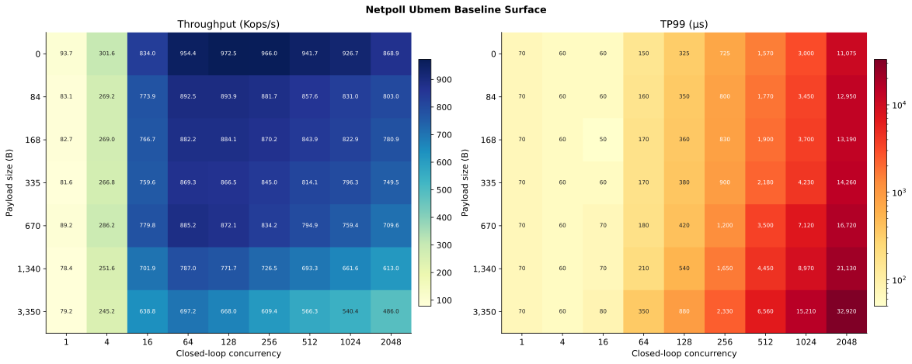
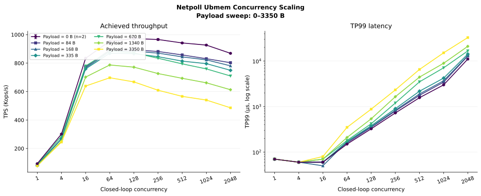

# Netpoll Ubmem payload × closed-loop concurrency baseline

## 结论摘要

本实验覆盖 `7` 个 payload size 与 `9` 个 closed-loop concurrency，共 `63` 个 Ubmem
baseline cell、`72` 条原始观测。`Payload=0 B` 的九个 cell 有两次重复，其余 cell
各一次。`Concurrency=64` 在全部 payload 上达到各自最大平均 TPS 的 `98.14%–100%`；
继续提高 concurrency 不再产生有效 capacity 收益，但 TP99 快速上升。
因此 `C=64` 是当前 Ubmem baseline 的共同 capacity knee，`C=128` 可作为饱和压力点，
`C>=256` 主要用于观察排队和过载。

Payload 增长会降低 capacity，但没有改变共同拐点。在 `C=64`，TPS 从 `0 B` 的
平均 `954.35K` 降至 `3350 B` 的 `697.2K`，保留 `73.06%`；TP99 从 `150us` 增至
`350us`。

## 实验设置

| 项目 | 设置 |
|---|---|
| RPC framework | Netpoll |
| Transport | Ubmem |
| Workload | Echo payload sweep |
| Payload size | `0, 84, 168, 335, 670, 1340, 3350 B` |
| Load model | closed-loop concurrency |
| Concurrency | `1, 4, 16, 64, 128, 256, 512, 1024, 2048` |
| 测量数 | `63` 个 cell、`72` 条观测；`0 B` 为 `n=2` |
| 原始指标 | TPS、TP99、TP99.9、client/server CPU、client/server RSS、Retry、Status |

## 数据保存与复现

- [原始数据](data/netpoll_ubmem_baseline_raw_20260810.csv)：完整保存 72 行及用户提供的
  所有字段，包括 `Value`、`Conc`、`Body`、`QPS`、`Cost`、TPS、TP99、TP99.9、
  client/server CPU、client/server RSS、Retry 和 Status；没有删除、补点或平滑。
- [派生数据](data/netpoll_ubmem_baseline_derived_20260810.csv)：按 63 个 cell 汇总，增加
  `sample_count`、mean、sample SD、payload peak、
  TPS/peak、同 concurrency 下相对 `0 B` 的 TPS retention、相对 `C=64` 的 tail
  amplification、相邻 concurrency 变化、总 CPU、estimated used-core 和 TPS/used-core。

```bash
uv run pytest -q
uv run netpoll-ubmem-baseline-plot
```

## 结果一：完整性能面



图 1 左侧为全部 63 个 cell 的 TPS，右侧为对应 TP99。TP99 使用对数颜色映射，但每个
cell 仍标注绝对值。

### TPS（Kops/s）/ TP99（us）

| Payload | C=1 | C=4 | C=16 | C=64 | C=128 | C=256 | C=512 | C=1024 | C=2048 |
|---:|---:|---:|---:|---:|---:|---:|---:|---:|
| 0 B（mean, n=2） | 93.7 / 70 | 301.6 / 60 | 834.05 / 60 | 954.35 / 150 | 972.45 / 325 | 966.05 / 725 | 941.7 / 1,570 | 926.7 / 3,000 | 868.85 / 11,075 |
| 84 B | 83.1 / 70 | 269.2 / 60 | 773.9 / 60 | 892.5 / 160 | 893.9 / 350 | 881.7 / 800 | 857.6 / 1,770 | 831.0 / 3,450 | 803.0 / 12,950 |
| 168 B | 82.7 / 70 | 269.0 / 60 | 766.7 / 50 | 882.2 / 170 | 884.1 / 360 | 870.2 / 830 | 843.9 / 1,900 | 822.9 / 3,700 | 780.9 / 13,190 |
| 335 B | 81.6 / 70 | 266.8 / 60 | 759.6 / 60 | 869.3 / 170 | 866.5 / 380 | 845.0 / 900 | 814.1 / 2,180 | 796.3 / 4,230 | 749.5 / 14,260 |
| 670 B | 89.2 / 70 | 286.2 / 60 | 779.8 / 70 | 885.2 / 180 | 872.1 / 420 | 834.2 / 1,200 | 794.9 / 3,500 | 759.4 / 7,120 | 709.6 / 16,720 |
| 1,340 B | 78.4 / 70 | 251.6 / 60 | 701.9 / 70 | 787.0 / 210 | 771.7 / 540 | 726.5 / 1,650 | 693.3 / 4,450 | 661.6 / 8,970 | 613.0 / 21,130 |
| 3,350 B | 79.2 / 70 | 245.2 / 60 | 638.8 / 80 | 697.2 / 350 | 668.0 / 880 | 609.4 / 2,330 | 566.3 / 6,560 | 540.4 / 15,210 | 486.0 / 32,920 |

### TP99.9（us）

| Payload | C=1 | C=4 | C=16 | C=64 | C=128 | C=256 | C=512 | C=1024 | C=2048 |
|---:|---:|---:|---:|---:|---:|---:|---:|---:|
| 0 B（mean, n=2） | 110 | 80 | 170 | 380 | 930 | 2,250 | 5,155 | 9,375 | 23,965 |
| 84 B | 110 | 80 | 160 | 490 | 1,070 | 3,680 | 5,250 | 11,330 | 24,920 |
| 168 B | 110 | 80 | 180 | 520 | 1,150 | 3,370 | 8,770 | 11,370 | 31,520 |
| 335 B | 110 | 80 | 180 | 580 | 1,190 | 4,050 | 7,990 | 15,740 | 29,370 |
| 670 B | 110 | 90 | 230 | 730 | 1,550 | 4,260 | 11,420 | 21,070 | 34,840 |
| 1,340 B | 110 | 90 | 240 | 890 | 1,670 | 4,510 | 12,520 | 22,250 | 45,530 |
| 3,350 B | 110 | 120 | 450 | 1,320 | 2,770 | 6,210 | 13,560 | 23,850 | 50,570 |

## 结果二：concurrency scaling



图 2 显示 `C=1→64` 的 throughput 扩展明显；到 `C=64` 后所有 payload 都进入平台或
下降区，而 TP99 继续随 outstanding work 增长。`Payload=0 B` 使用两次运行的
mean ± sample SD error bar；其他曲线仍为单次观测。

### Capacity knee 汇总

| Payload | C=64 TPS / TP99 | Peak TPS | Peak C | C=64 / Peak |
|---:|---:|---:|---:|---:|
| 0 B（mean, n=2） | 954.35K / 150us | 972.45K | 128 | 98.14% |
| 84 B | 892.5K / 160us | 893.9K | 128 | 99.84% |
| 168 B | 882.2K / 170us | 884.1K | 128 | 99.79% |
| 335 B | 869.3K / 170us | 869.3K | 64 | 100.00% |
| 670 B | 885.2K / 180us | 885.2K | 64 | 100.00% |
| 1,340 B | 787.0K / 210us | 787.0K | 64 | 100.00% |
| 3,350 B | 697.2K / 350us | 697.2K | 64 | 100.00% |

## 测试结论

1. `C=64` 是所有 payload 的共同 capacity knee，已经获得 `98.14%–100%` 的峰值 TPS。
2. `C=64→128` 只让 `0–168 B` 增加 `0.16%–1.90%` TPS，`335–3350 B` 已开始下降；
   同时 TP99 增加约 `112%–157%`。
3. Payload 主要改变 capacity 高度，而不改变拐点位置：`C=64` 的 TPS retention 相对
   `0 B` 在 `84–670 B` 为约 `91%–93%`，`1340 B` 为 `82.29%`，`3350 B` 为
   `73.06%`。
4. 推荐 `C=64` 作为 Ubmem 典型高吞吐配置，`C=128` 作为饱和压力点，`C>=256`
   仅作为 overload control。

## 证据边界

- `Payload=0 B` 有两次运行并绘制 sample SD；其他 54 个 cell 仍只有一条观测，不绘制
  error bar。相邻 cell 的小幅差异不作稳定排序。
- 当前报告描述 Ubmem baseline surface，不把结果进一步归因到 GQM 或具体硬件模块。
- 与 Socket 或其他 transport 比较时，需要使用完全相同的 payload、concurrency、资源配置
  和测量窗口。

## 增补运行原始值

以下 9 行作为第二次运行追加保存，没有覆盖第一次运行：

| C | TPS | TP99 | TP99.9 | Client CPU | Server CPU | Client RSS | Server RSS |
|---:|---:|---:|---:|---:|---:|---:|---:|
| 1 | 93.5K | 70 | 110 | 169.3% | 169.9% | 61440 | 43008 |
| 4 | 300.6K | 60 | 80 | 529.2% | 497.8% | 107520 | 45056 |
| 16 | 834.1K | 60 | 170 | 739.9% | 679.0% | 250880 | 47104 |
| 64 | 952.3K | 150 | 380 | 763.5% | 734.8% | 294912 | 58368 |
| 128 | 977.6K | 320 | 900 | 731.7% | 744.1% | 312320 | 69632 |
| 256 | 961.2K | 730 | 2,010 | 731.8% | 745.8% | 343040 | 96256 |
| 512 | 945.2K | 1,560 | 5,160 | 730.4% | 752.0% | 398336 | 143360 |
| 1024 | 923.3K | 3,020 | 9,660 | 728.6% | 758.0% | 560128 | 244736 |
| 2048 | 871.2K | 10,780 | 21,660 | 729.1% | 770.4% | 922624 | 506880 |
