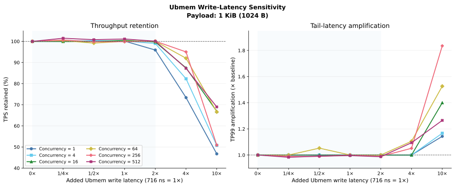
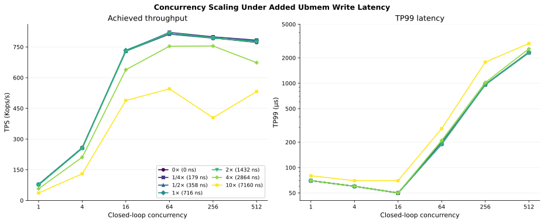

# Netpoll Ubmem write latency × closed-loop concurrency sweep

## 结论摘要

这组实验覆盖 `6` 个 closed-loop concurrency 和 `7` 个 Ubmem write latency，共
`42` 个实测 cell。在当前 `1 KiB Echo` 路径中，`0–716 ns（0–1×）` 区间没有形成
可辨识的 RPC 性能退化：各并发档 TPS 相对自身 `0 ns` 基线处于
`99.19%–101.49%`，TP99 也基本重合。`1432 ns（2×）` 时，只有 `C=1` 的 TPS
下降 `4.10%`，其余并发档仍保留 `99.03%–100.10%`。

`2864 ns（4×）` 是本轮首次观察到跨并发度的一致 capacity 下降，TPS retention 为
`73.37%–95.02%`；到 `7160 ns（10×）` 时仅保留 `46.73%–68.98%`，TP99 放大为
`1.14×–1.84×`。因此，当前实验能把 write-latency 的明显敏感区定位在
`1432–2864 ns（2×–4×）` 之间，而不是现有的 `716 ns（1×）` 附近。

面向硬件预算，这组数据暂不支持把“继续压低 `716 ns` 以下的 write latency”列为当前
Netpoll RPC 的优先优化项；更直接的规格提示是避免 write latency 进入约 `2.9 µs`
及以上的退化区。该判断仅针对本实验的 `1 KiB Echo`、closed-loop workload 和当前
并发范围。

## 实验设置

| 项目 | 设置 |
|---|---|
| RPC framework | Netpoll |
| Transport | Ubmem |
| Workload | Echo |
| Body size | `1024 B` |
| Load model | closed-loop concurrency |
| Concurrency | `1, 4, 16, 64, 256, 512` |
| Added write latency | `0, 179, 358, 716, 1432, 2864, 7160 ns` |
| 展示倍率 | `0, 1/4, 1/2, 1, 2, 4, 10×`，以 `716 ns=1×` |
| 测量数 | `42` 个 cell，每个 cell 一条观测 |
| 主要指标 | TPS、TP99、TP99.9、client/server CPU、RSS |

原始报告的 `Value=179x179` 等配置标签被原样保留。报告列出的 `Cost` 字段全部为
`0`，因此分析使用从 `Value` 明确给出的 write-latency 配置值，不把 `Cost` 解释成
实际注入时延，也不进一步推断一次 RPC 内部的 write 次数。

## 数据文件和复现

- [原始数据](data/netpoll_ubmem_write_latency_concurrency_raw_20260810.csv)：保留全部
  `42` 个观测及用户提供的所有字段；TPS 按原始报告的 `Kops/s` 精度存档。
- [派生数据](data/netpoll_ubmem_write_latency_concurrency_derived_20260810.csv)：增加
  `716 ns=1×` 倍率、同并发 `0 ns` 基线、TPS retention、TP99/TP99.9 amplification、
  总 CPU、估算 used cores 和 TPS/used-core。

在本目录执行：

```bash
uv run pytest -q
uv run netpoll-ubmem-write-latency-plot
```

## 结果一：write-latency sensitivity



图 1 对每个 concurrency 分别使用其 `0 ns` cell 归一化。左图回答 write latency
增加后 capacity 还剩多少，右图回答同一负载档的 TP99 放大多少。淡蓝区域标识本次数据
中尚未观察到跨并发一致退化的 `0–2×` 范围。

### TPS retention

| Write latency | Multiplier | C=1 | C=4 | C=16 | C=64 | C=256 | C=512 |
|---:|---:|---:|---:|---:|---:|---:|---:|
| 0 ns | 0× | 100.00% | 100.00% | 100.00% | 100.00% | 100.00% | 100.00% |
| 179 ns | 1/4× | 100.13% | 100.00% | 99.93% | 100.32% | 100.64% | 101.49% |
| 358 ns | 1/2× | 100.00% | 100.43% | 99.85% | 99.19% | 99.81% | 100.80% |
| 716 ns | 1× | 100.13% | 100.12% | 100.49% | 100.06% | 99.84% | 101.13% |
| 1432 ns | 2× | 95.90% | 99.03% | 99.71% | 100.04% | 100.09% | 100.10% |
| 2864 ns | 4× | 73.37% | 82.30% | 87.46% | 92.01% | 95.02% | 87.24% |
| 7160 ns | 10× | 46.73% | 50.76% | 66.89% | 66.61% | 50.89% | 68.98% |

前三个非零点与基线的差异都在约 `±1.5%` 内，且没有随 write latency 增长而持续
下降的顺序关系，应视为同一性能平台。`2×` 仍未形成普遍退化；`4×` 开始六条曲线
全部下降，但并发越高并不保证越能隐藏时延，例如 `C=512` 的 retention 低于
`C=256`。到 `10×` 时所有并发档均发生显著 capacity 损失。

### TP99 amplification

| Write latency | Multiplier | C=1 | C=4 | C=16 | C=64 | C=256 | C=512 |
|---:|---:|---:|---:|---:|---:|---:|---:|
| 0 ns | 0× | 1.00× | 1.00× | 1.00× | 1.00× | 1.00× | 1.00× |
| 179 ns | 1/4× | 1.00× | 1.00× | 1.00× | 1.00× | 0.99× | 0.98× |
| 358 ns | 1/2× | 1.00× | 1.00× | 1.00× | 1.05× | 0.99× | 0.99× |
| 716 ns | 1× | 1.00× | 1.00× | 1.00× | 1.00× | 1.00× | 1.00× |
| 1432 ns | 2× | 1.00× | 1.00× | 1.00× | 1.00× | 0.99× | 0.99× |
| 2864 ns | 4× | 1.00× | 1.00× | 1.00× | 1.11× | 1.05× | 1.09× |
| 7160 ns | 10× | 1.14× | 1.17× | 1.40× | 1.53× | 1.84× | 1.26× |

在 closed-loop 测试中，capacity 下降可以早于 TP99 明显上升：`4×` 点已经损失
`4.98%–26.63%` TPS，但 TP99 最多只放大 `1.11×`。因此 write latency 的预算不能
只看尾延迟曲线；TPS retention 是识别首个退化点的主要指标，TP99 用于描述进入严重
退化区后的用户可见代价。

## 结果二：concurrency scaling



图 2 保留绝对 TPS 和绝对 TP99。TP99 采用对数纵轴，使 `50–2960 µs` 的完整范围能在
同一幅图中辨认。低 write latency 下，TPS 在 `C=64` 附近达到约 `819–822K` 的平台；
继续增加到 `C=256/512` 不再提高 throughput，TP99 却从约 `190 µs` 上升到
`960–2340 µs`。所以 `C=64` 是这组数据中更适合代表高吞吐工作点的配置，`C=256/512`
更适合作为饱和尾延迟压力点。

在 `10×` 时，增加 concurrency 只能部分隐藏 write latency：TPS 从 `C=1` 的
`36.5K` 提高到 `C=64` 的 `545.5K`，但仍显著低于同并发 `0 ns` 的 `819.0K`；继续
增加 concurrency 也无法恢复低 latency 的 capacity。

### 绝对 TPS / TP99

每个 cell 的格式为 `TPS / TP99(µs)`。

| Write latency | Multiplier | C=1 | C=4 | C=16 | C=64 | C=256 | C=512 |
|---:|---:|---:|---:|---:|---:|---:|---:|
| 0 ns | 0× | 78.1K / 70 | 256.5K / 60 | 730.3K / 50 | 819.0K / 190 | 794.4K / 970 | 772.0K / 2340 |
| 179 ns | 1/4× | 78.2K / 70 | 256.5K / 60 | 729.8K / 50 | 821.6K / 190 | 799.5K / 960 | 783.5K / 2300 |
| 358 ns | 1/2× | 78.1K / 70 | 257.6K / 60 | 729.2K / 50 | 812.4K / 200 | 792.9K / 960 | 778.2K / 2320 |
| 716 ns | 1× | 78.2K / 70 | 256.8K / 60 | 733.9K / 50 | 819.5K / 190 | 793.1K / 970 | 780.7K / 2330 |
| 1432 ns | 2× | 74.9K / 70 | 254.0K / 60 | 728.2K / 50 | 819.3K / 190 | 795.1K / 960 | 772.8K / 2310 |
| 2864 ns | 4× | 57.3K / 70 | 211.1K / 60 | 638.7K / 50 | 753.6K / 210 | 754.8K / 1020 | 673.5K / 2560 |
| 7160 ns | 10× | 36.5K / 80 | 130.2K / 70 | 488.5K / 70 | 545.5K / 290 | 404.3K / 1780 | 532.5K / 2960 |

### TP99.9

| Write latency | Multiplier | C=1 | C=4 | C=16 | C=64 | C=256 | C=512 |
|---:|---:|---:|---:|---:|---:|---:|---:|
| 0 ns | 0× | 110 | 90 | 170 | 610 | 4460 | 11030 |
| 179 ns | 1/4× | 110 | 90 | 170 | 600 | 3960 | 10570 |
| 358 ns | 1/2× | 110 | 90 | 160 | 590 | 4630 | 11250 |
| 716 ns | 1× | 110 | 90 | 160 | 650 | 4160 | 11140 |
| 1432 ns | 2× | 110 | 90 | 170 | 540 | 5380 | 12120 |
| 2864 ns | 4× | 120 | 100 | 160 | 590 | 4550 | 11650 |
| 7160 ns | 10× | 120 | 110 | 170 | 950 | 5370 | 12730 |

## 原始观测表

公共字段：`Body=1024 B`、原表 `QPS=0`、原表 `Cost=0`、`Retry=1`、
`Status=OK`。延迟单位为 `µs`，RSS 单位为 `KiB`；完整机器可读字段见 raw CSV。

| Value | C | TPS | TP99 | TP99.9 | Client CPU | Server CPU | Client RSS | Server RSS |
|---:|---:|---:|---:|---:|---:|---:|---:|---:|
| 0x0 | 1 | 78.1K | 70 | 110 | 175.1% | 185.7% | 59392 | 41984 |
| 0x0 | 4 | 256.5K | 60 | 90 | 533.5% | 514.7% | 93184 | 45056 |
| 0x0 | 16 | 730.3K | 50 | 170 | 782.7% | 757.5% | 241664 | 46080 |
| 0x0 | 64 | 819.0K | 190 | 610 | 759.5% | 849.8% | 278528 | 51200 |
| 0x0 | 256 | 794.4K | 970 | 4460 | 761.9% | 897.0% | 314368 | 96256 |
| 0x0 | 512 | 772.0K | 2340 | 11030 | 761.4% | 924.1% | 395264 | 138240 |
| 179x179 | 1 | 78.2K | 70 | 110 | 171.8% | 184.3% | 62464 | 43008 |
| 179x179 | 4 | 256.5K | 60 | 90 | 533.6% | 515.2% | 95232 | 45056 |
| 179x179 | 16 | 729.8K | 50 | 170 | 782.8% | 759.9% | 242688 | 45056 |
| 179x179 | 64 | 821.6K | 190 | 600 | 759.6% | 845.5% | 267264 | 61440 |
| 179x179 | 256 | 799.5K | 960 | 3960 | 760.7% | 907.2% | 308224 | 89088 |
| 179x179 | 512 | 783.5K | 2300 | 10570 | 764.1% | 939.9% | 364544 | 149504 |
| 358x358 | 1 | 78.1K | 70 | 110 | 171.9% | 184.1% | 61440 | 33792 |
| 358x358 | 4 | 257.6K | 60 | 90 | 534.3% | 514.8% | 95232 | 44032 |
| 358x358 | 16 | 729.2K | 50 | 160 | 784.6% | 756.6% | 244736 | 48128 |
| 358x358 | 64 | 812.4K | 200 | 590 | 759.2% | 839.6% | 274432 | 61440 |
| 358x358 | 256 | 792.9K | 960 | 4630 | 763.1% | 899.2% | 311296 | 96256 |
| 358x358 | 512 | 778.2K | 2320 | 11250 | 761.8% | 926.8% | 367616 | 145408 |
| 716x716 | 1 | 78.2K | 70 | 110 | 172.0% | 184.6% | 62464 | 40960 |
| 716x716 | 4 | 256.8K | 60 | 90 | 533.8% | 514.8% | 96256 | 34816 |
| 716x716 | 16 | 733.9K | 50 | 160 | 783.4% | 760.5% | 237568 | 51200 |
| 716x716 | 64 | 819.5K | 190 | 650 | 757.7% | 853.7% | 274432 | 56320 |
| 716x716 | 256 | 793.1K | 970 | 4160 | 762.7% | 893.8% | 322560 | 100352 |
| 716x716 | 512 | 780.7K | 2330 | 11140 | 763.2% | 930.5% | 376832 | 150528 |
| 1432x1432 | 1 | 74.9K | 70 | 110 | 172.9% | 184.8% | 65536 | 43008 |
| 1432x1432 | 4 | 254.0K | 60 | 90 | 535.6% | 518.2% | 96256 | 38912 |
| 1432x1432 | 16 | 728.2K | 50 | 170 | 782.4% | 765.6% | 239616 | 49152 |
| 1432x1432 | 64 | 819.3K | 190 | 540 | 759.6% | 844.7% | 267264 | 63488 |
| 1432x1432 | 256 | 795.1K | 960 | 5380 | 763.2% | 906.5% | 314368 | 94208 |
| 1432x1432 | 512 | 772.8K | 2310 | 12120 | 763.1% | 925.6% | 384000 | 144384 |
| 2864x2864 | 1 | 57.3K | 70 | 120 | 175.1% | 192.8% | 54272 | 44032 |
| 2864x2864 | 4 | 211.1K | 60 | 100 | 544.6% | 535.4% | 86016 | 41984 |
| 2864x2864 | 16 | 638.7K | 50 | 160 | 789.8% | 755.7% | 211968 | 48128 |
| 2864x2864 | 64 | 753.6K | 210 | 590 | 759.4% | 868.2% | 246784 | 51200 |
| 2864x2864 | 256 | 754.8K | 1020 | 4550 | 762.0% | 941.4% | 295936 | 95232 |
| 2864x2864 | 512 | 673.5K | 2560 | 11650 | 764.3% | 875.4% | 345088 | 137216 |
| 7160x7160 | 1 | 36.5K | 80 | 120 | 176.6% | 201.2% | 54272 | 38912 |
| 7160x7160 | 4 | 130.2K | 70 | 110 | 572.9% | 570.2% | 70656 | 40960 |
| 7160x7160 | 16 | 488.5K | 70 | 170 | 793.8% | 897.9% | 192512 | 49152 |
| 7160x7160 | 64 | 545.5K | 290 | 950 | 793.4% | 898.9% | 195584 | 55296 |
| 7160x7160 | 256 | 404.3K | 1780 | 5370 | 797.5% | 935.2% | 224256 | 93184 |
| 7160x7160 | 512 | 532.5K | 2960 | 12730 | 796.1% | 972.2% | 332800 | 137216 |

## 证据边界与下一步

- 本轮每个 cell 是一条观测，因此不绘制 error bar；相邻点的 `±1.5%` 变化不作为稳定
  排序，只用跨全部并发档的一致趋势识别退化区。
- 当前结果给出的是 write latency 对这一组 RPC workload 的反向敏感度，不等价于将
  现有硬件 write latency 优化到更低值后一定能获得相同比例的正向加速。
- 若要进一步收紧硬件上限，下一轮无需重扫完整矩阵；固定 `C=16`（低尾延迟吞吐档）和
  `C=64`（高吞吐档），在 `1432–2864 ns` 之间增加 `1790, 2148, 2506 ns` 三个点并做
  至少三次交错重复，就能更精确定位首次超过 `5%` TPS 损失的位置。
