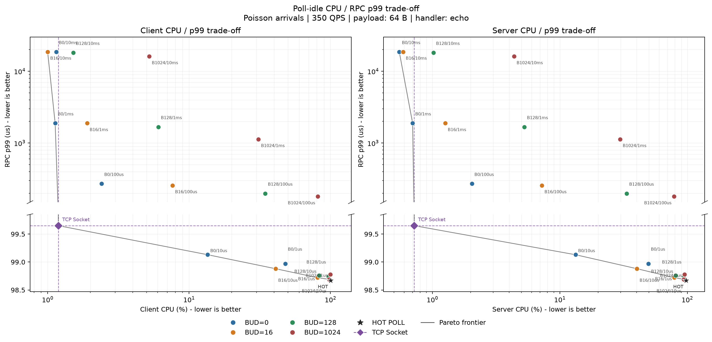
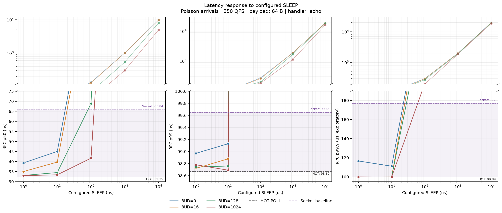
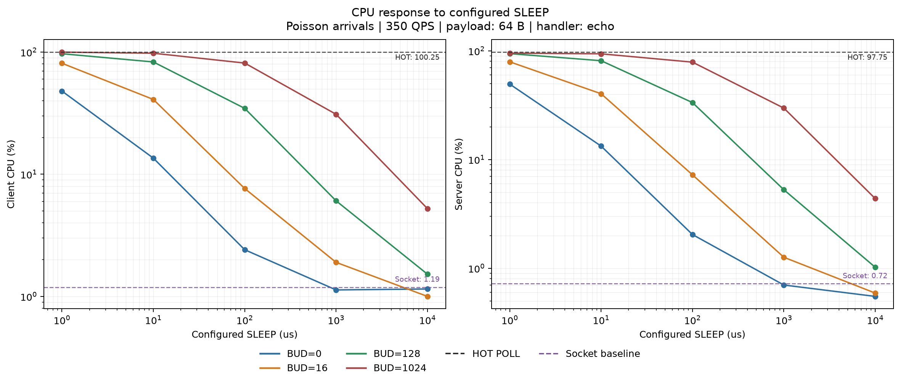
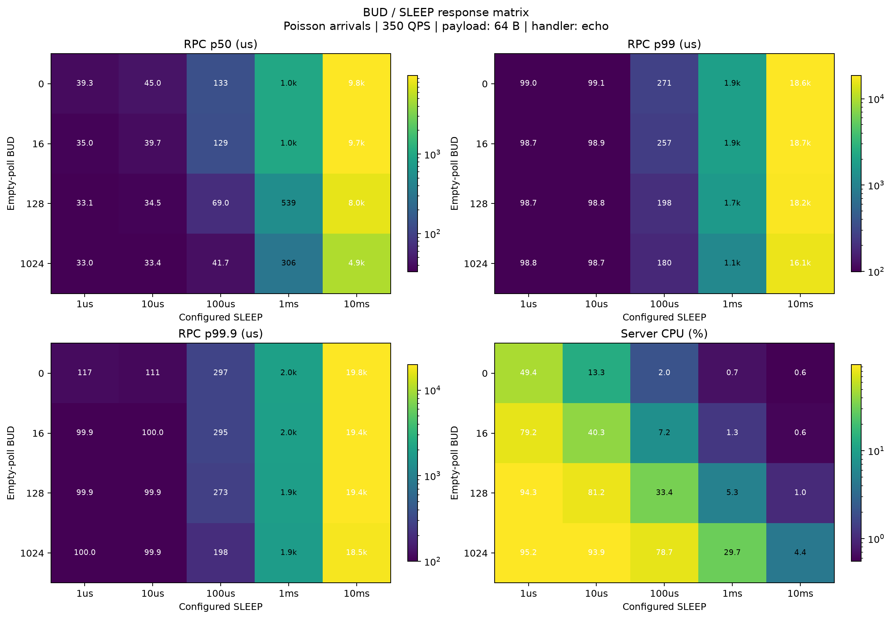

# Poll-idle 在 Poisson 350 QPS 下的 CPU–尾延迟取舍

本报告研究低负载 Poisson RPC 中，poll-idle 的两个配置参数如何改变 client/server CPU
与端到端尾延迟。它要回答的不是“poll-idle 一定应该取哪个默认值”，而是：在当前
350 QPS 实验 envelope 中，CPU 与 p50/p99/p99.9 之间出现了怎样的取舍，哪一段参数
值得作为下一轮软件、firmware 和硬件协同优化的起点。

原始汇总数据见
[`data/poisson_exp_350qps_unary64.csv`](data/poisson_exp_350qps_unary64.csv)。

## 结论摘要

1. **当前 sweep 中最明显的 CPU–p99 取舍点是 `empty-poll budget=0`、
   `sleep interval=10us`。** 该点 p99 为 `99.13us`，相比 HOT POLL 的 `98.67us`
   增加 `0.46us`（约 `0.47%`）；client/server CPU 从 `100.25%/97.75%` 降至
   `13.55%/13.29%`，分别下降约 `86.5%/86.4%`。
2. **这个点保住了 TCP Socket 的 p99 参考线，但没有达到 TCP 的 CPU 水平。** 在所有
   `p99 <= 99.65us` 的 idle 配置中，它的 client 和 server CPU 都最低；但 TCP Socket
   的两端 CPU 只有 `1.19%/0.72%`。
3. **配置的 sleep interval 对应主要 latency 区间。** 当 sleep interval 为 `1us` 或
   `10us` 时，四个 empty-poll budget 的 p99 都集中在 `98.69–99.13us`；增加到
   `100us`、`1ms`、`10ms` 后，p99 分别进入 `179.95–270.72us`、
   `1.130–1.888ms` 和 `16.125–18.674ms` 区间。
4. **固定 `sleep interval=10us` 时，empty-poll budget 主要改变 CPU。** budget 从
   `0` 增至 `1024`，client/server CPU 从 `13.55%/13.29%` 增至
   `97.81%/93.90%`，而 p99 只从 `99.13us` 变为 `98.69us`，跨度为 `0.44us`。
5. **放宽 latency budget 可以继续换取 CPU。** 在本次数据中，若只要求
   `p99 < 300us`，`budget=0/sleep=100us` 的 p99 为 `270.72us`，两端 CPU 为
   `2.41%/2.04%`；若只要求 `p99 < 2ms`，`budget=0/sleep=1ms` 的 p99 为
   `1.888ms`，两端 CPU 为 `1.13%/0.70%`。
6. **这些结论只描述当前单次运行。** 每点没有重复实验，artifact 也没有记录实际进入
   idle 的时间、实际 sleep 时长和 notification publish-to-detect latency，因此当前结果
   不能直接确定跨机器默认值或证明内部时序机制。



## 1. 实验目的

HOT POLL 以持续轮询换取低检测延迟，但会长期占用 CPU。Poll-idle 在连续空轮询后进入
sleep，希望在低负载时释放 CPU；代价是请求到达时可能需要等待下一次检查。这个 sweep
围绕三个问题展开：

1. 在 p99 接近 HOT POLL 和 TCP Socket 参考点时，poll-idle 可以释放多少 client/server
   CPU？
2. Empty-poll budget 与 sleep interval 分别对应怎样的 CPU 和 latency 变化？
3. 如果下一轮需要向软件、firmware 或硬件设计反馈，应该优先补测哪个参数和内部时序？

本实验是端到端 RPC sensitivity sweep，不是 queue primitive 微基准。报告使用 RPC
latency 与两端 CPU 共同判断参数影响，但不从单次观测反推出精确的内部轮询次数、实际
sleep 时间或 wakeup 成本。

## 2. 参数与实验 Envelope

### 2.1 参数定义

- **Empty-poll budget**（空轮询预算，原始 CSV 和图例标为 `BUD`）：进入 idle sleep
  前允许的 empty-poll 次数。它目前是次数配置，不是经过时间归一化的物理量。
- **Sleep interval**（睡眠间隔，原始 CSV 字段为 `sleep_us`，图例标为 `SLEEP`）：进入
  idle 后配置的 sleep 时长。它是配置值，不代表线程每次实际等待的精确时长。
- **HOT POLL**：持续 active polling 的延迟参考点。
- **TCP Socket**：socket transport 的 CPU 与 latency 参考点，不是与 poll-idle 只差一个
  参数的严格实现 A/B。

本文后续优先使用完整名称 `empty-poll budget`。`BUD` 只用于对应原始 CSV、配置标签和
既有图例，不把它当作另一个未经验证的机制名称。

### 2.2 已知实验条件

| 维度 | 条件 |
| --- | --- |
| arrival | `poisson_exp` |
| target rate | `350 QPS` |
| workload | `64 B` payload、echo handler |
| measurement | `15s` |
| requests | `5285` |
| empty-poll budget | `{0, 16, 128, 1024}` 次 |
| sleep interval | `{1, 10, 100, 1000, 10000}us` |
| reference modes | HOT POLL、TCP Socket |
| repetitions | 每个点 `1` 次 |
| primary metrics | p50、p99、p99.9、client CPU、server CPU |

这是一个 `4 x 5` 的 idle 参数矩阵，共 20 个配置点，另有 HOT POLL 和 TCP Socket
两个参考点。

### 2.3 当前 artifact 没有保留的条件

- 机器型号、CPU、内存、firmware、频率策略和精确拓扑。
- 构建实验二进制时的 `folly` / `fbthrift` commit、dirty tree 状态和 binary checksum。
- 完整 client/server 命令、core pinning、NUMA placement 和 CPU 统计窗口。
- time-to-first-idle、实际 sleep duration、wakeup latency 和 publish-to-detect latency。
- 每个请求触发的 empty poll 数、进入 idle 的比例和每种状态的 CPU 时间。

因此，当前 checkout 的 commit 不能补写成实验 provenance，配置次数也不能直接换算为跨
机器可比较的时间。

### 2.4 完整 idle sweep

下表只保留本报告使用的 latency 和 CPU 指标。数值均直接来自规范化 CSV。

| Empty-poll budget | Sleep interval | p50 | p99 | p99.9 | Client CPU | Server CPU |
| ---: | ---: | ---: | ---: | ---: | ---: | ---: |
| 0 | 1us | 39.33us | 98.97us | 116.63us | 47.93% | 49.42% |
| 0 | 10us | 45.03us | 99.13us | 111.16us | 13.55% | 13.29% |
| 0 | 100us | 133.35us | 270.72us | 297us | 2.41% | 2.04% |
| 0 | 1ms | 1014.54us | 1887.58us | 1999us | 1.13% | 0.70% |
| 0 | 10ms | 9816.35us | 18614us | 19768us | 1.15% | 0.55% |
| 16 | 1us | 35.04us | 98.72us | 99.89us | 80.97% | 79.25% |
| 16 | 10us | 39.73us | 98.88us | 99.97us | 40.94% | 40.30% |
| 16 | 100us | 129.40us | 257.12us | 295us | 7.64% | 7.23% |
| 16 | 1ms | 1012.97us | 1886.56us | 1992us | 1.90% | 1.26% |
| 16 | 10ms | 9727.83us | 18674us | 19439us | 1.00% | 0.59% |
| 128 | 1us | 33.08us | 98.74us | 99.94us | 96.89% | 94.27% |
| 128 | 10us | 34.53us | 98.76us | 99.94us | 82.99% | 81.16% |
| 128 | 100us | 68.95us | 198.15us | 273us | 34.61% | 33.42% |
| 128 | 1ms | 539.08us | 1675us | 1933us | 6.06% | 5.27% |
| 128 | 10ms | 7960.11us | 18151us | 19427us | 1.52% | 1.02% |
| 1024 | 1us | 32.99us | 98.78us | 99.99us | 99.84% | 95.24% |
| 1024 | 10us | 33.40us | 98.69us | 99.89us | 97.81% | 93.90% |
| 1024 | 100us | 41.71us | 179.95us | 198us | 81.28% | 78.71% |
| 1024 | 1ms | 305.62us | 1130us | 1865us | 30.95% | 29.73% |
| 1024 | 10ms | 4941.41us | 16125us | 18452us | 5.23% | 4.37% |

## 3. CPU–p99 主取舍


图中左、右两侧分别使用 client CPU 和 server CPU。按 empty-poll budget 着色的散点
标注原始 `BUD/SLEEP` 配置，灰线表示当前采样点形成的 Pareto 前沿；HOT POLL 和 TCP
Socket 作为参考点单独标识。

| 配置 | p50 | p99 | p99.9 | Client CPU | Server CPU |
| --- | ---: | ---: | ---: | ---: | ---: |
| HOT POLL | 32.35us | 98.67us | 99.89us | 100.25% | 97.75% |
| Empty-poll budget 0 / sleep 10us | 45.03us | 99.13us | 111.16us | 13.55% | 13.29% |
| Empty-poll budget 0 / sleep 100us | 133.35us | 270.72us | 297us | 2.41% | 2.04% |
| Empty-poll budget 0 / sleep 1ms | 1014.54us | 1887.58us | 1999us | 1.13% | 0.70% |
| TCP Socket | 65.84us | 99.65us | 177us | 1.19% | 0.72% |

几个中间结果需要分别看待：

- `budget=0/sleep=10us` 的 p99 与 HOT POLL、TCP Socket 都接近，但 p50 从 HOT 的
  `32.35us` 增至 `45.03us`。因此，“p99 基本不变”不等于整条 latency 分布完全不变。
- 从 `sleep=10us` 增至 `100us`，两端 CPU 从约 `13%` 进一步降到约 `2%`，同时
  p50/p99 增至 `133.35/270.72us`。
- `sleep=1ms` 时两端 CPU 已接近 TCP Socket，但 p50/p99 为 `1.015/1.888ms`，与 TCP
  Socket 的 latency 形状不再接近。

所以，`budget=0/sleep=10us` 只是在当前 sweep 中接近 `100us` p99 参考线的候选 knee；
如果应用允许 `300us` 或 `2ms` 级 p99，图上还存在 CPU 更低的不同候选点。

## 4. Sleep interval 的 latency 敏感度



各 sleep interval 下，四个 empty-poll budget 的 latency 范围如下：

| Sleep interval | p50 range | p99 range | p99.9 range |
| ---: | ---: | ---: | ---: |
| 1us | 32.99–39.33us | 98.72–98.97us | 99.89–116.63us |
| 10us | 33.40–45.03us | 98.69–99.13us | 99.89–111.16us |
| 100us | 41.71–133.35us | 179.95–270.72us | 198–297us |
| 1ms | 305.62–1014.54us | 1.130–1.888ms | 1.865–1.999ms |
| 10ms | 4.941–9.816ms | 16.125–18.674ms | 18.452–19.768ms |

这组中间结果呈现两个区间：

- `1–10us`：p99 都集中在约 `99us`，但 p50 和 CPU 已随配置发生变化。
- `100us–10ms`：sleep interval 每提高一个数量级，p50 和尾延迟进入更高的毫秒区间；
  增大 empty-poll budget 可以减小一部分延迟，但没有消除 sleep 档位带来的整体变化。

这里的 `sleep interval` 是配置值。由于没有实际 sleep duration 和 wakeup timestamp，
不能把曲线直接解释成“每个请求恰好多等待一个配置的 sleep interval”。当前数据能支持的
表述是：**在这个 sweep 中，sleep interval 档位与主要 latency regime 强相关。**

## 5. Empty-poll budget 的 CPU 敏感度





固定 `sleep interval=10us` 时，可以较清楚地分离 empty-poll budget 的影响：

| Empty-poll budget | p50 | p99 | Client CPU | Server CPU |
| ---: | ---: | ---: | ---: | ---: |
| 0 | 45.03us | 99.13us | 13.55% | 13.29% |
| 16 | 39.73us | 98.88us | 40.94% | 40.30% |
| 128 | 34.53us | 98.76us | 82.99% | 81.16% |
| 1024 | 33.40us | 98.69us | 97.81% | 93.90% |

budget 从 `0` 增至 `1024` 时，p50 逐步接近 HOT POLL，但 p99 只变化 `0.44us`；同一
过程中两端 CPU 从约 `13%` 升至约 `94–98%`。这说明在当前低负载、`10us` sleep
配置下，继续增加 active empty polling 的主要可见代价是 CPU，而 p99 收益很小。

这个关系在更长 sleep interval 下会与 latency 发生交互。例如固定 `sleep=100us`：

| Empty-poll budget | p50 | p99 | Client CPU | Server CPU |
| ---: | ---: | ---: | ---: | ---: |
| 0 | 133.35us | 270.72us | 2.41% | 2.04% |
| 16 | 129.40us | 257.12us | 7.64% | 7.23% |
| 128 | 68.95us | 198.15us | 34.61% | 33.42% |
| 1024 | 41.71us | 179.95us | 81.28% | 78.71% |

此时增大 budget 能明显降低 p50 和 p99，但 CPU 也相应升高。因而不能只根据一条
`sleep=10us` 切片断言 budget 对 latency 永远没有作用；更准确的描述是：**sleep
interval 决定主要 latency 区间，empty-poll budget 决定进入该区间前保留多少 active
polling，并在 CPU 与 latency 之间移动具体位置。**

## 6. 可以与不能从当前结果推断什么

### 可以说明

- 在这次 350 QPS、64 B echo sweep 中，`budget=0/sleep=10us` 相比 HOT POLL 大幅
  降低了两端 CPU，同时 p99 只增加 `0.46us`。
- 在当前采样矩阵内，sleep interval 与主要 latency regime 的关系比 empty-poll budget
  更直接；固定 sleep interval 后，budget 可以进一步移动 CPU–latency 取舍点。
- 当前数据可以按应用的 p99 budget 选择后续复测候选点，例如约 `100us`、`300us` 和
  `2ms` 三个区间。
- 同时看 client/server CPU 与 p50/p99 比只看单一端、单一 percentile 更能反映这个
  idle 策略的取舍。

### 尚不能说明

- 不能确定 `budget=0/sleep=10us` 是其他 QPS、payload、机器或 firmware 上的默认最优值。
- 不能从配置值反推出实际 time-to-first-idle、实际 sleep 时长、wakeup 成本或
  publish-to-detect latency。
- 不能把 empty-poll budget 次数直接作为跨 CPU 比较的时间，因为单次 empty poll 成本
  可能随实现、频率和 contention 改变。
- 不能仅凭一次运行判断相邻 `98–100us` p99 差异是否超过实验噪声。
- 不能把 p99.9 当作稳定尾延迟结论：5285 个请求只能为 p99.9 提供大约 5 个尾部样本。

## 7. 对 poll-idle 设计的含义

在当前 envelope 中，可以按应用 latency budget 选取下一轮候选点：

| 当前 p99 budget | 候选配置 | 实测 p99 | Client CPU | Server CPU |
| ---: | --- | ---: | ---: | ---: |
| 约 100us | budget 0 / sleep 10us | 99.13us | 13.55% | 13.29% |
| 300us | budget 0 / sleep 100us | 270.72us | 2.41% | 2.04% |
| 2ms | budget 0 / sleep 1ms | 1.888ms | 1.13% | 0.70% |

这张表不是默认值推荐，而是从已有矩阵中选出的复测锚点。它给软件、firmware 和硬件的
浅层反馈是：

1. 如果目标是维持约 `100us` p99，应优先精细 sweep `1–100us` 之间的短 sleep interval，
   而不是只继续增大 empty-poll budget。
2. 如果需要判断下一步应该优化 polling、sleep 还是 wakeup，必须增加实际 empty-poll
   count、time-to-first-idle、actual sleep duration 和 publish-to-detect 指标；只有配置值
   无法拆开这些成本。
3. Empty-poll budget 最终应同时记录“次数”和“从首次 empty 到进入 idle 的时间”，否则
   相同 budget 在不同 CPU、频率或 firmware 上不一定代表相同 active-poll window。

## 8. 下一轮实验

建议按以下顺序补齐证据：

1. **重复当前矩阵。** 每点至少运行 3 次，报告 median、min/max 或置信区间，先判断
   `98–100us` 区间内的差异是否可重复。
2. **增加负载维度。** 在同一 payload/handler 下加入多个 QPS 档位，至少覆盖低负载、
   knee 附近和较高利用率，观察当前候选点是否随 arrival gap 改变。
3. **记录实际状态时序。** 增加 empty polls before idle、time-to-first-idle、actual sleep
   duration、wakeup-to-first-poll 和 publish-to-detect latency。
4. **把 budget 归一化到时间。** 同时报告 empty-poll count 和 active-poll window，避免
   将某台机器上的 `1024` 次直接外推到另一台机器。
5. **固定实验 provenance。** 保存二进制 checksum、源代码 commit、CPU/firmware、频率
   策略、NUMA/core pinning、CPU 统计窗口和完整 client/server 命令。
6. **增加尾部样本量。** 延长运行或增加请求数，使 p99.9 不再只由约 5 个请求支撑，并将
   慢请求与 idle/wakeup 事件关联。

## 9. 复现分析

本目录使用 `uv` 创建和管理本地 `.venv`：

```bash
uv sync --group dev
uv run poll-idle-plot
```

指定其他兼容 CSV 或输出目录：

```bash
uv run poll-idle-plot \
  --input data/poisson_exp_350qps_unary64.csv \
  --output-dir figures
```

运行测试：

```bash
uv run --group dev pytest -q
```

## 10. 图表输出

- `01_cpu_latency_pareto`：RPC p99 主取舍图，分别使用 client CPU 和 server CPU；
  散点按 empty-poll budget 着色并标注原始 `BUD/SLEEP` 配置，灰线表示当前采样点的
  Pareto 前沿。Y 轴在 `150us` 处断开，下段放大参考点附近的结果，上段保留高延迟点。
- `02_latency_by_sleep`：不同 empty-poll budget 下，sleep interval 对
  p50/p99/p99.9 的影响；断轴用于同时呈现约 `100us` 和毫秒级结果。
- `03_cpu_by_sleep`：不同 empty-poll budget 下，sleep interval 对 client CPU 和
  server CPU 的影响。
- `04_parameter_heatmaps`：完整 `empty-poll budget x sleep interval` 参数矩阵，用于
  对照 CPU 与 latency 的交互。

每张图同时生成 PNG 和 SVG。

## 11. 结论边界

本报告对“这一次 350 QPS sweep 中各配置测得了什么”具有直接数据支持；对“sleep
interval 与 empty-poll budget 分别对应哪类取舍”提供了可供下一轮验证的实验观察。
由于每点只有一次 15 秒运行、缺少机器和 build provenance，也缺少实际 idle/wakeup
时序，报告不把候选 knee 升级为通用默认值，不把配置相关性写成已证明的内部因果机制。
